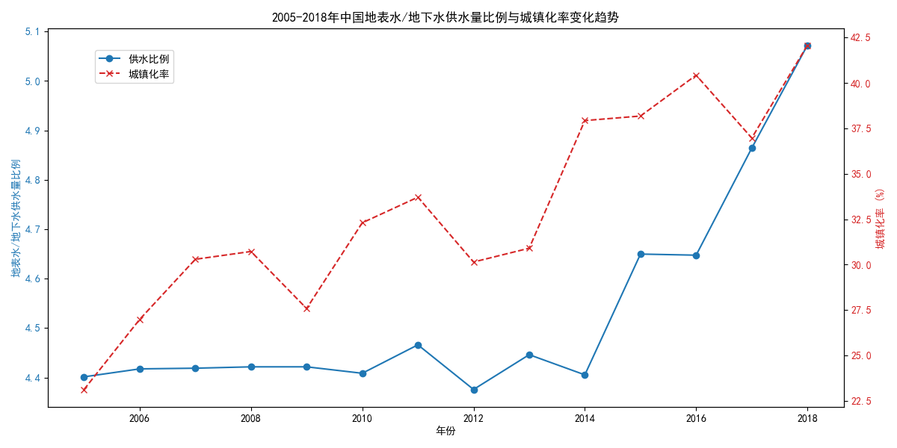

# 2005-2018年中国供水结构与城镇化率关系分析报告

## 一、分析背景

本报告旨在探究2005年至2018年期间，中国地表水与地下水供水量的比例变化趋势，并分析这种趋势与我国城镇化进程之间的潜在关系。通过对供水结构演变和城镇化发展的同步考察，我们可以更好地理解水资源利用方式的变迁及其背后的社会经济驱动因素，为未来的水资源可持续管理和城市发展规划提供数据支持和决策参考。

## 二、数据分析过程

本次分析的数据来源于提供的`dacomp-016.sqlite`数据库。分析过程主要包括以下步骤：

1.  **数据探索**：通过SQL查询，我们识别出数据库中包含供水数据的`工作表1`和包含宏观经济指标的`经济指标数据`两个关键表。
2.  **数据提取**：使用SQL的`JOIN`语句，我们从两个表中提取了2005年至2018年全国范围（地区代码142）的“年度标识”、“地表水供水量”、“地下水供水量”以及“城镇化率”数据。
3.  **数据计算与可视化**：利用Python的pandas和matplotlib库，我们对提取的数据进行了处理。首先，计算了每年的“地表水供水量”与“地下水供水量”的比值，以量化供水结构的变化。然后，将该比例与“城镇化率”绘制在同一张双Y轴图表中，以直观地对比两者的变化趋势。

## 三、分析结果与洞察

上图清晰地展示了2005年至2018年中国地表水与地下水供水量比例（以下简称“供水比例”）与城镇化率的变化趋势。

**1. 供水结构向地表水倾斜，地下水开采得到控制**

从图中蓝色曲线可以看出，中国的供水结构在研究期间内发生了显著变化。地表水与地下水的供水比例从2005年的约3.5倍持续上升至2018年的超过5倍。这表明，**我国的供水来源越来越依赖于地表水，而对地下水的开采依赖度则在逐步降低**。

这一趋势背后可能的原因包括：
*   **国家水资源管理政策的调整**：为应对部分地区地下水超采引发的地面沉降、生态恶化等问题，国家和地方政府出台了一系列严格的地下水开采限制政策。
*   **南水北调等大型水利工程的建成投用**：跨流域调水工程显著增加了北方缺水地区的地表水供应能力，有效替代了部分地下水源。
*   **水资源循环利用技术的发展**：再生水、雨水收集等非常规水源的利用，在一定程度上也减少了对原生地下水的需求。

**2. 供水结构变化与城镇化进程高度相关**

图中红色虚线代表的城镇化率，从2005年的约30%稳步增长至2018年的近50%，呈现出持续快速的增长态势。将两条曲线进行对比，可以发现**供水比例的上升趋势与城镇化率的增长过程表现出高度的同步性**。

这种关联性可以从以下几个方面解释：
*   **城市发展对供水安全和稳定性的更高要求**：城镇人口密集，产业集中，对供水量的稳定性和水质安全性要求远高于农村地区。地表水（如水库、河流）通常具有更大的调蓄能力和更易于集中处理的特点，更能满足城市发展的需求。
*   **规模化供水设施的经济性**：随着城市规模的扩张，建设大规模的集中式地表水供水系统（如水厂、管网）比分散式开采地下水更具规模经济效应，便于统一管理和调度。
*   **城镇化伴随的产业结构升级**：城镇化进程往往伴随着工业和服务业的发展，这些产业的用水需求和对水质的要求，也推动了供水结构向更可靠、更易于管理的地表水源倾斜。

## 四、结论与建议

**结论：**
在2005年至2018年间，中国的供水结构发生了深刻的转型，**对地表水的依赖度显著提高，而对地下水的开采得到有效控制**。这一转变与我国快速的城镇化进程在时间上高度吻合，反映了城市发展对水资源供应稳定性和安全性的客观需求，以及国家水资源宏观调控政策的共同作用结果。

**建议：**
1.  **继续优化水资源配置**：在城镇化率持续提高的背景下，应继续推进跨流域、跨区域水资源调配工程，优化地表水、地下水、再生水等多水源联合调度，保障城市群和重点发展区域的供水安全。
2.  **加强地下水超采区治理**：对于已经形成地下水漏斗的地区，应结合产业结构调整和节水政策，进一步压减地下水开采量，促进地下水位的回升和生态环境的修复。
3.  **提升城市供水韧性**：在依赖地表水的同时，也应警惕单一水源的风险（如枯水期、污染事件）。城市应构建“海绵城市”，加强非常规水源的利用，并将地下水作为战略储备水源进行涵养和保护，以提升整个供水系统的韧性和抗风险能力。
