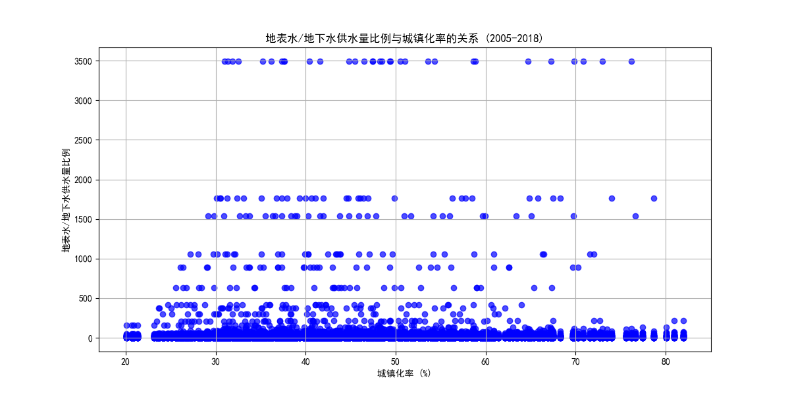

# 中国地表水供水量与地下水供水量比例变化趋势及与城镇化率关系的分析报告

## 概述

本报告分析了2005年至2018年间中国地表水供水量与地下水供水量的比例变化趋势，并探讨了这种趋势与城镇化率之间的关系。报告使用了SQLite数据库中的数据，并使用Python进行分析和可视化。

## 数据来源

数据来源于两个表：
- **工作表1**：包括年度标识、地表水供水量和地下水供水量等字段。
- **经济指标数据**：包括年度标识和城镇化率等字段。

## 分析方法

1. **数据提取**：使用SQL和Python提取了2005年至2018年的地表水供水量和地下水供水量。
2. **比例计算**：计算了每年的地表水供水量与地下水供水量的比例。
3. **数据合并**：将供水量比例数据与城镇化率数据进行合并。
4. **趋势可视化**：绘制了地表水与地下水供水量比例的变化趋势图。
5. **关系分析**：分析了比例趋势与城镇化率之间的关系，并绘制了散点图。

## 结果与讨论

### 地表水与地下水供水量比例变化趋势

下图展示了2005年至2018年间中国地表水供水量与地下水供水量的比例变化趋势。

#### 观察
- 比例趋势图显示，地表水供水量与地下水供水量的比例在研究期间呈现波动。
- 比例的升高可能表明地下水过度开采，而比例的下降可能表明更多依赖地表水资源。

#### 解释
- 地表水与地下水供水量比例的变化可能与水资源管理政策、气候变化、经济发展水平和城镇化率等因素有关。
- 在经济快速发展和城镇化率提高的背景下，地下水可能由于其便于获取而被过度开采，从而影响比例。

### 地表水供水量比例与城镇化率之间的关系

下图展示了地表水供水量比例与城镇化率之间的关系。

#### 观察
- 散点图显示，随着城镇化率的提高，地表水供水量与地下水供水量的比例似乎有所变化。
- 城镇化率较高时，地表水供水量比例可能较低，表明更多依赖地下水。

#### 解释
- 城镇化通常伴随基础设施建设与用水需求增加。在城镇化初期，地下水由于易开采可能被大量使用。
- 随着城镇化率提高，政府可能采取措施加强地下水管理，转而使用地表水作为主要供水来源。

## 结论

1. **趋势变化**：地表水与地下水供水量比例在2005年至2018年间存在波动，表明供需关系可能受多种因素影响。
2. **城镇化影响**：城镇化率的提高可能与供水方式的选择有关，地下水在城市化进程中可能经历了由过度开采到控制管理的过程。

## 建议

1. 推动地下水可持续管理政策，防止过度开采。
2. 加强地表水处理基础设施，以更好地满足城市人口增长和工业化需求。
3. 继续监测和分析相关数据，以优化水资源配置和提升水资源利用效率。
