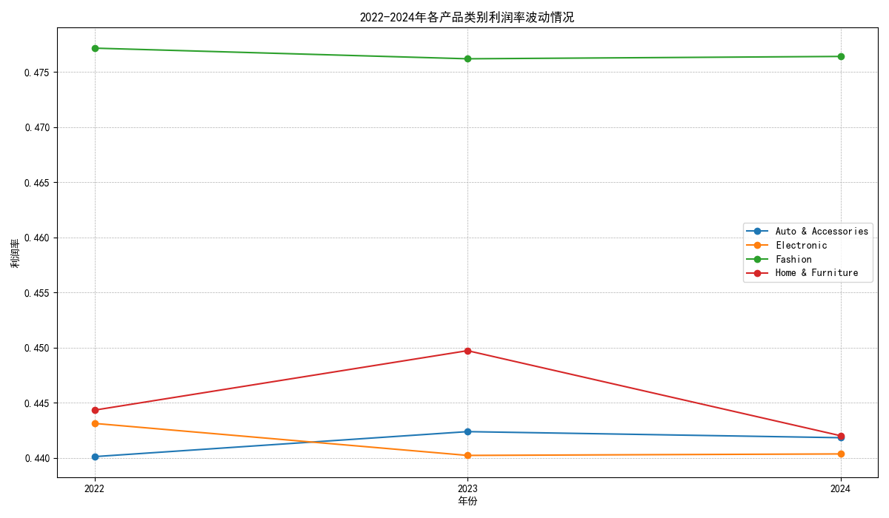
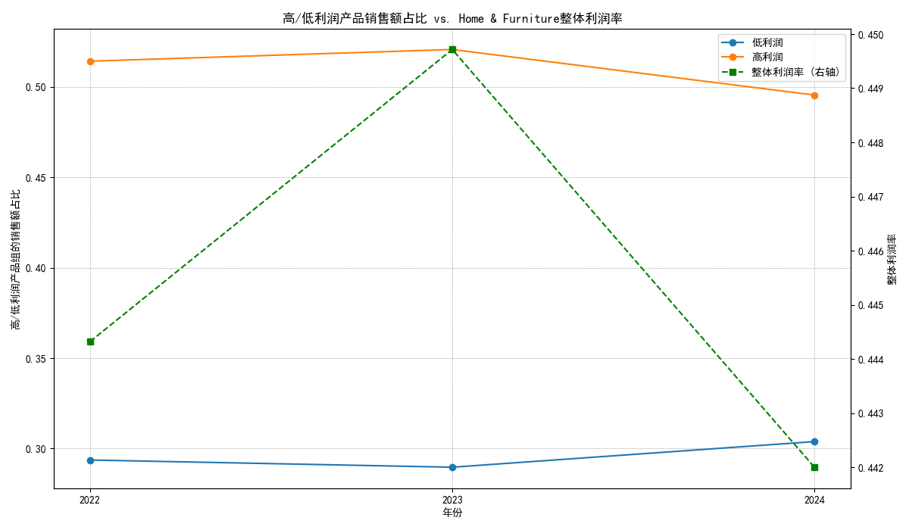
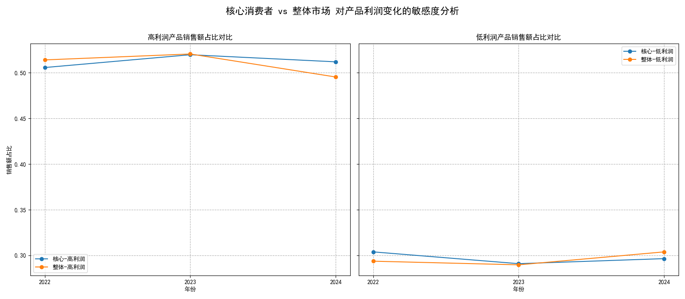

# 关于产品利润率波动、原因及核心客群敏感度的分析报告

## 摘要

本报告旨在分析2022至2024年间不同产品类别的利润率波动情况，并深入探究波动最剧烈的类别——**家居家具 (Home & Furniture)** 的波动原因。分析发现，其利润率波动并非由折扣引起，而是源于**内部高、低利润产品销售结构的年度变化**。

进一步通过RFM模型对消费者进行分层后，我们识别出了“核心消费者”群体。研究表明，该核心客群对导致利润率波动的购买行为变化**并不敏感**，他们的购买偏好相对稳定。利润率的波动主要由**非核心、价格敏感的普通消费者**行为所驱动。

基于以上洞察，报告最后提出了针对性的业务建议，旨在稳定利润率并深化客户关系管理。

---

## 1. 家居家具 (Home & Furniture) 类别利润率波动最为显著

通过对2022-2024年各产品类别的年度利润率进行分析，我们发现虽然所有类别的利润率都存在一定的变化，但“家居家具 (Home & Furniture)”类别的波动幅度是最大的。如下图所示，其利润率在2023年达到峰值后，在2024年出现了明显下滑。

*图1：2022-2024年各产品类别利润率波动情况*

这一发现促使我们聚焦于该类别，深入探究其利润率不稳定的根本原因。

---

## 2. 探究波动根源：产品销售结构的变化

最初我们假设利润率的波动可能与年度平均折扣水平有关，但数据显示，`Home & Furniture`类别的平均折扣在三年间几乎保持不变，因此折扣并非主要影响因素。

进一步的分析揭示了真正的原因：**类别内部不同利润水平的产品的销售额占比发生了变化**。

我们将该类别下的产品根据其利润率分为“高利润”和“低利润”两组。数据显示：
- **2022-2023年**：整体利润率上升。这与**高利润产品销售额占比上升**（从51.4%到52.1%）及**低利润产品占比下降**（从29.4%到29.0%）的趋势完全吻合。
- **2023-2024年**：整体利润率下降。这期间，**高利润产品销售额占比显著下降**（从52.1%到49.5%），而**低利润产品占比则相应上升**（从29.0%到30.4%）。

*图2：高/低利润产品销售额占比 vs. Home & Furniture整体利润率*

**结论**：`Home & Furniture`类别的利润率波动，直接由其内部高、低利润产品的销售此消彼长所驱动。

---

## 3. 核心消费者分析：对波动原因免疫力更强

为了解是哪些消费者群体的行为导致了上述的产品结构变化，我们运用RFM模型对所有客户进行了分层，识别出了205名“核心消费者”（高价值客户）。随后，我们对比了这部分群体与整体市场在`Home & Furniture`类别上的购买行为。

分析结果出人意料：**核心消费者对这种高/低利润产品的购买倾向变化并不敏感**。

如下图所示，尤其是在2023-2024年利润率下滑期间：
- **整体市场**中，高利润产品的销售占比大幅下降了 **2.52%**。
- 而在**核心消费者**中，该比例仅微降了 **0.78%**。
- 核心消费者对低利润产品的购买占比也远比整体市场稳定。

*图3：核心消费者 vs 整体市场 对高/低利润产品购买占比变化的对比*

**结论**：驱动`Home & Furniture`类别利润率波动的，并非我们的核心客户，而是**广大的非核心、可能对价格更敏感的普通或偶发性消费者**。他们在不同年份的购买选择差异，造成了整体销售结构的变化。

---

## 4. 业务建议与策略

基于以上分析，我们提出以下建议：

1.  **实施差异化的营销策略**:
    *   **面向非核心消费者**: 在市场整体消费力可能下降的年份（如2024年），应主动通过精准营销或捆绑销售等方式，**加强对高利润产品的推广**，引导这部分价格敏感的客群购买利润更高的商品，以“对冲”他们自发转向低利润商品的趋势，从而稳定整体利润率。
    *   **面向核心消费者**: 这部分客群价值高且购买偏好稳定。应**避免过度的价格促销**，转而通过会员权益、新品优先体验、优质服务等方式维护其忠诚度，巩固这部分稳定的高利润收入来源。

2.  **优化产品组合与库存管理**:
    *   动态监控高、低利润产品的销售趋势，尤其是非核心消费者的购买数据。
    *   当预见到低利润产品需求可能上升时，可适度调整库存和营销资源分配，但更关键的是准备好相应的**向上销售 (Up-sell)** 和**交叉销售 (Cross-sell)** 方案，将流量引导至利润更高的替代品或补充品上。

3.  **深化客户洞察**:
    *   将“购买高/低利润产品的倾向”作为用户画像的一个新维度，结合RFM模型，可以更精准地识别出“价格敏感型客户”和“价值导向型客户”，并实施更具针对性的互动和营销活动。
