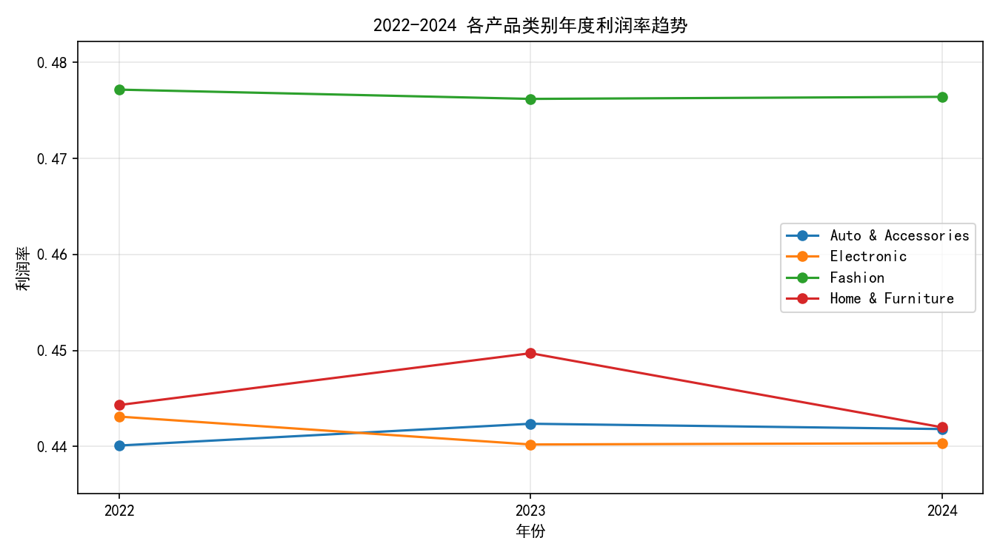
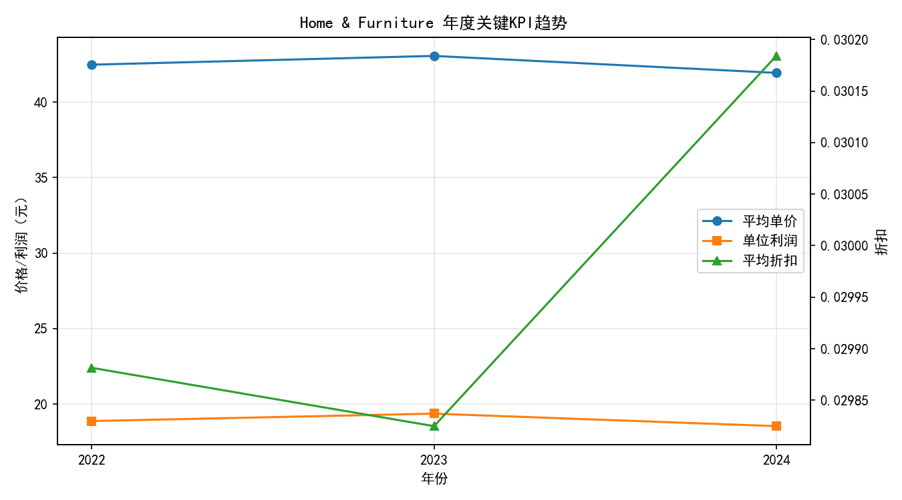
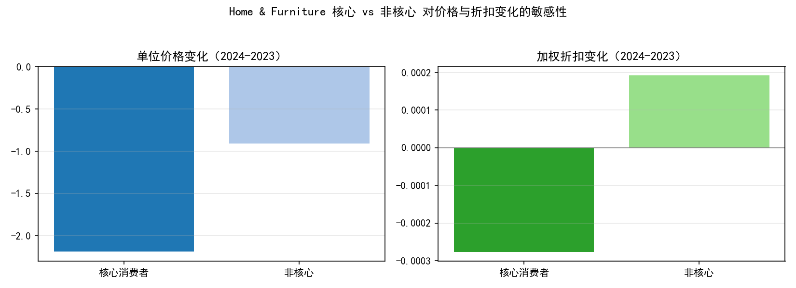

# 2022-2024 各品类利润率波动与RFM敏感性分析报告

作者：数据分析师

## 结论要点（先读我）
- 利润率波动幅度最大品类：Home & Furniture（三年利润率极差=0.0077，即0.77个百分点）。
- 2024年该品类利润率较2023年下降的主要驱动：
  - 单价下滑是核心驱动：2023→2024 平均单价从43.06降至41.93（-1.12），单位利润从19.36降至18.53（-0.83）。
  - 折扣变化极小：平均折扣仅从0.02983微升至0.03018（+0.00036），对利润率影响有限。
  - 运费强度稳定：运费/销售额比在0.044-0.045之间，非主要原因。
  - 产品结构层面（以2024年Top10产品为基准集合）加权毛利率由0.4497降至0.4420，表明2024年同一核心产品组合的毛利表现整体下滑，进一步印证“价格/结构细分层面”而非运费/折扣导致的下降。
- RFM核心消费者 vs 非核心的敏感性：
  - 非核心消费者对利润率的负面波动更敏感：2024-2023利润率变化，非核心为-0.00883，而核心仅-0.00195。
  - 非核心的折扣更“抬头”：2024-2023加权折扣变化为+0.00019；核心为-0.00028。
  - 尽管核心消费者单价降幅更大（-2.19 vs 非核心 -0.91），其利润率降幅更小，推测核心客群商品偏好/附加购更优，使其对利润波动的“抗压性”更强；非核心更易被折扣驱动，且对低毛利子品的偏好更强，放大利润下滑。

## 数据与方法说明
- 数据库：dacomp-017.sqlite
- 关键表：
  - 订单信息：客户编号、订单编号、订单日期、产品类别、产品、销售额、数量、折扣、利润、运费、订单优先级等
  - 客户信息：客户基本属性
  - 商品浏览：浏览时长、点赞、分享、加购等行为
- 时间范围：2022-01-13 至 2024-12-31
- 度量定义：
  - 年度利润率（category-year）：SUM(利润) / SUM(销售额)
  - 波动幅度：同一品类三年利润率的极差（max-min）
  - RFM（在目标品类内计算）：Recency=相对最近消费天数；Frequency=订单数；Monetary=销售额。四分位打分，R值反向高分最好。核心消费者=R=4、F=4、M=4。

## 一、各品类利润率三年趋势与波动


- 利润率波动幅度（极差）排名：
  - Home & Furniture：0.4497→0.4420，极差≈0.0077（最大）
  - Electronic：极差≈0.0029
  - Auto & Accessories：极差≈0.0023
  - Fashion：极差≈0.0010（最稳）

解读：
- Home & Furniture 在2023年达到阶段性高位（0.4497），2024年回落至0.4420，回吐0.77个百分点。

## 二、Home & Furniture 深度诊断（价格/折扣/运费/结构）


关键KPI（2023→2024）：
- 平均单价：43.06 → 41.93（-1.12）
- 单位利润：19.36 → 18.53（-0.83）
- 平均折扣：0.02983 → 0.03018（+0.00036，变化极小）
- 利润率：0.4497 → 0.4420（-0.0077）
- 运费强度（SQL核对）：2023为0.0450，2024为0.0442，稳定略降，非主要因素

产品结构（以2024年Top10产品作为分析集合）：
- 2024年Top10销售占比在2023/2024均为100%，说明该集合基本覆盖主要销量产品。
- Top10集合的加权毛利率：2023为0.4497，2024为0.4420（与整体一致），说明2024的毛利下滑不是由“Top10之间的占比变化”驱动，而更可能是：
  - 同产品下的成交单价走低（标价或成交结构变化），或
  - 产品子款式/规格（仍归为同名产品）在2024更偏向低价/低毛利变体。

辅助SQL（示例）：
- 年度利润率与波动幅度
  - SELECT 产品类别, 年份, SUM(销售额) AS 总销售额, SUM(利润) AS 总利润, 总利润/总销售额 AS 利润率 FROM 订单信息 WHERE 年份 in (2022,2023,2024) GROUP BY 产品类别, 年份
  - 再聚合计算极差（max(利润率)-min(利润率)）

## 三、RFM分层与敏感性对比（核心 vs 非核心）
方法：
- 在Home & Furniture品类内计算每位客户的R/F/M，四分位打分。
- 核心消费者定义：R=4、F=4、M=4。
- 对比核心 vs 非核心在2023与2024之间“单位价格变化、加权折扣变化、利润率变化”。

可视化：


关键对比（2024-2023）：
- 单位价格变化：核心 -2.19；非核心 -0.91
- 加权折扣变化：核心 -0.00028；非核心 +0.00019
- 利润率变化：核心 -0.00195；非核心 -0.00883

解读与结论：
- 非核心消费者利润率跌幅更大（-0.883个百分点），对不利因素更敏感；且其折扣“上升”与之相符，可能是通过更高折扣来促动非核心成交，但带来利润率下滑。
- 核心消费者虽然单价降幅更大，但折扣更收敛，利润率仅小幅回落，说明核心人群对品牌/产品具有更强偏好，承压能力更强，且可能购买更优毛利的组合（如加购配件等）。

## 四、业务建议（规范性）
1) 价格与促销
- 避免“一刀切”降价：2024利润率下行主要来自价格端，建议建立品类底价与动态定价规则，对敏感SKU设定最低标价或折扣上限。
- 针对非核心人群的促销重构：减少单纯降价，改为“价值型优惠”（捆绑、加购满减、赠品），提升有效客单与毛利。
- 对核心消费者：维持价格相对坚挺，提供会员专属权益（提前购、延保、安装/服务加成），以非价格方式提升黏性。

2) 产品结构与组合
- 梳理2024低毛利子款：拆分同名产品下的低价变体，优化曝光/排序，提升高毛利变体权重。
- 组合包装：配高毛利配件/服务包，特别在非核心客群触点中引导，提高单笔毛利。
- 供应链议价与成本优化：对毛利承压SKU进行供方复盘，争取更优进价或替代方案。

3) 分群运营与触达
- RFM驱动的人群分层运营：
  - 核心：以权益提升和内容教育为主（评测、场景搭配），减少价格刺激。
  - 非核心：以“结构性提升”为目标的促销（捆绑、高毛利引导），减少直降与广撒式优惠券。
- 个性化推荐与排序：将高毛利或高复购潜力SKU在非核心客群中提权。

4) 监控与试验
- 建立价格-毛利-销量三维看板，按细分子款式监控“单价/折扣/毛利率”。
- 进行小流量价格与组合A/B实验，识别弹性高SKU，形成差异化定价策略。

## 附：关键Python绘图代码片段
说明：所有图片已保存在当前目录下（非子目录）。绘图时加入中文与负号显示设置。
```python
import matplotlib.pyplot as plt
plt.rcParams['font.sans-serif'] = ['SimHei']
plt.rcParams['axes.unicode_minus'] = False
# 后续分别绘制：
# 1) 各品类利润率趋势 -> category_margin_trend.png
# 2) Home & Furniture KPI趋势 -> hf_kpi_trend.png
# 3) RFM核心敏感性对比 -> hf_core_sensitivity.png
```

## 主要数值摘录（便于复核）
- Home & Furniture 年度KPI：
  - 2022：利润率 0.4443；平均单价 42.48；单位利润 18.87；平均折扣 0.02988
  - 2023：利润率 0.4497；平均单价 43.06；单位利润 19.36；平均折扣 0.02983
  - 2024：利润率 0.4420；平均单价 41.93；单位利润 18.53；平均折扣 0.03018
- Top10产品（覆盖主要销量）加权毛利率：2023→2024 从 0.4497 降至 0.4420
- 核心 vs 非核心（2024-2023变化）：
  - 单位价格：核心 -2.19；非核心 -0.91
  - 加权折扣：核心 -0.00028；非核心 +0.00019
  - 利润率：核心 -0.00195；非核心 -0.00883

## 局限与后续
- 产品“同名不同子款/规格”的差异无法在当前字段中完全拆解，建议补充SKU层级或成本字段，以进行更细的结构-成本归因。
- 可结合“商品浏览”行为做从浏览到购买的路径分析，识别非核心用户的转化瓶颈与内容优化点。
