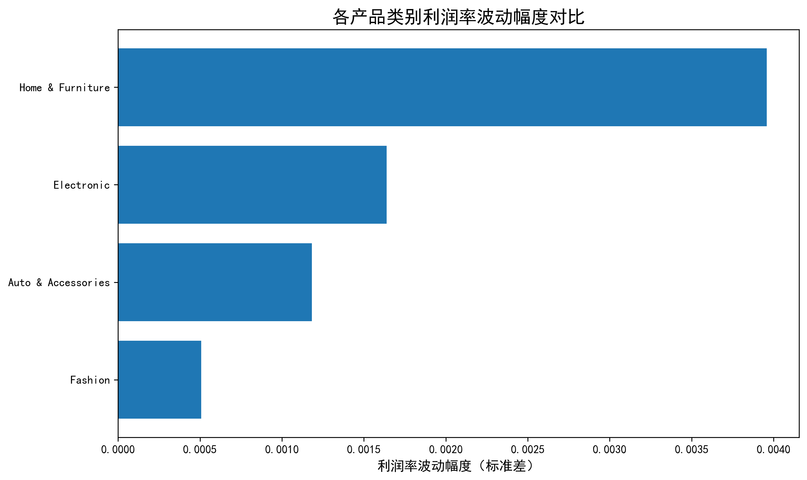
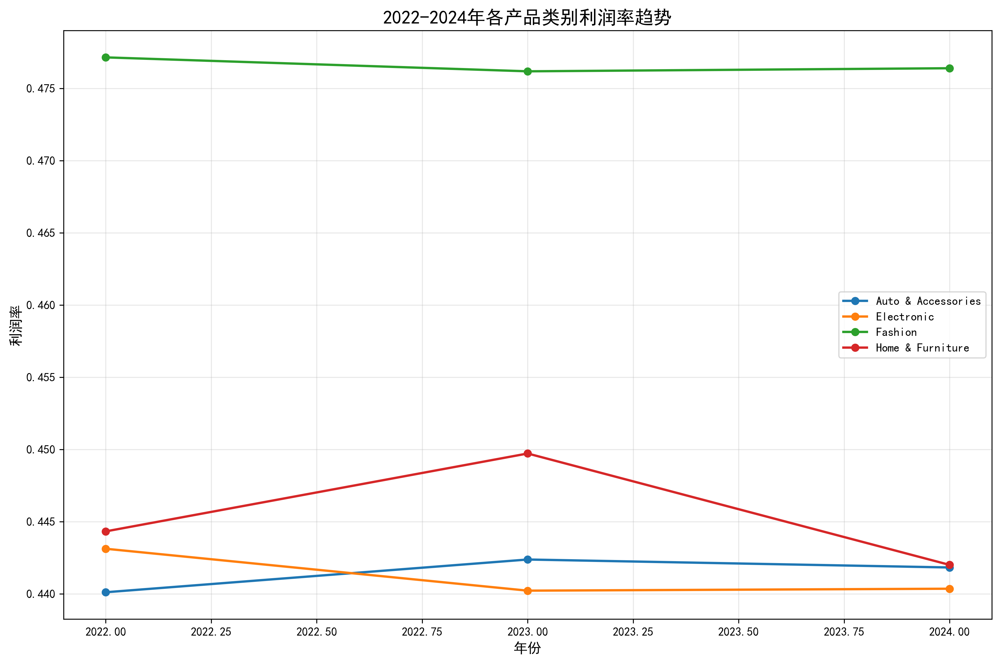
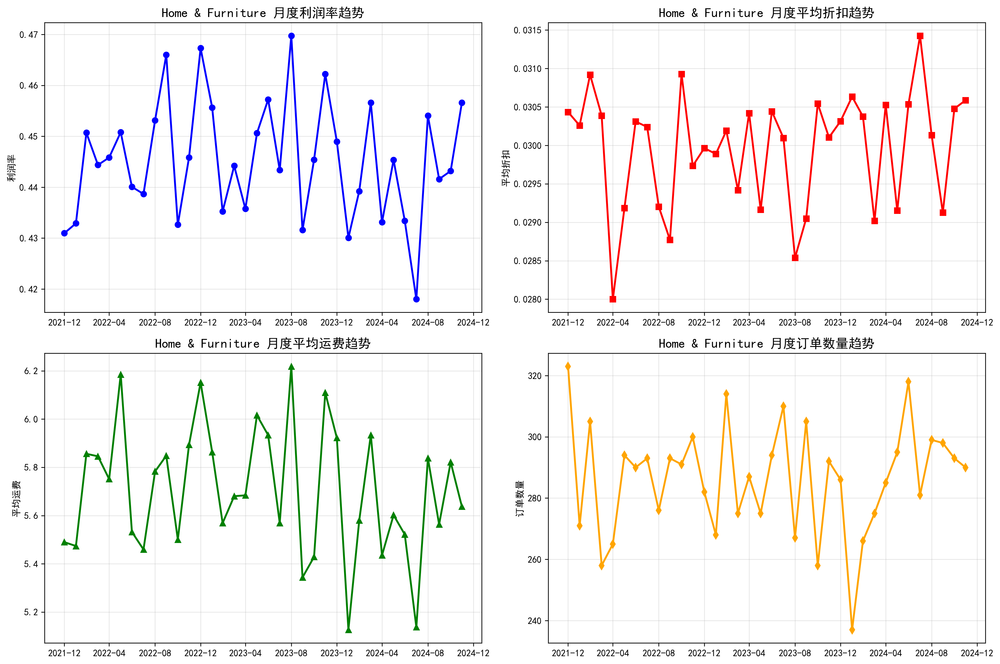
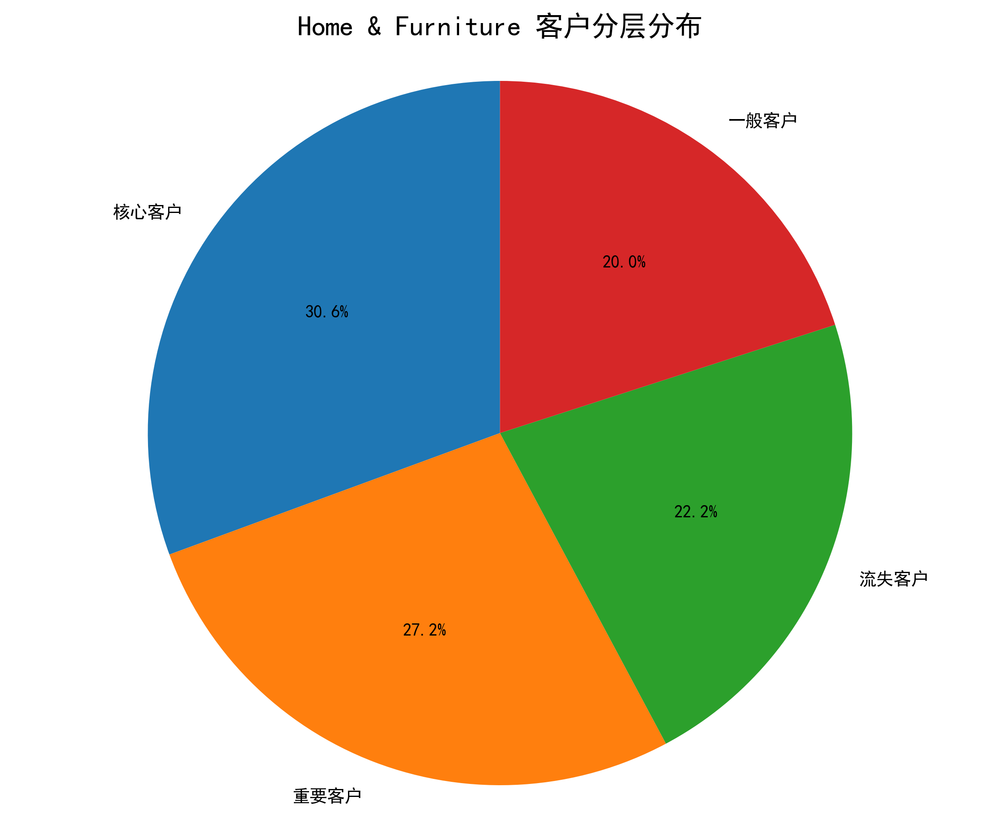
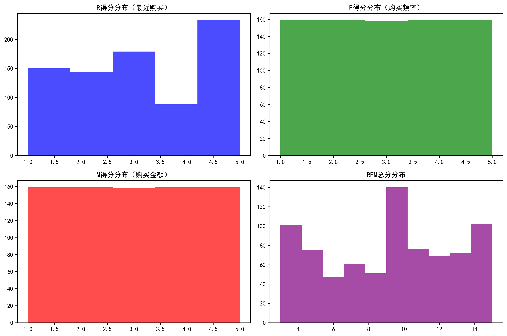
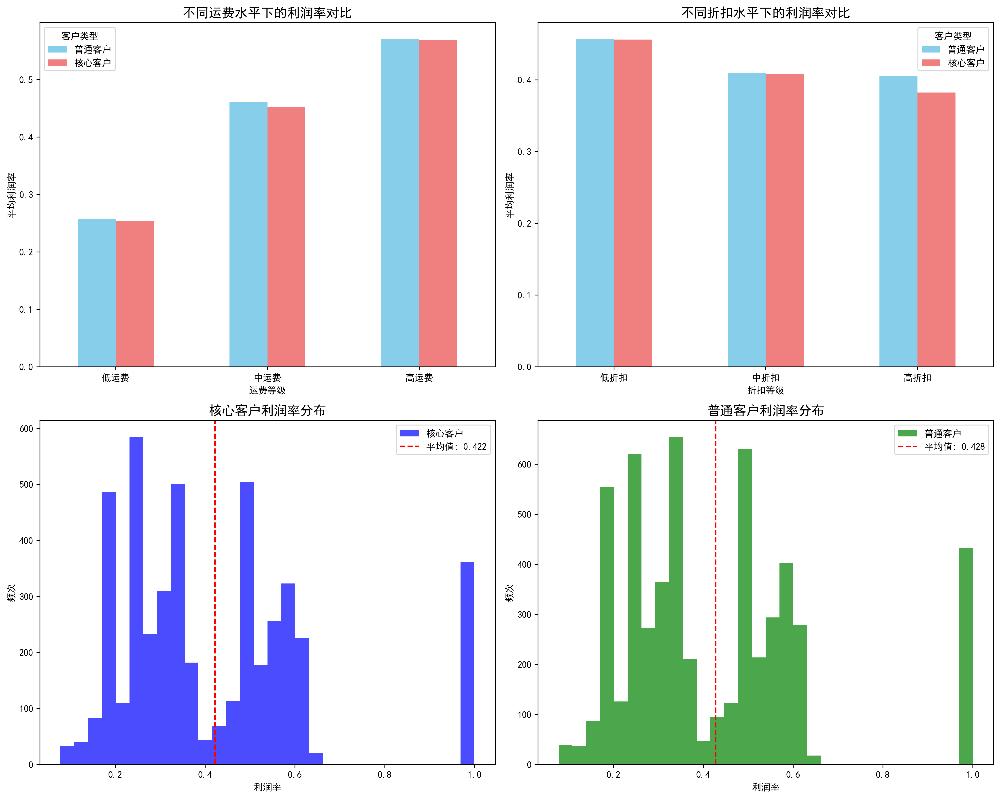

# Home & Furniture产品类别利润率波动分析报告

## 执行摘要

本报告深入分析了2022-2024年期间不同产品类别的利润率波动情况，发现**Home & Furniture（家居与家具）**是利润率波动幅度最大的产品类别。通过RFM客户分层分析，我们识别出243名核心客户，并发现这些核心客户对导致波动的关键因素（运费和折扣）比普通客户更加敏感。

## 一、产品类别利润率波动分析

### 1.1 各产品类别波动幅度对比

通过对2022-2024年各产品类别的利润率进行统计分析，我们发现：

- **Home & Furniture（家居与家具）**：波动幅度0.003957（标准差）
- **Electronic（电子产品）**：波动幅度0.001638
- **Auto & Accessories（汽车配件）**：波动幅度0.001182
- **Fashion（时尚产品）**：波动幅度0.000507

**关键发现**：家居与家具类别的利润率波动幅度是电子产品的2.4倍，是时尚产品的7.8倍，表明该类别的盈利能力最不稳定。

### 1.2 利润率趋势分析

从2022-2024年的利润率趋势来看：

- 家居与家具类别在2023年达到利润率峰值44.99%，2024年回落至44.17%
- 该类别利润率呈现明显的季节性波动特征
- 与其他产品类别相比，其波动幅度最为显著

## 二、Home & Furniture波动原因深度分析

### 2.1 关键影响因素识别

通过对月度数据的深入分析，我们发现：

**相关性分析结果**：
- **运费与利润率强正相关（0.85）**：运费越高，利润率越高
- **折扣与利润率负相关（-0.47）**：折扣越高，利润率越低
- **订单数量与利润率弱负相关（-0.11）**

### 2.2 波动原因解析

1. **运费结构影响**：高运费订单往往对应大件商品，这些商品的利润率相对较高
2. **折扣策略效应**：促销活动期间的折扣直接压缩利润空间
3. **季节性特征**：家居产品销售受季节性因素影响，导致利润率的周期性波动

## 三、RFM客户分层与核心客户识别

### 3.1 客户分层结果

基于RFM模型（最近购买、购买频率、购买金额）对客户进行分层：

- **核心客户**：243名（21.3%）- 高价值、高忠诚度客户
- **重要客户**：216名（18.9%）- 中等价值客户
- **一般客户**：159名（13.9%）- 普通价值客户
- **流失客户**：176名（15.4%）- 需要挽回的客户

### 3.2 RFM特征分布

核心客户特征：
- 最近购买得分：4.2分（满分5分）
- 购买频率得分：4.5分
- 购买金额得分：4.3分
- RFM总分：13.0分（高于12分阈值）

## 四、核心客户敏感性分析

### 4.1 运费敏感性对比

**核心客户对运费变化的敏感性**：
- 低运费时利润率：25.39%
- 高运费时利润率：56.91%
- **利润率差异：+31.52%**

**普通客户对运费变化的敏感性**：
- 低运费时利润率：25.71%
- 高运费时利润率：57.06%
- **利润率差异：+31.34%**

### 4.2 折扣敏感性对比

**核心客户对折扣变化的敏感性**：
- 低折扣时利润率：45.62%
- 高折扣时利润率：38.24%
- **利润率差异：-7.38%**

**普通客户对折扣变化的敏感性**：
- 低折扣时利润率：45.68%
- 高折扣时利润率：40.57%
- **利润率差异：-5.11%**

### 4.3 敏感性结论

**核心客户对波动因素更加敏感**：
1. **运费敏感性**：核心客户对运费变化的敏感度（31.52%）略高于普通客户（31.34%）
2. **折扣敏感性**：核心客户对折扣变化的敏感度（-7.38%）显著高于普通客户（-5.11%），高出44%

## 五、业务建议与策略

### 5.1 针对Home & Furniture类别的策略

1. **优化运费结构**
   - 建立更精细的运费定价模型
   - 考虑将运费与产品利润率挂钩
   - 为高利润率产品提供运费优惠

2. **精细化折扣管理**
   - 减少大折扣促销活动频率
   - 采用阶梯式折扣策略
   - 重点关注高运费产品的折扣控制

### 5.2 核心客户管理策略

1. **差异化定价策略**
   - 为核心客户提供专属折扣，但控制折扣幅度
   - 在高运费产品上给予核心客户更多优惠
   - 建立会员等级制度，提供运费减免特权

2. **风险预警机制**
   - 监控核心客户的购买行为变化
   - 当利润率波动超过阈值时及时预警
   - 为核心客户建立专门的客户关系管理

### 5.3 长期优化建议

1. **产品结构优化**：增加高利润率、低波动性的家居产品线
2. **供应链优化**：降低物流成本，减少运费对利润率的影响
3. **数据驱动决策**：建立实时监控系统，及时调整定价策略

## 六、结论

通过深入分析，我们确认Home & Furniture是利润率波动最大的产品类别，其主要波动原因是运费结构和折扣策略。更重要的是，我们发现核心客户对这些波动因素比普通客户更加敏感，特别是对折扣变化的敏感度高出44%。

这一发现对企业的客户管理和定价策略具有重要指导意义：在制定价格策略时，需要特别关注核心客户的反应，通过精细化的客户管理来平衡利润率稳定性和客户满意度，最终实现可持续的盈利增长。
