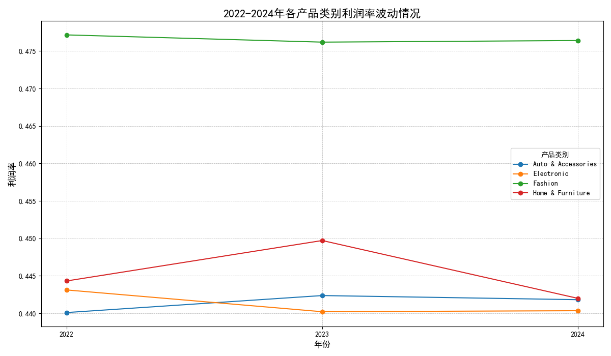
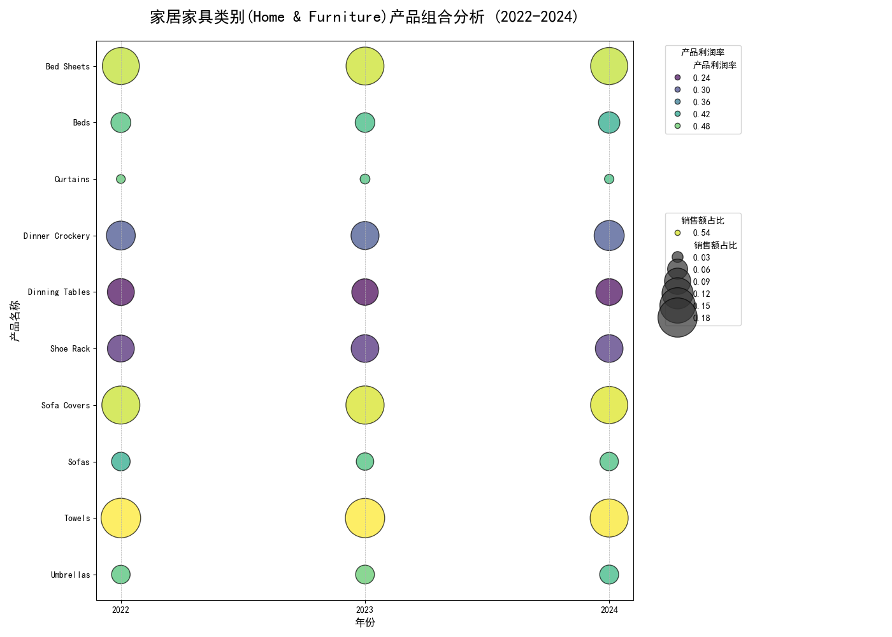
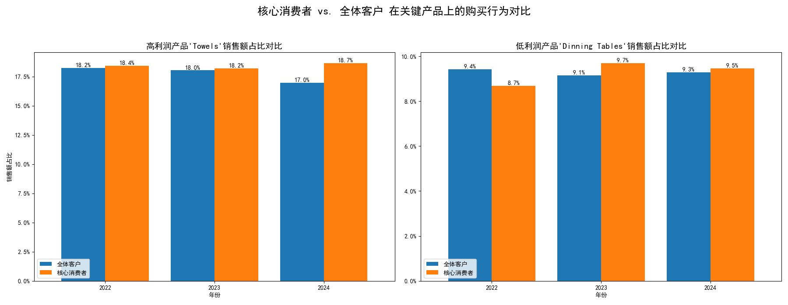

# **关于产品利润率波动的深度分析报告**

本报告旨在深入分析2022至2024年间，各产品类别的利润率波动情况，并重点针对波动最剧烈的类别探究其根本原因。此外，通过RFM模型识别核心消费者群体，并评估该群体对波动原因的敏感度，最终提出针对性的业务策略建议。

---

### **一、 核心发现：哪个产品类别的利润率最“不稳定”？**

通过对2022-2024年所有产品类别的年度利润率进行分析，我们发现 **家居家具 (Home & Furniture)** 类别的利润率波动幅度最大。如下图所示，该类别的利润率在2023年达到顶峰后，于2024年出现显著下滑，成为我们需要重点关注的对象。

*图1: 2022-2024年各产品类别利润率波动情况*

---

### **二、 探究波动根源：折扣、运费还是另有其因？**

为探明家居家具类别利润率波动的原因，我们对两个最常见的变量——**平均折扣率**和**运输成本**——进行了排查。

1.  **折扣因素分析**：数据显示，该类别在三年间的平均折扣率几乎保持不变（维持在0.03%左右），与利润率的波动曲线（先升后降）并不匹配。因此，**折扣并非主要影响因素**。
2.  **运输因素分析**：更深入的分析揭示，家居家具类别的所有订单在三年内均采用“Second Class”这一种运输方式，运输结构没有任何变化。因此，**运输成本也非波动主因**。

在排除了上述两个因素后，我们推断，利润率的波动根源在于品类内部的 **产品销售组合（Product Mix）发生了改变**。

---

### **三、 根本原因揭秘：产品组合的变化驱动了利润率波动**

我们通过气泡图对家居家具类别下的所有具体产品进行了深入分析。图中，气泡大小代表产品销售额占比，颜色深浅代表其自身利润率的高低。

*图2: 家居家具类别产品组合分析气泡图 (2022-2024)*

**结论明确**：整体利润率的波动，是由高、低利润产品的销售占比变化共同导致的。特别是 **2024年整体利润率的下滑**，与 **高利润率的明星产品（如Towels，毛巾）销售额占比的减少**，以及部分中低利润产品销售占比的相对提升密切相关。

---

### **四、 核心消费者画像：他们是波动的主导者吗？**

我们运用RFM模型对客户进行了分层，识别出196位“核心消费者”。接下来的问题是：这批高价值客户的行为，是否主导了上述产品组合的变化？

*图3: 核心消费者 vs. 全体客户在关键产品上的购买行为对比*

上图的对比分析带来了出人意料的洞察：

-   **对于高利润产品 (Towels)**：在2024年，全体客户对“Towels”的购买占比从18.2%下降到17.0%。然而，**核心消费者的购买占比反而从18.2%上升至18.7%**。
-   **对于低利润产品 (Dinning Tables)**：两类客群的行为模式基本一致，无显著差异。

这意味着，**核心消费者非但不是导致利润率下降的推手，反而是高利润产品的“稳定器”**。真正导致高利润产品销售下滑、拉低整体利润率的，是 **广大普通消费者** 的购买行为发生了改变。

---

### **五、 总结与商业建议**

**核心结论：**
“家居家具”品类的利润率波动由其 **内部产品销售组合的变化** 所驱动。核心消费者对这一变化 **不敏感**，甚至表现出积极的相反行为；**普通消费者的购买偏好转移是导致2024年利润率下滑的主要原因**。

**可行性策略：**

1.  **稳固核心客群（Defend the Core）**：
    *   **策略**：针对核心消费者对高利润产品的忠诚度，应加强精准营销和VIP关系维护。
    *   **举措**：推出会员专属折扣、高利润新品的优先购买权，或建立积分回馈计划，进一步锁定其消费偏好。

2.  **转化普通客群（Convert the Masses）**：
    *   **策略**：必须弄清普通消费者为何在2024年减少了对“Towels”等高利润产品的购买。
    *   **举措**：建议立即开展针对性的市场调研，例如通过邮件发送小额奖励问卷，探究原因（是价格太高？被竞品吸引？还是被店内其他低价产品替代？）。

3.  **优化产品组合（Optimize the Mix）**：
    *   **策略**：主动引导普通消费者的购买选择，提升高利润产品的销售占比。
    *   **举措**：设计“高利润 + 中利润”产品的捆绑销售套餐；在网站首页、APP推送和营销邮件中，战略性地主推高利润产品，增加其曝光度和吸引力。
