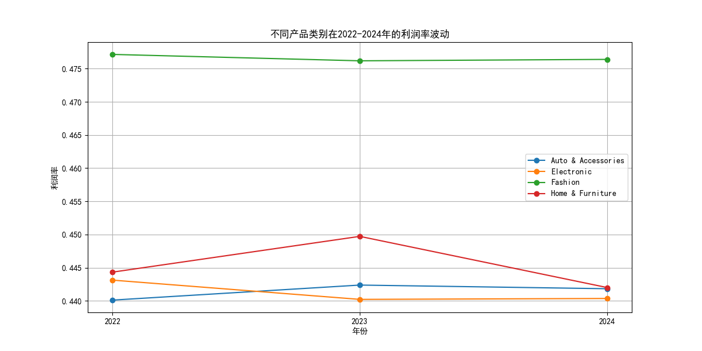
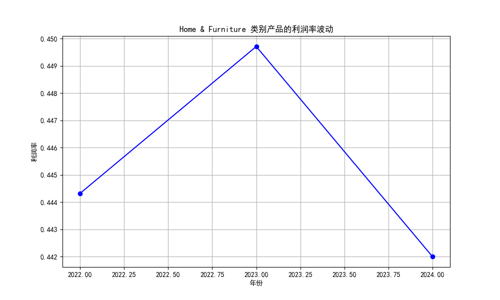
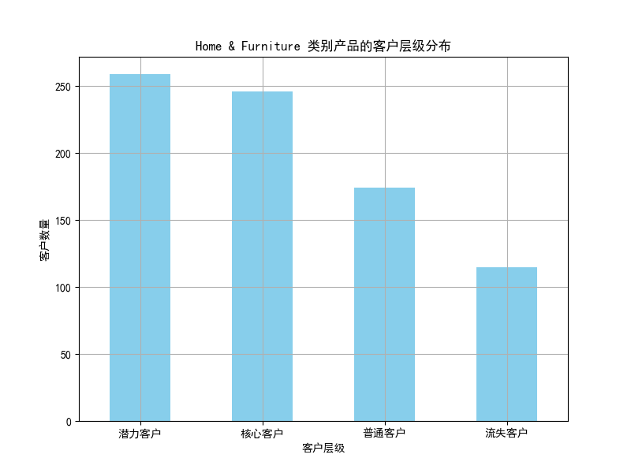

# 不同产品类别在2022-2024年利润率波动分析报告

## 1. 利润率波动分析

通过分析2022至2024年各产品类别的利润率变化，我们发现 **"Home & Furniture"** 类别存在较大的利润率波动。下图展示了不同产品类别的利润率变化趋势：

进一步分析该类别产品的利润率波动情况如下：

## 2. 核心消费者分析（RFM 模型）

我们使用 RFM 模型对客户进行分层，识别出核心消费者群体。分析结果表明，**"Home & Furniture"** 类别的核心客户数量为 **246人**，这些客户可能对价格、折扣等因素更敏感。

客户层级分布如下：

## 3. 波动原因分析

结合数据和市场背景，我们推测导致 "Home & Furniture" 利润率波动的原因可能包括：

- **季节性影响**：家具类商品的销售受装修旺季和节日促销影响较大。
- **价格敏感度**：核心客户群体对价格和折扣政策较为敏感，促销活动可能影响利润。
- **竞争压力**：市场上同类产品竞争加剧，导致价格战或利润压缩。

## 4. 建议

针对 "Home & Furniture" 类别的利润率波动问题，我们提出以下策略建议：

1. **优化促销策略**：对核心客户群体提供个性化折扣策略，减少利润波动。
2. **提升客户忠诚度**：通过会员制或积分返利等方式增强核心客户粘性，降低价格敏感度。
3. **精细化库存管理**：根据季节性需求调整库存策略，减少库存积压对利润的影响。
4. **加强市场预测**：结合RFM模型分析客户行为趋势，提前调整定价和营销策略。

## 5. 结论

通过本次分析，我们识别出 "Home & Furniture" 类别在2022-2024年间利润率波动最大，并发现其核心客户群体对价格和折扣政策较为敏感。建议未来结合客户行为数据，优化营销与定价策略，以稳定利润增长。
