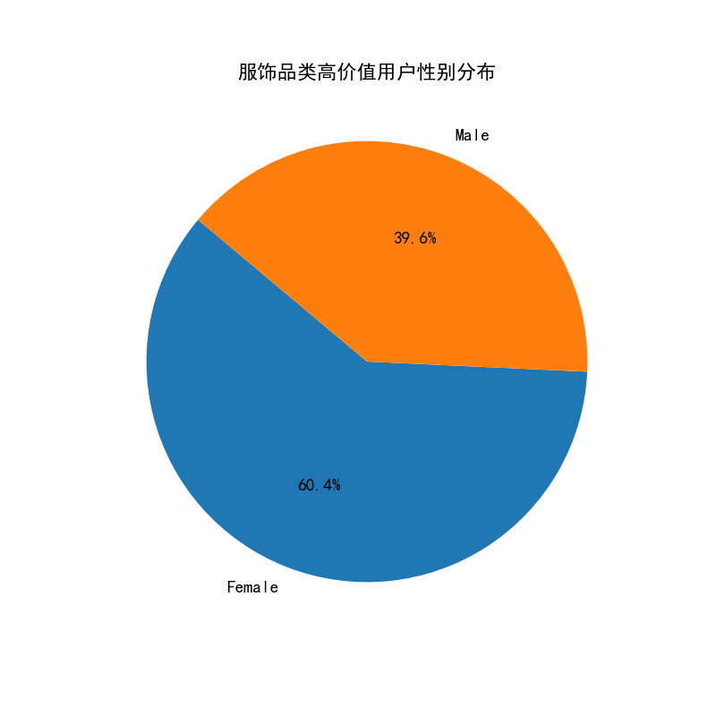
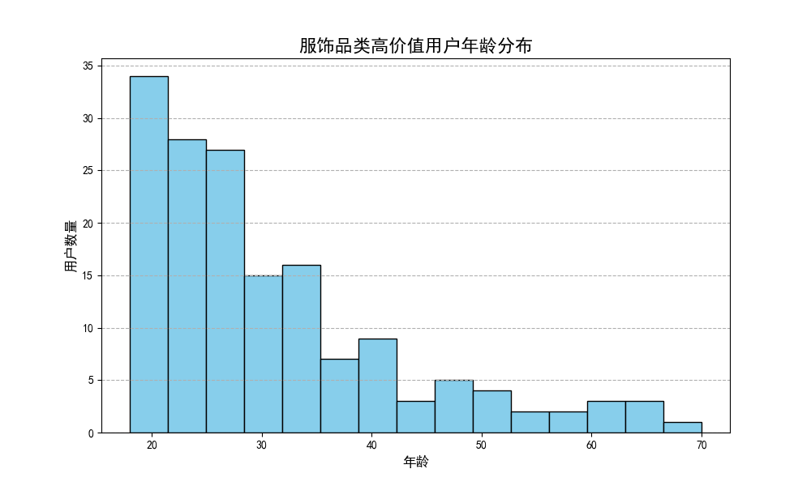
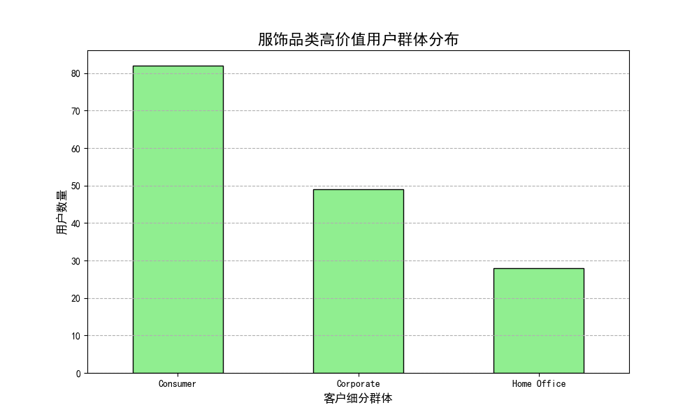

# 服饰品类电商经营策略分析报告

## 一、核心结论

为了在电商平台上成功经营服饰品类并获得较高利润，商家应重点关注以下核心用户画像：**22-35岁的年轻女性消费者**。数据显示，这部分群体是利润贡献最高的核心价值用户。精准定位并服务好她们，是提升盈利能力的关键。

## 二、数据分析洞察

我们对平台内的订单数据和客户信息进行了深度关联分析，聚焦于服饰品类（Fashion），识别出贡献了最多利润的用户群体，并总结出以下三大核心洞察：

### 1. 利润贡献高度集中，高价值用户是关键

分析发现，服饰品类的利润分布呈现出典型的“二八定律”。**前20%的高价值用户贡献了近35%的总利润**。这意味着商家应将有限的资源优先投入到这部分“关键少数”身上，通过精细化运营提升她们的忠诚度和消费潜力，从而实现利润最大化。

### 2. 女性用户是绝对的消费主力

在高价值用户群体中，**女性用户占比高达60.4%**，数量远超男性。这明确指出，在服饰品类中，女性强大的购买意愿和消费能力是驱动销售和利润增长的核心引擎。

### 3. 年轻消费者与普通大众市场是利润核心来源

从年龄和客户群体来看，高价值用户的画像进一步聚焦：
*   **年龄分布**：高价值用户的年龄主要集中在 **22岁至35岁** 之间，平均年龄约为31岁。这个群体的消费者通常处于职业上升期，既有独立的经济能力，又对时尚和生活品质有较高追求。
*   **用户群体**：**普通消费者 (Consumer)** 在高价值用户中占比超过一半（51.6%），是服饰消费的中坚力量。这表明，虽然企业和家庭办公市场也有一定潜力，但主要利润来源仍是广大的个人消费市场。

## 三、经营策略建议

基于以上用户画像分析，我们为服饰品类商家提供以下可行的经营策略：

1.  **产品策略：聚焦年轻女性审美**
    *   **选品**：重点开发和引进符合22-35岁年轻女性审美的时尚单品、通勤装和休闲服饰。关注潮流趋势，保持产品更新频率。
    *   **定价**：设定符合年轻白领消费能力的价格带，同时可以推出一些高品质、设计感强的精品系列，满足其对生活品质的追求。

2.  **营销策略：精准触达，内容共鸣**
    *   **渠道**：在年轻女性活跃的社交媒体平台（如小红书、抖音、微博）进行重点营销投入，通过KOL/KOC合作、内容种草等方式精准触达目标用户。
    *   **内容**：营销内容应围绕“时尚穿搭”、“职场形象”、“生活美学”等主题，与目标用户建立情感共鸣，而不仅仅是产品推销。

3.  **用户运营策略：提升高价值用户粘性**
    *   **会员体系**：建立针对高价值用户的VIP会员体系，提供新品优先体验、专属折扣、生日礼遇等特权服务，提升用户忠诚度。
    *   **个性化推荐**：利用数据分析，根据用户的购买历史和浏览行为，进行个性化的商品推荐，刺激复购，提升客单价。

通过以上策略，服饰品类商家可以更精准地把握市场脉搏，将资源集中在最具价值的用户身上，从而在激烈的电商竞争中获得持续的利润增长。
