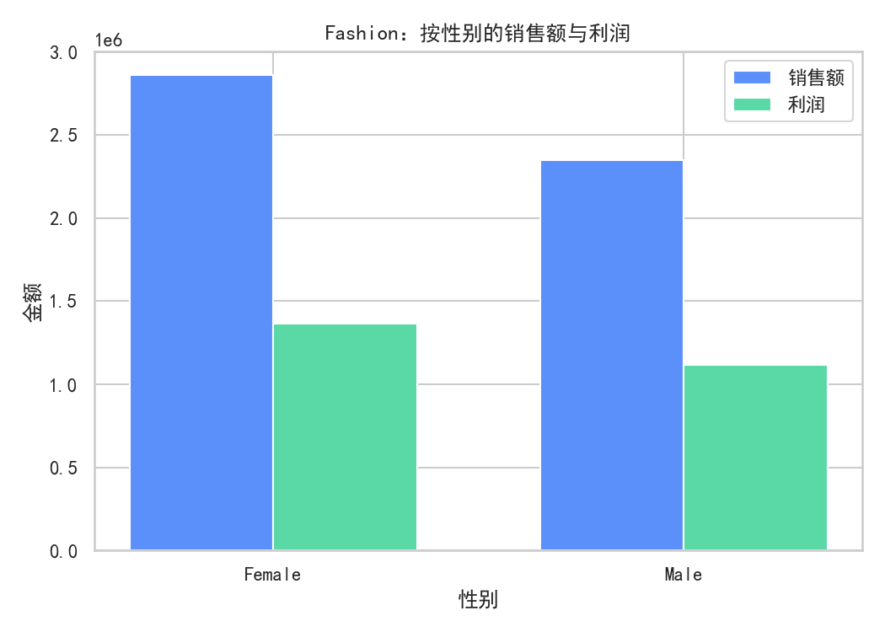
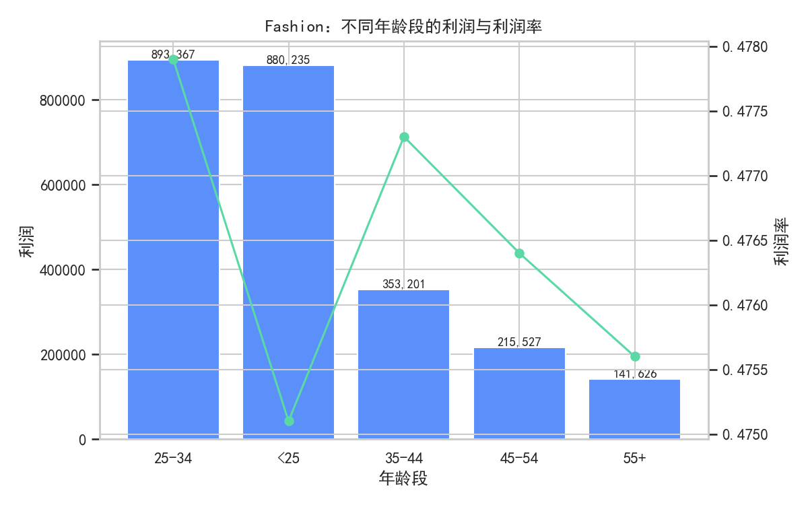
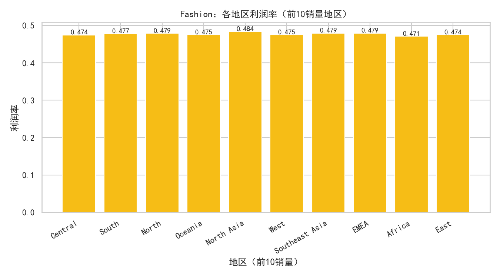
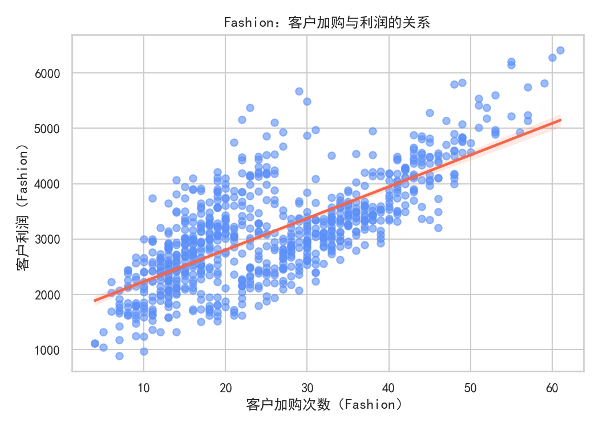

# 在某电商平台做好“服饰”品类，应该重点关注哪些用户画像（基于订单+用户+浏览数据的诊断性分析）

以下结论基于对数据库 dacomp-018.sqlite 三张表（订单信息、客户信息、商品浏览）的联合分析。为避免客户表重复行导致的连接放大，分析时对客户维度按客户编号仅保留一条记录（不进行数据清洗，仅用于防止重复累计）。并使用Python绘制了图表（文件名见文中）。

重要说明（绘图代码中的字体与负号设置）
```python
plt.rcParams['font.sans-serif'] = ['SimHei']
plt.rcParams['axes.unicode_minus'] = False
```

一、总体概览：服饰是平台中的绝对大头，利润率领先
- 各品类（来自订单信息表）：
  - Fashion：销售额约 5,212,097，利润约 2,483,955，利润率约 47.66%
  - Home & Furniture：销售额约 1,319,407，利润率约 44.54%
  - Auto & Accessories：销售额约 1,097,067，利润率约 44.14%
  - Electronic：销售额约 394,738，利润率约 44.13%
- 解读：服饰品类不仅规模最大，同时利润率也更高，是该平台核心利润来源。优化服饰用户画像运营的边际收益更大。

二、在“服饰(Fashion)”内部的用户画像表现
以下分群分析均在“订单信息 ×（去重）客户信息”下计算，避免重复连接放大。

1) 性别画像
- 女性：销售额 2,860,588，利润 1,366,499，利润率 47.77%
- 男性：销售额 2,351,509，利润 1,117,457，利润率 47.52%
- 小结：女性在规模与利润都更高，且利润率略高。优先度：女性 > 男性。
- 可视化：见“按性别的销售额与利润”图


2) 年龄画像
- 25-34：销售额 1,869,225，利润率 47.79%
- 小于25：销售额 1,852,681，利润率 47.51%
- 35-44：销售额 739,968，利润率 47.73%
- 45-54：销售额 452,454，利润率 47.64%
- 55+：销售额 297,769，利润率 47.56%
- 小结：<25 与 25-34 两个年轻年龄段贡献了绝大部分销售额，且利润率不输其他年龄段，是服饰的主力客群。
- 可视化：见“不同年龄段的利润与利润率”图


3) 客户细分群体（类似B2C/B2B）
- Consumer：销售额 2,679,128，利润率 47.44%
- Corporate：销售额 1,574,181，利润率 47.87%
- Home Office：销售额 958,788，利润率 47.90%
- 小结：B2C（Consumer）体量最大；但B2B（Corporate/Home Office）利润率略高。想要做“利润率优先”，建议加大对B2B场景的渗透；想要做“规模优先”，重点仍是Consumer。

4) 地区画像
- 销售规模靠前的地区：Central、South、North、Oceania
- 利润率更高的地区：North Asia（48.37%）、EMEA（47.93%）、Southeast Asia（47.92%）、Caribbean（48.11%）、Canada（47.98%）
- 小结：如果追求绝对规模，Central/South/North/Oceania更值得覆盖与加深；若追求利润率，North Asia/EMEA/SE Asia等跨境区域更具优势。
- 可视化：见“各地区利润率（前10销量地区）”图


三、行为信号：浏览与加购强相关于利润（选择“谁值得重点跟进”的关键指标）
基于“商品浏览 ×（去重）客户 × 订单信息”的客户级合并，计算参与度与利润的相关性：
- 浏览时长 与 客户利润：相关系数 ≈ 0.768
- 加入购物车次数 与 客户利润：相关系数 ≈ 0.733
- 点赞 与 客户利润：相关系数 ≈ 0.637
- 分享 与 客户利润：相关系数 ≈ 0.604
- 解读：高参与度（更长的浏览、更频繁的加购/点赞/分享）与更高利润强正相关。尽管“相关不代表因果”，但这些行为是捕捉高价值用户的强信号，适合作为精细化运营的触发条件。
- 可视化：见“客户加购与利润的关系”图


四、结论：应重点关注的服饰用户画像（可操作排序）
综合“规模、利润率、行为信号”，建议优先聚焦以下画像与线索：
- 画像1：年轻女性消费者（<25 与 25-34），在Central/South/North等大盘区域
  - 理由：体量最大、利润额高，利润率不低于整体；年轻客群更容易被内容与社交互动影响，结合高“参与度信号”可以实现较好ROI。
- 画像2：B2B客群（Corporate、Home Office），在North Asia/EMEA/Southeast Asia等高利润率区域
  - 理由：利润率显著高于Consumer，跨区域场景利润率更优，适宜做利润率优先的增长。
- 画像3：高参与度用户（浏览时长与加购次数处于高位的用户，不限性别/年龄）
  - 理由：行为强信号与利润强相关，这类用户是“边际转化最值钱”的对象，适合重点激活与保留。

五、规范性建议（落地打法）
1) 针对年轻女性消费者（规模优先）
- 内容与展示：短视频穿搭、买家秀、限时新品首发，强调场景（通勤/运动/约会），优化首屏图与尺码/搭配信息。
- 价格与转化：设置加购门槛的满减/免邮（加购对利润提升强相关），优化购物车挽回（短信/站内信+限时券）。
- 社交裂变：点赞/分享与利润存在正相关，可推出“分享领券/拼团”玩法，扩大自然流量。

2) 针对B2B（利润率优先）
- 商品与服务：成套/工装/团购SKU、开发票、固定账期、快速履约；针对不同地区定制物流SLA与退换保障。
- 价格策略：阶梯折扣+毛利保护线，组合包（上装+下装+配饰）提升客单与毛利率。
- 客群拓展：重点投放在North Asia/EMEA/SE Asia等高利润率地区的行业关键词与渠道，执行AB价测，校正区域价格带。

3) 高参与度用户运营（行为驱动）
- 识别规则：近7-14天浏览时长/加购次数进入前20%的客户，标记为“高潜转化”；对未成单用户触发定向优惠或客服跟进。
- 私域与留存：为高参与度用户建立穿搭主题会员群，推送新品预售、专属礼包，维持高频互动。
- A/B 验证：围绕“加购后多条件触发优惠”“长时浏览推送尺码/试穿攻略”等策略做对照试验，持续验证提升幅度。

4) 区域策略
- 规模区域（Central/South/North/Oceania）：加大货盘覆盖与内容投放，围绕当地偏好做主题活动；提升履约速度以稳住转化。
- 高利润率区域（North Asia/EMEA/SE Asia）：优先利润率，控制过度让利；强化跨境物流与本地化内容（尺码体系、节日节点）。
- 低利润率区域（如Africa）：排查运费/退换成本，必要时提高包邮门槛或设置更合理的价格带与促销阈值。

六、分析方法与注意事项
- 数据来源：订单信息、客户信息、商品浏览三表；“服饰(Fashion)”通过订单/浏览的产品类别筛选。
- 客户表存在同一客户编号的多行记录。为避免连接后重复累计导致的“虚高”，本分析采用“每个客户编号保留一条记录”的方式构建客户维度进行聚合。未对原始数据做清洗，仅用于避免重复统计。
- 统计口径：销售额与利润按订单逐笔汇总，利润率=SUM(利润)/SUM(销售额)。
- 行为-利润关系为相关性分析，非因果结论；建议以AB测试与小流量试点验证策略效果。

七、关键可视化与文件
- 年龄段利润与利润率：fashion_profit_by_age.png
- 地区利润率（前10销量地区）：fashion_profit_rate_by_region.png
- 加购与利润关系（客户级）：fashion_profit_vs_addtocart_scatter.png
- 性别销售额与利润：fashion_sales_profit_by_gender.png

八、结论一句话总结
- 想做规模：聚焦“年轻女性消费者”，在Central/South/North等大盘区域，通过内容种草+加购激励放大转化。
- 想做利润率：聚焦“B2B（Corporate/Home Office）+ North Asia/EMEA/SE Asia等区域”，以组合包与阶梯折扣提升客单并保护毛利。
- 行为优先定位：不论画像，只要“浏览时长长/加购频繁”，即是高价值客户，应优先运营与挽回。
