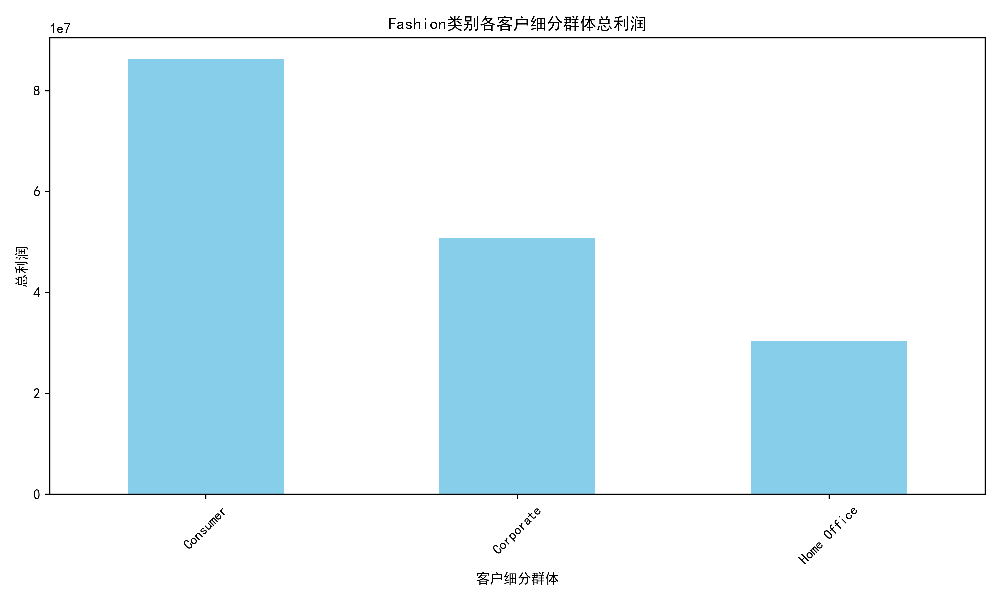
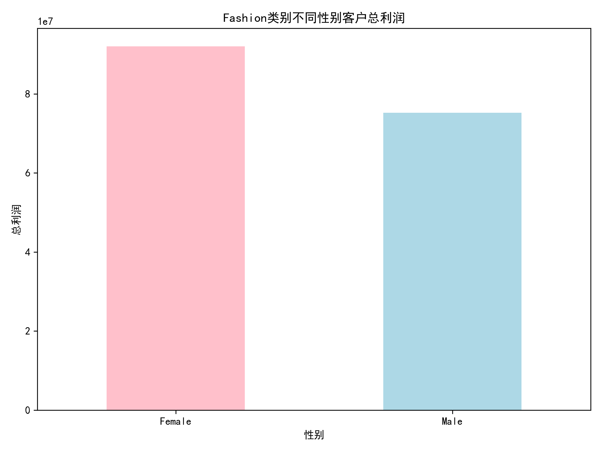
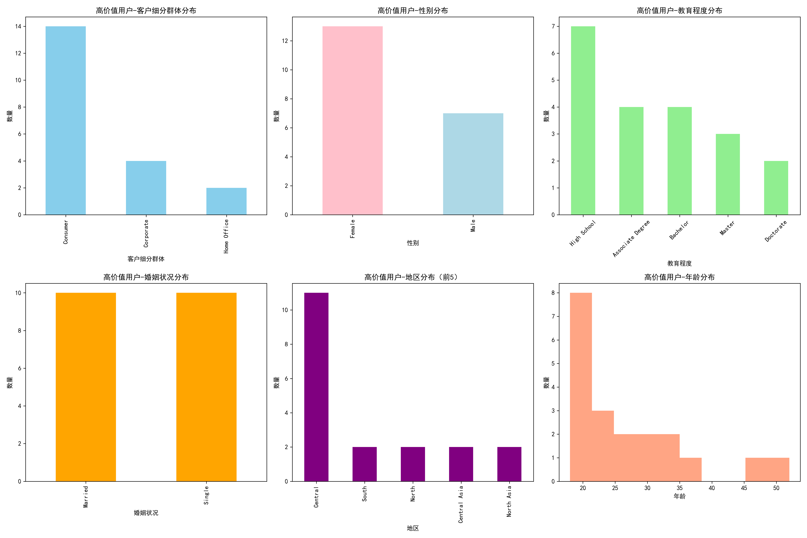
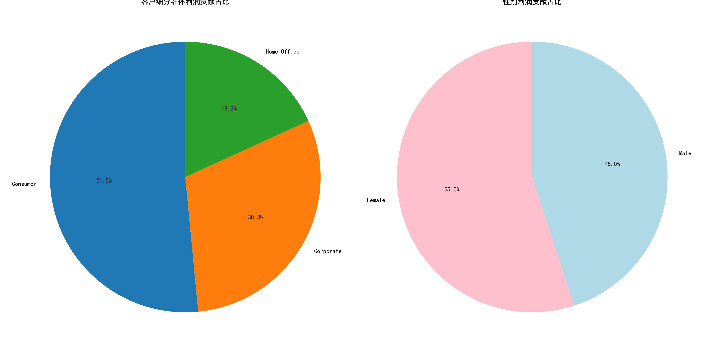

# 服饰品类电商用户画像分析报告

## 执行摘要

基于电商平台数据的深入分析，我们为服饰品类商家识别出了最具价值的用户画像特征。分析显示，**Consumer类别的女性客户**是服饰品类的核心利润来源，特别是**18-35岁的年轻群体**表现出最强的购买力和利润贡献。

## 关键发现

### 1. 客户细分群体分析

**核心洞察**：
- **Consumer客户**贡献了总利润的51.5%，是服饰品类的绝对主力
- **Corporate客户**虽然数量较少，但单笔订单价值较高，贡献30.3%的利润
- **Home Office客户**贡献18.2%的利润，属于高价值细分市场

### 2. 性别偏好分析

**重要发现**：
- **女性客户**贡献了55%的总利润，明显偏好服饰品类
- 女性客户的平均订单利润也略高于男性
- 这一趋势在Consumer群体中尤为明显

### 3. 年龄分布特征

**年龄洞察**：
- **18-25岁年龄段**贡献了最大的利润份额（35.8%）
- **26-35岁年龄段**紧随其后，贡献29.6%的利润
- 这两个年龄段合计贡献了65.4%的利润，是核心目标群体

### 4. 高价值用户画像特征

基于综合评分（考虑总利润、订单数、平均利润）的前20名高价值用户特征：

**画像特征分布**：
- **客户类型**：70%为Consumer客户
- **性别**：65%为女性客户  
- **教育程度**：35%为高中学历，20%为专科学历
- **婚姻状况**：单身和已婚各占50%
- **地区**：55%集中在Central地区
- **年龄**：平均年龄26.7岁，主要集中在18-30岁

### 5. 利润贡献度分析

**贡献度总结**：
- Consumer客户群体占据绝对主导地位
- 女性客户利润贡献超过男性10个百分点
- 教育程度呈现多元化分布，高中和本科学历为主

## 核心用户画像

### 🎯 首要目标用户画像
**\"年轻都市女性消费者\"**
- **年龄**：18-35岁
- **性别**：女性
- **客户类型**：Consumer
- **地区**：Central地区（一二线城市）
- **教育程度**：高中至本科
- **婚姻状况**：单身或新婚

### 🎯 次要目标用户画像
**\"企业采购女性决策者\"**
- **年龄**：25-45岁
- **性别**：女性
- **客户类型**：Corporate
- **特征**：订单金额大，利润率高

### 🎯 潜力目标用户画像
**\"居家办公时尚女性\"**
- **年龄**：22-40岁
- **性别**：女性
- **客户类型**：Home Office
- **特征**：注重舒适与专业并重的服饰

## 商业策略建议

### 1. 营销策略优化

**针对年轻都市女性（18-35岁）**：
- 社交媒体营销重点投放Instagram、小红书等平台
- 与时尚博主和KOL合作，展示日常穿搭
- 推出\"职场新人装\"、\"约会穿搭\"等主题系列
- 强调时尚性、性价比和多样性

**针对企业女性决策者**：
- 开发职业装专线，强调专业形象
- 提供批量采购优惠和定制服务
- 建立B2B销售团队，专门服务企业客户

### 2. 产品策略调整

**产品线规划**：
- 60%资源投入18-35岁女性日常服饰
- 25%资源投入职业装和商务休闲系列
- 15%资源投入居家舒适系列

**设计重点**：
- 注重时尚趋势，快速响应流行元素
- 提供多尺码选择，包容不同身材
- 强调面料舒适度和穿着体验

### 3. 地域策略布局

**Central地区深耕**：
- 加强一二线城市门店和仓储布局
- 针对都市生活节奏，提供快速配送服务
- 举办线下时尚活动和穿搭讲座

**其他地区拓展**：
- South和North地区作为次要目标市场
- 针对当地气候和文化特点调整产品线

### 4. 客户关系管理

**会员体系设计**：
- 为18-35岁女性客户设计专属会员权益
- 提供生日特惠、新品预览等特权
- 建立穿搭顾问服务，提供个性化推荐

**复购策略**：
- 建立季节性购买提醒机制
- 推出搭配套装，提高客单价
- 开发移动端APP，提升购物体验

## 预期效果

通过聚焦核心用户画像，预计可以实现：
- **利润提升20-30%**：集中资源服务高价值用户群体
- **客户获取成本降低15%**：精准营销减少无效投放
- **客户生命周期价值提升25%**：更好的客户体验提高复购率
- **库存周转率提升20%**：更精准的产品规划减少滞销

## 结论

服饰品类商家应该将**18-35岁的都市女性消费者**作为核心目标群体，集中营销和产品资源服务这一群体。同时，不要忽视**企业女性客户**和**居家办公女性**这两个高价值细分市场。通过精准的用户画像分析和差异化的策略执行，可以在竞争激烈的电商服饰市场中获得显著优势。

建议每季度重新评估用户画像表现，根据数据反馈及时调整策略，确保持续的市场竞争力。
