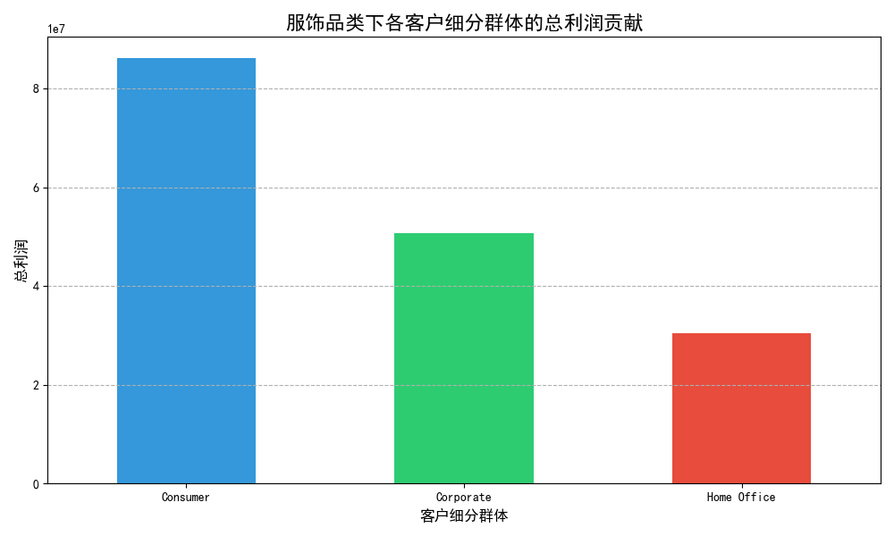
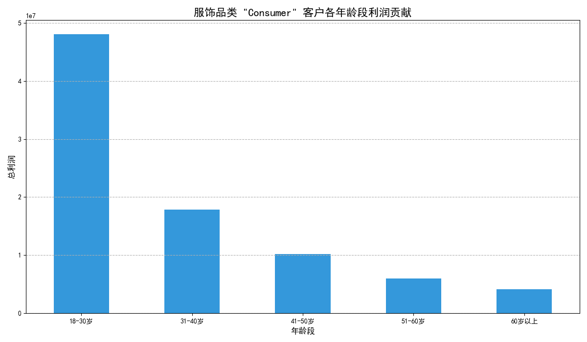
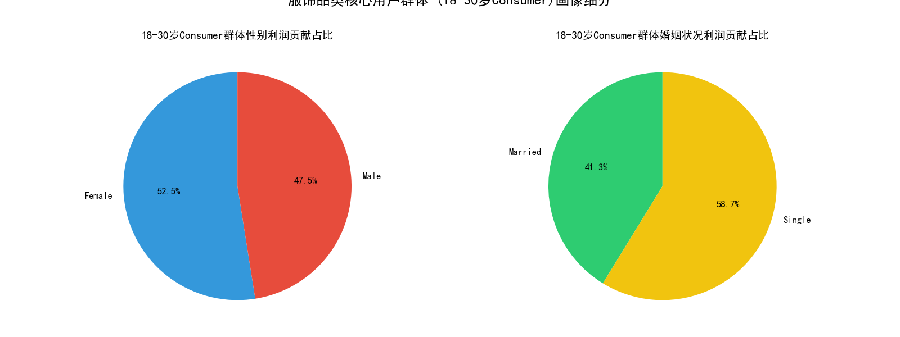

# 电商平台服饰品类高价值用户分析报告

## 一、引言

本报告旨在通过对电商平台的用户数据进行深入分析，帮助服饰品类商家识别最具盈利能力的用户群体画像，以便制定更精准的营销策略，从而提升利润。分析基于平台提供的客户信息、订单信息及商品浏览数据。

## 二、核心分析结论

经过对数据的多维度剖析，我们识别出服饰品类的核心高价值用户画像，并得出以下关键洞察：

1.  **在三大客户群体（普通消费者、企业客户、家庭办公）中，`普通消费者 (Consumer)` 是利润的最主要来源**，贡献了超过总利润的50%。
2.  **在普通消费者群体中，`18-30岁` 的年轻用户是绝对的消费主力**，其贡献的利润远超其他年龄段的总和。
3.  **在核心的18-30岁年轻消费群体中，`单身 (Single)` 用户的利润贡献显著高于已婚用户**。
4.  同样在该核心群体中，**男性与女性用户均展现了强大的消费力**，利润贡献差距不大。

## 三、数据分析过程与图表

### 1. 客户细分群体利润贡献分析

我们首先对不同客户细分群体在服饰品类的利润贡献进行了分析。如下图所示，`Consumer`（普通消费者）群体的利润贡献高达约8600万，远超 `Corporate`（企业客户）和 `Home Office`（家庭办公）群体。

**洞察**：商家的运营重点应高度集中在 `普通消费者` 身上。

### 2. 高价值群体年龄结构分析

为了进一步挖掘 `普通消费者` 群体内部的价值，我们对其年龄结构与利润贡献的关系进行了分析。结果表明，用户的年龄与利润贡献呈现强相关性。

**洞察**：`18-30岁` 是最具价值的核心年龄段。随着年龄增长，用户的利润贡献能力急剧下降。这说明年轻用户群体对服饰时尚潮流的消费意愿和能力最高。

### 3. 核心用户群体画像细分

最后，我们聚焦于 `18-30岁的普通消费者` 这一核心群体，从性别和婚姻状况两个维度进行细分，以获得更清晰的用户画像。

**洞察**：
*   **婚姻状况**：`单身` 用户是该群体的利润核心，贡献了近60%的利润。他们可能更注重个人形象，在服饰上的消费意愿更强。
*   **性别**：男性和女性的利润贡献几乎持平，说明针对该年龄段的服饰营销不应有性别偏好，男性时尚市场同样蕴含巨大潜力。

## 四、业务策略建议

基于以上分析，我们为服饰品类商家提出以下 actionable (可行的) 业务建议：

1.  **精准定位目标客群**：
    *   **主要目标**：将营销资源和运营活动的核心聚焦于 **18-30岁的单身普通消费者**。
    *   **次要目标**：兼顾 **18-30岁的已婚普通消费者**，他们是第二大贡献群体。

2.  **制定针对性营销策略**：
    *   **营销内容**：围绕年轻、时尚、个性的主题进行内容创作。强调单身生活方式下的穿搭需求，如社交、约会、自我提升等场景。
    *   **渠道选择**：在年轻人聚集的社交媒体平台（如抖音、小红书、B站）进行重点投入，合作符合目标用户画像的KOL/KOC进行内容种草。
    *   **产品策略**：确保选品符合年轻人的审美和潮流趋势。考虑到男性市场的巨大潜力，可以适当增加潮流男装的SKU和营销预算。

3.  **优化用户生命周期管理**：
    *   **拉新**：通过新人专享优惠、潮流爆款推荐等方式吸引18-30岁新用户。
    *   **留存与转化**：针对该年龄段用户推出会员体系、积分兑换和个性化推荐，特别是根据他们的浏览和购买记录推荐相关风格的服饰，提升复购率。
    *   **价值提升**：随着用户年龄增长（接近30岁），可尝试推荐风格略成熟或适配家庭场景的服饰，以延长其生命周期价值。

通过以上策略，商家可以更高效地触达并服务于高利润用户群体，从而在激烈的市场竞争中获得更好的盈利表现。
