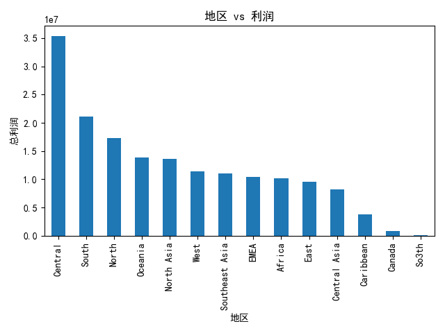
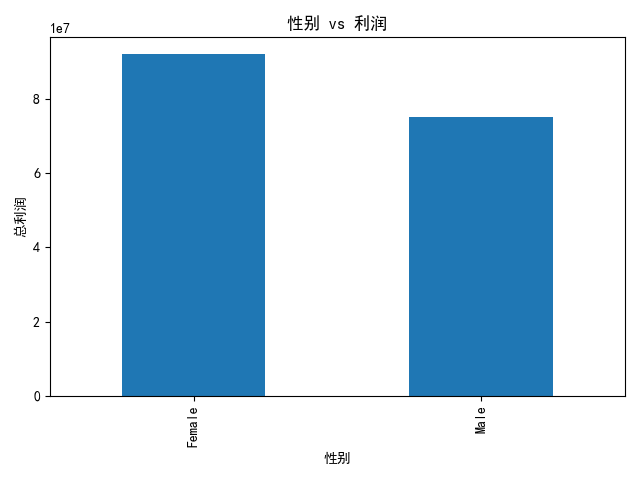
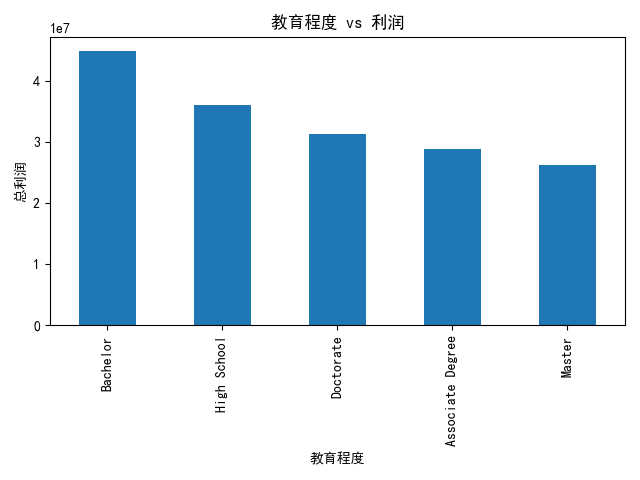
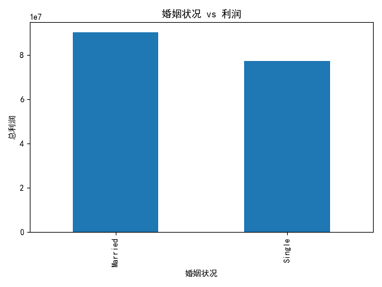

# 服饰品类客户画像分析报告

## 概述
本报告分析了服饰品类的订单信息，并结合客户的基本画像，从**地区**、**年龄**、**性别**、**教育程度** 和 **婚姻状况** 等多个维度统计了利润贡献，以帮助商家确定应重点关注的客户群体。

---

## 1. 地区 vs 利润

### 分析结果
不同地区的利润贡献如下：
- **Central**: 35,406,622.8
- **South**: 21,162,730.3
- **North**: 17,348,001.4
- **Oceania**: 13,817,403.2
- **North Asia**: 13,553,520.3
- **West**: 11,405,714.4
- **Southeast Asia**: 11,033,073.9
- **EMEA**: 10,465,703.2
- **Africa**: 10,199,254.9
- **East**: 9,598,136.4
- **Central Asia**: 8,244,891.3
- **Caribbean**: 3,791,809.8
- **Canada**: 869,822.8
- **So3th**: 137,703.6

### 观察与洞察
- **Central** 地区是利润贡献最高的地区，建议加强在 Central 地区的营销与客户维护。
- **Caribbean** 地区虽然贡献相对较低，但仍有发展空间，可以结合当地特色推出定制化服饰产品。
- 对于高利润贡献的地区，建议增加广告投放和个性化推荐，以进一步提升转化率。

---

## 2. 年龄区间 vs 利润

### 分析结果
不同年龄区间的利润贡献如下：
- **(18, 23]**: 41,043,101.3
- **(23, 28]**: 36,640,180.5
- **(28, 33]**: 28,350,894.0
- **(33, 38]**: 12,676,705.6
- **(38, 43]**: 11,332,421.4
- **(43, 48]**: 8,852,245.8
- **(48, 53]**: 7,106,301.0
- **(53, 58]**: 2,973,631.1
- **(58, 63]**: 3,546,328.4
- **(63, 68]**: 2,923,945.3

### 观察与洞察
- **18-23 岁** 和 **23-28 岁** 的客户贡献了最高的利润。
- 相较于其他年龄段，**28-33 岁** 的客户仍有进一步挖掘潜力。
- 建议针对年轻客户群体推出时尚潮流服饰，并通过社交媒体进行推广。

---

## 3. 性别 vs 利润

### 分析结果
- **Female（女性）**: 92,037,706.2
- **Male（男性）**: 75,260,329.3

### 观察与洞察
- 女性客户的利润贡献远高于男性客户。
- 建议针对女性客户推出更多定制服饰，并通过KOL等营销手段吸引女性用户。

---

## 4. 教育程度 vs 利润

### 分析结果
- **Bachelor**: 44,849,909.9
- **High School**: 36,041,687.7
- **Doctorate**: 31,340,570.5
- **Associate Degree**: 28,810,104.6
- **Master**: 26,255,762.8

### 观察与洞察
- **Bachelor** 和 **High School** 人群的利润贡献最高。
- **Doctorate** 和 **Master** 也有显著的贡献，值得关注。
- 对于不同教育程度的客户，可以采取不同的营销策略，例如向 Bachelor 群体推荐高性价比服饰，向 Doctorate 群体推出高端定制服饰。

---

## 5. 婚姻状况 vs 利润

### 分析结果
- **Married（已婚）**: 90,172,179.3
- **Single（未婚）**: 77,125,856.2

### 观察与洞察
- **已婚人群**的利润贡献略高于未婚人群，建议向该群体推荐家庭风格服饰或成对服饰。
- **未婚人群**的潜力也不容忽视，可以推出适合单身用户的个性化推荐。

---

## 总结与建议

### 总结
- **Central 地区**的客户在地域中利润贡献最高。
- **18-28 岁**的年轻客户群体是利润的主要来源。
- **女性客户**的消费力显著高于男性客户。
- **Bachelor** 和 **High School** 学历用户的利润贡献最大。
- **已婚人群**的利润贡献略高于未婚人群。

### 建议
1. 针对 **Central 地区** 加强营销投放，推出地域定制服饰。
2. 针对 **18-28 岁**的年轻客户群体推出潮流服饰，并加强社交媒体营销。
3. 针对 **女性用户** 推出更多高端服饰和限量款，提高客单价。
4. 对 **Bachelor** 和 **High School** 学历群体进行个性化推荐，提升复购率。
5. 针对 **已婚人群** 推出情侣风格服饰，增加组合销售。
