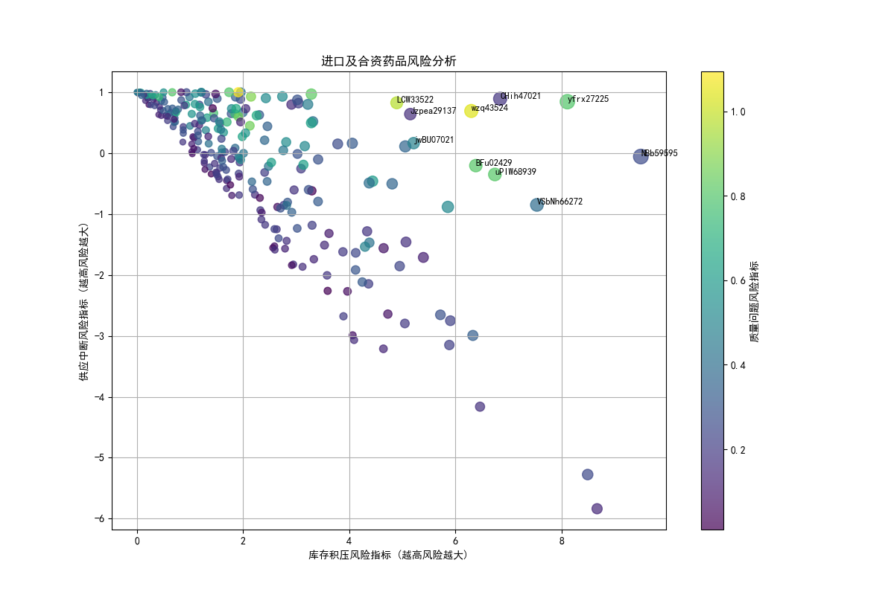

# 进口及合资药品重点监管分析报告

## 1. 分析背景与目标

为有效防范药品供應鏈風險，本次分析旨在从**库存积压**、**供应中断**和**质量问题**三个维度，对进口及合资药品进行综合风险评估，识别出需要重点监管的药品，并提出相应建议。

## 2. 分析方法与过程

我们整合了企业的《药品基本信息》、《库存管理》和《价格体系》三张数据表，重点筛选出“进口”和“合资”类别的药品。通过构建三个核心风险指标，我们对每种药品进行了量化评估：

*   **库存积压风险指标**：衡量现有库存量超出最大库存阈值的程度。指标越高，库存积压越严重，资金占用和药品过期风险越大。
*   **供应中断风险指标**：衡量合格库存量与最大库存阈值之间的差距。指标越高，表明库存量越低，供应短缺的风险越高。
*   **质量问题风险指标**：综合评估了过期、破损等问题药品的占比，并对“GSP未认证”和“温湿度超标”等情况进行了加权，以反映潜在的质量风险。

基于以上三个指标，我们计算了**综合风险分**（`综合风险分 = 库存积压风险 * 0.4 + 供应中断风险 * 0.3 + 质量问题风险 * 0.3`），以此为依据对药品进行排序和可视化呈现。

## 3. 核心发现与洞察

通过数据分析，我们发现部分进口及合资药品同时面临多种风险，需要立即引起重视。

*图1：进口及合资药品风险分析*

上图清晰地展示了各类药品的风险分布情况：
- **X轴** 代表库存积压风险，越靠右侧，积压风险越高。
- **Y轴** 代表供应中断风险，越靠上方，中断风险越高。
- **点的颜色** 代表质量问题风险，颜色越亮（偏黄色），质量风险越高。
- **点的大小** 代表综合风险分，点越大，综合风险越高。

从图中可以识别出几个高风险区域：
1.  **右上角区域**：该区域药品同时面临严重的库存积压和供应中断风险（注：此现象看似矛盾，但可能源于库存结构不合理，如合格品库存极低，而待验或近效期库存很高，导致可用库存少，但总体库存积压），同时其颜色偏亮，说明质量问题也很突出。这是**最高优先级**的监管对象。
2.  **右下角区域**：药品库存严重积压，但供应中断风险较低。主要风险在于资金占用和药品效期管理。
3.  **左上角区域**：药品库存量极低，面临迫在眉睫的供应中断风险，需要紧急补货或协调供应。

### 重点监管药品清单

根据综合风险评分，以下10种药品风险最高，建议列为首批重点监管对象：

| 药品ID     | 生产企业         | 质量层次 | 综合风险分 (越高越险) | 主要风险类型 |
| :--------- | :--------------- | :------- | :------------------ | :----------- |
| **NBb59595** | 上海上药信谊药厂 | 合资     | **最高**            | 极端库存积压 |
| **yfrx27225**| 石药集团河北中润制药 | 进口     | 极高                | 供应中断、质量问题、库存积压 |
| **CHih47021**| 齐鲁制药有限公司   | 合资     | 极高                | 供应中断、库存积压 |
| **wzq43524** | 上海上药信谊药厂 | 合资     | 极高                | 极端库存积压、严重质量问题 |
| **VSbNh66272**| 华北制药股份有限公司 | 合资     | 很高                | 极端库存积压 |
| **uPIW68939**| 石药集团河北中润制药 | 进口     | 很高                | 极端库存积压、严重质量问题 |
| **BFu02429** | 石药集团河北中润制药 | 进口     | 很高                | 极端库存积压、严重质量问题 |
| **LCW33522** | 扬子江药业集团有限公司 | 进口     | 很高                | 供应中断、质量问题、库存积压 |
| **Jzpea29137**| 齐鲁制药有限公司   | 合资     | 较高                | 库存积压 |
| **jwBU07021**| 上海上药信谊药厂 | 进口     | 较高                | 库存积压、质量问题 |

## 4.  actionable建议

针对上述分析结果，我们提出以下具体监管建议：

1.  **立即核查高风险药品**：
    *   针对 `wzq43524`、`uPIW68939`、`BFu02429` 和 `yfrx27225` 等药品，其质量风险指标异常高。应立即**启动现场核查**，检查是否存在大量过期、破损药品，并追溯GSP认证状态和温湿度记录，防止不合格药品流入市场。
    *   对于 `NBb59595`、`VSbNh66272` 等库存积压极其严重的药品，需要审核其采购计划的合理性，并与供应商协商调整后续订单。同时，需要制定**近效期药品催销计划**，降低库存过期造成的损失。

2.  **建立分级预警机制**：
    *   根据综合风险分，建立**红、黄、蓝**三级预警体系。红色预警药品（如清单中前5种）需由专人每日跟进；黄色预警药品每周审查；蓝色预警药品常规监控。
    *   将供应中断风险高的药品（如 `yfrx27225`, `CHih47021`, `LCW33522`）纳入**优先保供清单**，与供应商建立紧急沟通渠道，确保市场供应稳定。

3.  **优化库存管理策略**：
    *   重新评估和调整高风险药品的**最大库存阈值和安全库存水平**。当前部分药品的库存阈值设置可能已不适应市场需求变化，导致积压或短缺。
    *   加强对“GSP未认证”供应商的审查，在采购评估中适当降低其权重或要求其限期整改，从源头控制质量风险。

4.  **数据驱动的常态化监控**：
    *   将本报告中的分析逻辑固化为常态化的数据看板。通过自动化脚本定期刷新风险数据，实现对供应链风险的**动态、实时监控**，从被动响应转向主动预防。

通过实施以上建议，可以显著提升对高风险进口及合资药品的监管效率，保障药品供应链的稳定与安全。
