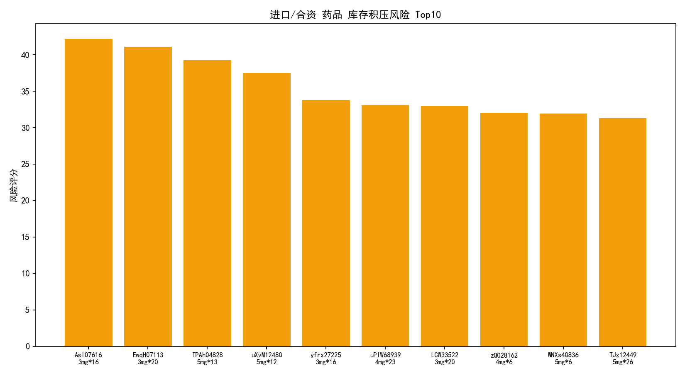
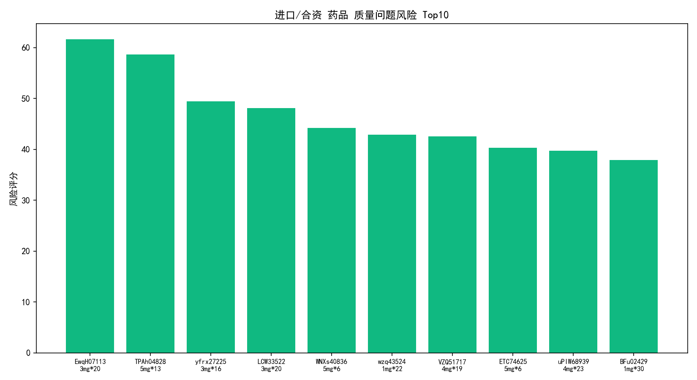
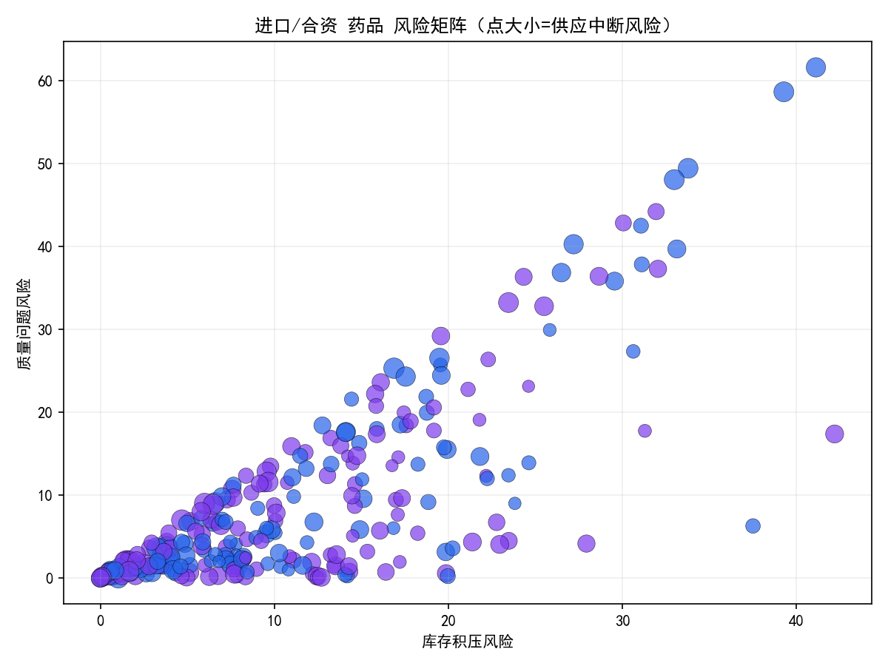

# 进口及合资药品重点监管风险评估报告（库存积压 / 供应中断 / 质量问题）

## 结论摘要
- 综合风险高且需要重点监管的进口/合资药品（综合风险>50）：
  - 药品ID EwqH07113（齐鲁制药有限公司，规格：3mg*20）
  - 药品ID TPAh04828（扬子江药业集团有限公司，规格：5mg*13）
  - 药品ID yfrx27225（石药集团河北中润制药，规格：3mg*16）
  - 药品ID LCW33522（扬子江药业集团有限公司，规格：3mg*20）
- 维度性高风险：
  - 库存积压风险 Top10 如图：参见图片 top10_backlog.png
  - 供应中断风险 Top10 如图：参见图片 top10_supply.png
  - 质量问题风险 Top10 如图：参见图片 top10_quality.png
- 风险矩阵显示：部分进口/合资药品在“库存积压风险”和“质量问题风险”同时较高，且点大小显示供应中断风险不低，形成“三高”叠加（参见图片 risk_matrix.png）。

## 方法与数据
- 数据来源：SQLite 数据库 dacomp-019.sqlite，表包括：
  - 药品基本信息（含“质量层次(国产/进口/合资)”、“最大库存阈值”、“存储条件”、“运输方式”等）
  - 库存管理（含“合格库存量”、“近效期库存量”、“过期药品数量”、“退货/破损/污染/温湿度超标”、“最近入/出库日期”、“库存状态(正常/冻结/报损)”、“库存预警状态”等）
  - 价格体系（含“价格异常波动标记”等）
- 分析对象：仅筛选“质量层次(国产/进口/合资)”为“进口/合资”的药品；按药品ID聚合库存与价格特征，未进行数据清洗，仅做必要的数值容错以便计算指标（例如空值计算时视为0，不改动原始数据）。
- 指标构造：
  - 库存积压风险（0-100）：
    1) 库存相对阈值压力（合格库存量/最大库存阈值，或库存量的归一化）
    2) 近效期占比（近效期库存量/合格库存量）
    3) 过期药品数量
    综合为三者的平均并线性缩放到百分制。
  - 供应中断风险（0-100）：
    1) 库存短缺程度（与阈值相比的缺口或库存量的反向归一化）
    2) 距最近入库天数（越久越可能供应不稳）
    3) 价格异常波动标记（市场波动/供需紧张信号）
    4) 冻结标记（库存状态为“冻结”的计数）
    5) 预警条目数（库存预警状态非空的条目数）
    综合为五者平均并线性缩放到百分制。
  - 质量问题风险（0-100）：
    1) 质量事件总量（过期、退货、破损、虫蛀霉变、鼠咬污染、空气污染、温湿度超标记录）之和
    2) 近效期占比（近效期库存更易引发质量处置压力）
    综合为两者平均并线性缩放到百分制。
  - 综合风险：三类风险平均分。

- 可视化代码片段（中文显示设置）：
```python
plt.rcParams['font.sans-serif'] = ['SimHei']
plt.rcParams['axes.unicode_minus'] = False
```

## 可视化与发现
- 库存积压风险 Top10：见图片 top10_backlog.png
- 供应中断风险 Top10：见图片 top10_supply.png
- 质量问题风险 Top10：见图片 top10_quality.png
- 风险矩阵（X轴：库存积压风险，Y轴：质量问题风险，点大小：供应中断风险，颜色：进口/合资）：见图片 risk_matrix.png

图片引用：
- 
- 
- 
- 

## 高风险清单（示例Top10与解释）
根据综合风险排名（Top10打印结果）：
1) EwqH07113（齐鲁制药有限公司，3mg*20，进口）：综合风险≈57.39；维度：供应中断风险≈69.44，质量风险≈61.63，库存积压≈41.11。诊断：供应侧信号偏高（入库间隔长/预警/冻结/价格异常），同时质量事件与近效期占比不低，需快速处置与补货策略。
2) TPAh04828（扬子江药业集团有限公司，5mg*13，进口）：综合风险≈57.31；供应中断≈73.98居高，质量≈58.68也高。诊断：存在供给链波动与质量处置压力叠加。
3) yfrx27225（石药集团河北中润制药，3mg*16，进口）：综合风险≈52.13；供应中断≈73.18高。诊断：补货周期可能过长，需加固采购与在途监控。
4) LCW33522（扬子江药业集团有限公司，3mg*20，进口）：综合风险≈51.89；供应中断≈74.61高。诊断：显著的供应风险与较高的近效期/过期指标。
5) ETC74625（石药集团河北中润制药，5mg*6，进口）：综合风险≈45.70，供应中断≈69.61；诊断：供应风险偏高但综合尚处次高位。
6) uPIW68939（石药集团河北中润制药，4mg*23，进口）：综合≈44.13；诊断：供应与质量均有关注点。
7) pFwDF40287（扬子江药业集团有限公司，2mg*19，合资）：综合≈43.55；合资品种中风险较高。
8) icIB45839（齐鲁制药有限公司，2mg*15，进口）：综合≈42.29。
9) oXZ18640（石药集团河北中润制药，3mg*27，进口）：综合≈41.40。
10) chv94032（扬子江药业集团有限公司，1mg*13，合资）：综合≈41.17。

从维度上看：
- 供应中断维度的头部风险分值普遍高于其他两个维度，显示出“近阶段入库不及时 + 预警/冻结信号 + 价格波动”是主因。
- 质量问题维度受“过期、退货、破损、环境污染、温湿度超标”驱动，与近效期占比相关性较强。仓储管理和冷链运行质量对进口/合资药品尤为关键。
- 库存积压维度更多由“库存相对阈值压力 + 近效期占比 + 过期数量”决定。个别品种存在结构性滞销迹象。

## 诊断性洞察（为什么会这样）
- 供应侧：
  - “距最近入库天数”偏高反映补货周期和跨境/合资供应链波动；价格异常波动可能暗示上游紧张或政策调整。
  - “冻结标记”“预警条目数”提示运营环节的异常事件，可能与批次质量复核、合规封存或系统预警触发有关。
- 质量侧：
  - 近效期占比高与过期/退货/破损/温湿度超标等事件相关，冷链或仓储管理不足会在进口/合资品类上放大风险。
- 库存结构：
  - 阈值设定与采购策略未及时动态调整，导致某些品种库存压力与滞销并存。

## 预测性判断（将会发生什么）
- 若不调整补货与分销节奏，高供应中断风险品种（如 TPAh04828、LCW33522）存在阶段性缺货或频繁预警的可能。
- 近效期占比偏高的品种（如 EwqH07113、TPAh04828）在未来1-2个补货周期内更可能触发质量处置与退货，增加成本与损失。
- 品类层面：进口/合资品种在冷链及合规管理较高标准下，任一环节偏差更易累积为质量事件，需提前加固仓配与温湿度监控。

## 规范性建议（我们应该做什么）
- 供应中断缓解：
  - 设置“动态安全库存”与“在途监控阈值”，对综合风险>50且供应中断风险高于70的品种（EwqH07113、TPAh04828、yfrx27225、LCW33522）执行加速补货与双供应商策略。
  - 启动价格异常联动预案：与供应商沟通锁价/分批到货，降低价格波动传导到终端的风险。
  - 运营侧排障：对“冻结标记”与“预警条目数”高的品种开展专项排查，明确冻结原因与解除路径。
- 库存积压与滞销治理：
  - 针对近效期占比高的品种进行区域调拨与精准促销（面向合规渠道），缩短周转；必要时调整采购频率与批次规模。
  - 用“阈值/销量”联动机制，动态下调积压品的补货阈值，避免进一步滞销。
- 质量风险控制：
  - 加强冷链与仓储管理：对温湿度超标记录较多的仓库与批次开展GSP稽核；对进口/合资品类强化到仓验收、批次追溯与温控记录。
  - 批次处置优先级：对近效期+质量事件叠加的批次优先做稳定性复核与分销优先级调整，降低过期与退货风险。
- 监控机制：
  - 建立每周风险看板，自动产出维度Top10与综合高风险清单，并配置阈值触发的任务工单。

## 局限与后续
- 本次分析未进行数据清洗，仅基于现有字段做指标计算与归一化；若增加销售/出库频率、在途采购、批次质量检测的更详数据，风险评分的诊断性与预测性将更强。
- 可进一步引入季节性需求与政策调整事件，提升价格异常与供应波动的解释度。

## 附：生成的图片
- 库存积压风险Top10：top10_backlog.png
- 供应中断风险Top10：top10_supply.png
- 质量问题风险Top10：top10_quality.png
- 风险矩阵：risk_matrix.png

以上结果可作为进口与合资药品的重点监管依据，建议对综合风险>50及供应中断维度评分>70的品种优先纳入“红色清单”，并按建议执行专项治理与持续监控。
