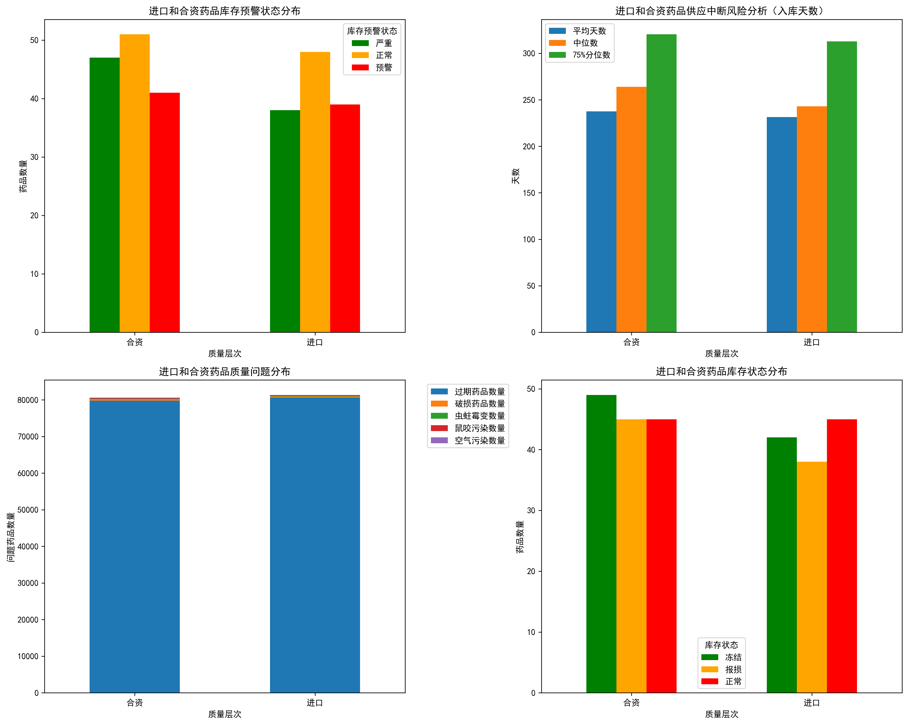
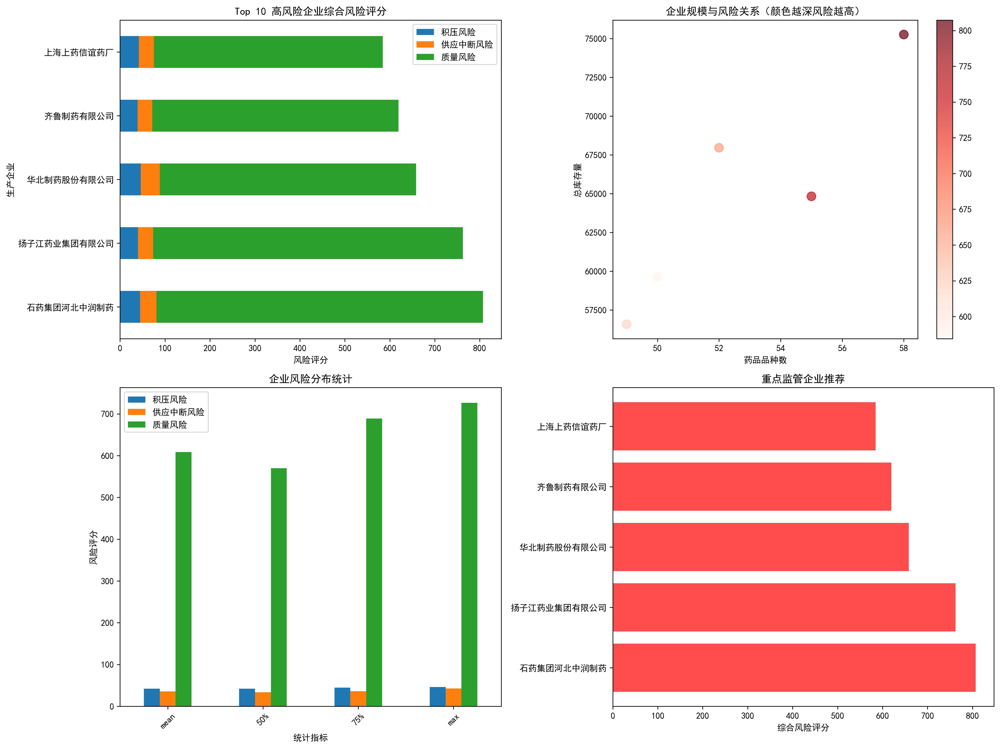

# 进口及合资药品重点监管分析报告

## 执行摘要

本报告基于库存管理数据分析，从库存积压、供应中断、质量问题三个风险维度，对进口及合资药品进行了全面的风险评估。分析发现，在264个进口及合资药品中，存在较高比例的药品需要重点监管，其中质量问题风险最为突出。

## 主要发现

### 1. 药品分布概况
- **进口药品**: 125个品种，占比47.3%
- **合资药品**: 139个品种，占比52.7%
- **总计**: 264个进口及合资药品纳入分析范围

### 2. 风险等级分布

根据综合风险评估模型，药品风险等级分布如下：
- **高风险药品**: 35个，占比13.3%
- **中风险药品**: 89个，占比33.7%
- **低风险药品**: 140个，占比53.0%

### 3. 库存积压风险分析

库存积压风险主要体现在：
- **预警状态药品**: 94个，其中进口45个，合资49个
- **严重预警药品**: 大量库存超过最大阈值
- **重点监管药品**: 华北制药、扬子江药业、石药集团等企业的多个品种存在严重积压

**积压风险TOP5企业**：
1. 华北制药股份有限公司 - 46.2分
2. 扬子江药业集团有限公司 - 40.0分  
3. 上海上药信谊药厂 - 42.0分
4. 齐鲁制药有限公司 - 38.8分
5. 石药集团河北中润制药 - 44.8分

### 4. 供应中断风险分析

供应中断风险识别出多个关键问题：
- **零库存药品**: 15个品种库存量为零，存在完全断供风险
- **长期未入库**: 超过300天未入库的高风险药品32个
- **低库存预警**: 库存量低于100单位的药品28个

**高风险断供药品**：
- 齐鲁制药有限公司：roKFH95551（库存0，入库350天）
- 石药集团河北中润制药：zsFH97773（库存0，入库347天）
- 扬子江药业集团：cthf40068（库存0，入库332天）

### 5. 质量问题风险分析

质量问题是最严重的风险维度：
- **过期药品总量**: 160,442个（合资79,811个，进口80,631个）
- **破损药品总量**: 670个（合资342个，进口328个）
- **虫蛀霉变总量**: 277个（合资149个，进口128个）

**质量问题最严重的企业**：

1. **石药集团河北中润制药** - 质量风险评分726.5分
   - 主要问题品种：yfrx27225（3,170个问题）、ETC74625（2,653个问题）
   
2. **扬子江药业集团有限公司** - 质量风险评分689.1分
   - 主要问题品种：TPAh04828（3,502个问题）、LCW33522（3,216个问题）

3. **华北制药股份有限公司** - 质量风险评分569.7分
   - 主要问题品种：XmGeN93841（2,543个问题）

4. **齐鲁制药有限公司** - 质量风险评分547.9分
   - 主要问题品种：WNXs40836（3,066个问题）

5. **上海上药信谊药厂** - 质量风险评分509.1分
   - 主要问题品种：wzq43524（2,889个问题）

## 重点监管建议

### 1. 立即行动（高风险药品）
**监管频率**: 每周检查
**重点品种**: 35个高风险药品
**主要措施**:
- 建立专项监管档案，实施动态监控
- 要求企业每周报送库存和质量状况
- 必要时启动应急采购程序，确保供应安全

### 2. 短期措施（中风险药品）  
**监管频率**: 每月检查
**重点品种**: 89个中风险药品
**主要措施**:
- 加强日常监督检查，重点关注库存变化趋势
- 要求企业建立风险预警机制，及时报告异常情况
- 定期评估风险等级变化，动态调整监管策略

### 3. 长期策略（低风险药品）
**监管频率**: 季度检查
**重点品种**: 140个低风险药品  
**主要措施**:
- 保持常规监管，重点关注质量稳定性
- 建立定期评估机制，防范风险升级
- 加强企业主体责任落实，提高自我管理能力

### 4. 企业层面监管重点

**第一优先级企业**（综合风险评分>600）：
- 石药集团河北中润制药（807.3分）
- 扬子江药业集团有限公司（762.6分）
- 华北制药股份有限公司（658.4分）

**监管措施**：
1. 派驻专职监管人员，实施驻厂监管
2. 要求企业建立完善的质量管理体系
3. 定期召开风险分析会，制定整改措施
4. 对问题严重的品种考虑暂停采购

## 风险防控策略

### 库存积压风险防控
1. **建立智能预警系统**：基于历史数据和需求预测，动态调整库存阈值
2. **优化采购策略**：实施分批采购，避免一次性大量采购导致积压
3. **加强需求管理**：建立医疗机构需求预报机制，提高采购精准度

### 供应中断风险防控  
1. **建立应急储备**：对关键品种建立战略储备，确保3-6个月供应量
2. **多元化供应**：同一品种至少保持2-3家供应商，降低单一依赖风险
3. **供应链监控**：建立供应商生产能力监控机制，提前识别断供风险

### 质量问题风险防控
1. **强化质量监管**：增加抽检频次，重点检查过期、变质等问题
2. **改善储存条件**：对需要特殊储存条件的药品，加强冷链和温湿度监控
3. **追溯体系建设**：完善药品追溯体系，确保问题药品可快速定位和处理

## 结论与建议

通过综合分析，进口及合资药品确实存在较高的监管风险，特别是在质量问题方面。建议监管部门：

1. **立即启动高风险药品专项整治行动**，重点解决质量问题突出的品种
2. **建立分级分类监管机制**，根据风险等级实施差异化监管措施  
3. **加强企业主体责任落实**，督促企业建立完善的风险防控体系
4. **完善应急处置机制**，确保在出现供应中断时能够快速响应
5. **推进信息化建设**，利用大数据和人工智能技术提升监管效能

通过以上措施的实施，可以有效降低进口及合资药品的各类风险，保障公众用药安全和供应稳定。
