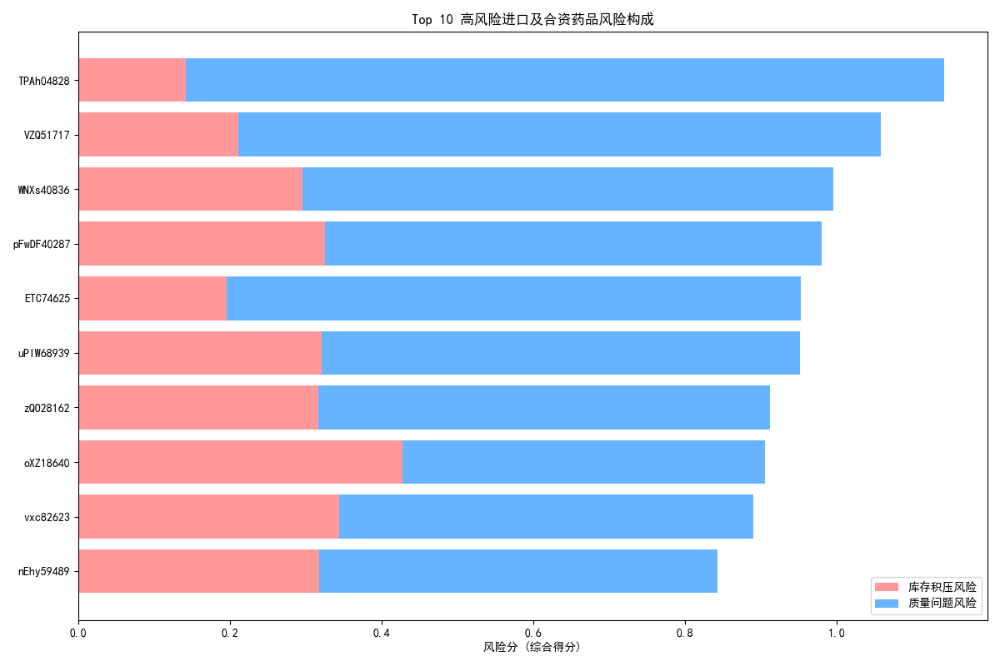

# 进口及合资药品风险监管分析报告

## 一、 分析背景与目标

为保障药品供应链的稳定与安全，本报告旨在对进口及合资药品进行风险评估。通过分析库存数据和药品基本信息，我们识别出在**库存积压**、**供应中断**和**质量问题**方面具有较高风险的药品，为实施重点监管提供数据驱动的决策支持。

## 二、 分析方法

我们整合了`药品基本信息`和`库存管理`两个数据表，重点关注“进口”和“合资”药品。风险评估主要围绕以下两个维度构建：

1.  **库存积压风险**：综合评估药品的`合格库存量`、`近效期库存比例`以及`呆滞天数`（自最近出库日期至今的天数）。得分越高，表明库存周转越慢，资金占用和药品过期风险越大。
2.  **质量问题风险**：综合评估已发生的`质量问题总数`（如过期、破损等），并结合`存储条件`进行加权。对于需要“冷藏”或“阴凉”等特殊条件存储的药品，我们赋予了更高的风险权重，因为存储不当或库存周期过长更容易引发质量问题。

通过对上述两个维度进行标准化评分和加权（各占50%），我们计算出每个药品的**总风险分**，并据此进行排序。

## 三、 分析结果与洞察

### 1. 高风险药品识别

通过模型计算，我们识别出总风险最高的10种进口及合资药品。这些药品的共同特点是其风险评分显著高于其他药品，需要优先关注。

*图：Top 10高风险进口及合资药品风险构成*

### 2. 核心洞察

*   **质量问题是主要风险源**：从上图可以看出，对于风险最高的药品（如药品ID `TPAh04828`、`VZQ51717`、`WNXs40836`），其风险主要由**质量问题风险**驱动。这表明这些药品可能已经出现了过期、破损等问题，或者其存储条件（如冷藏）增加了潜在的质量隐患。
*   **进口药品占据高风险榜单多数**：在Top 10高风险名单中，有7种为进口药品，3种为合资药品。这表明在当前的库存管理体系下，进口药品面临的挑战可能更大，这或许与更长的供应链、更复杂的运输环节有关。
*   **库存积压不容忽视**：对于药品ID `oXZ18640` 和 `vxc82623` 等，其**库存积压风险**占比较高。这表明这些药品存在库存量过大、周转缓慢或长期未出库的问题，不仅占用了大量资金，也增加了未来发生质量问题的概率（如药品临近效期）。

## 四、 监管建议

基于以上分析，我们提出以下几点监管建议：

1.  **实施分级重点监管**：
    *   **优先核查**：立即对风险排名前10的药品，特别是以`TPAh04828`和`VZQ51717`为首的药品，进行现场核查。重点检查其实际库存状况、质量问题记录（破损、过期）以及存储条件是否符合标准。
    *   **定期监控**：将总风险分较高的药品（如Top 20）纳入重点监控清单，每月审核其库存周转、近效期和质量状况，预防风险升级。

2.  **强化特殊存储条件药品的管理**：
    *   分析结果显示，存储条件是质量风险的重要放大器。建议对所有需要“冷藏”、“阴凉”保存的进口及合资药品，提高检查频率，确保温控设备、记录和应急预案均符合GSP（药品经营质量管理规范）要求。

3.  **优化库存与供应链策略**：
    *   针对库存积压风险高的药品（如`oXZ18640`），建议与供应商协商，探讨更灵活的订货策略，如降低最小订货量、缩短补货周期等，以减少库存水平。
    *   深入分析呆滞天数长的药品，评估其临床需求是否下降，并考虑采取促销、调拨或在效期前进行处理的措施，避免资本沉淀和过期损失。

4.  **建立风险预警机制**：
    *   将本报告中的风险评估模型固化为常态化工具。系统应能自动计算并更新药品的风险评分，当某一药品的风险分超过预设阈值时，自动向管理人员发出预警，从而实现从“被动响应”到“主动预防”的转变。

通过上述措施，可以更精准地分配监管资源，有效控制进口及合资药品的潜在风险，保障药品质量与供应链安全。
