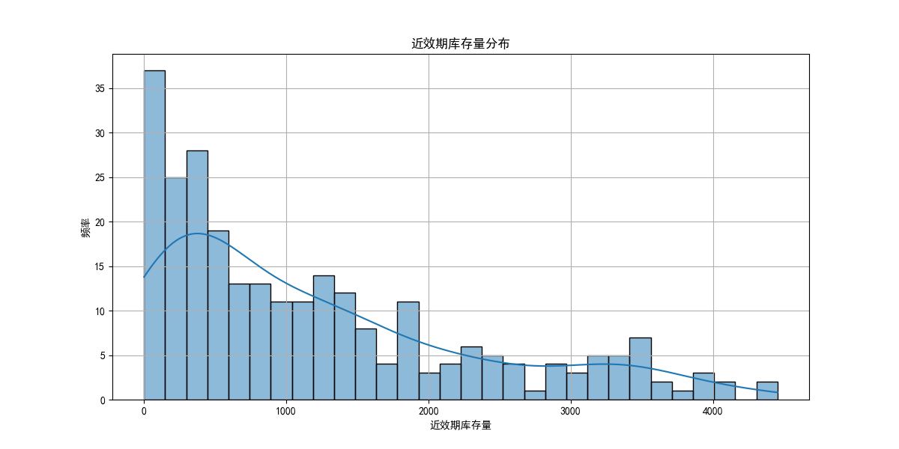
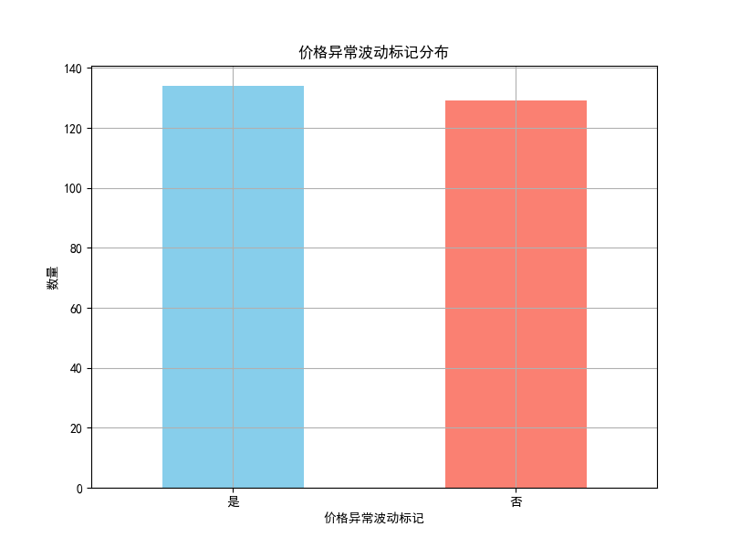
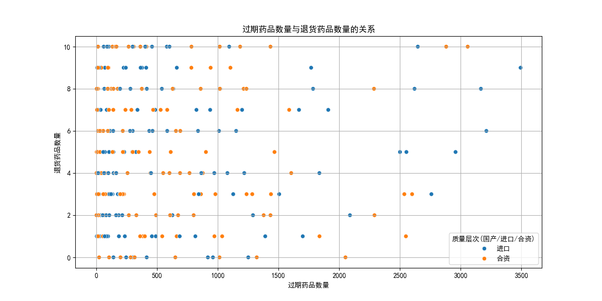
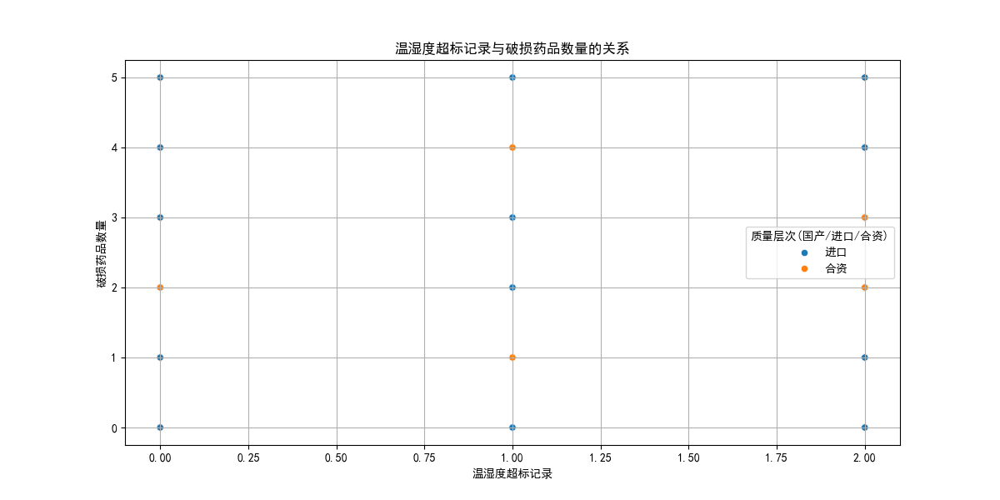

# 进口及合资药品重点监管分析报告

## 引言
本报告旨在从库存积压、供应中断、质量问题风险角度，分析需要重点监管的进口及合资药品。通过结合数据库中的药品基本信息、库存管理和价格体系数据，我们识别出具有潜在风险的药品，并提供监管建议。

## 数据来源
数据来源于 `dacomp-019.sqlite` 数据库，包含以下三个表：
1. **药品基本信息**：包含药品ID、质量层次（国产/进口/合资）等信息。
2. **库存管理**：包含库存预警状态、近效期库存量、过期药品数量、退货药品数量、破损药品数量、虫蛀霉变数量、鼠咬污染数量、空气污染数量、温湿度超标记录等信息。
3. **价格体系**：包含价格异常波动标记。

## 数据分析方法
1. **数据提取与整合**：从数据库中提取进口及合资药品的信息，并整合库存管理和价格体系信息。
2. **风险评估**：
   - **库存积压**：根据近效期库存量和库存预警状态评估。
   - **供应中断**：根据价格异常波动标记评估。
   - **质量问题**：根据过期药品数量、退货药品数量、破损药品数量、虫蛀霉变数量、鼠咬污染数量、空气污染数量和温湿度超标记录评估。
3. **可视化展示**：使用 Python 绘制图表，展示各类风险的分布情况。

## 结果与讨论

### 1. 库存积压分析

#### 近效期库存量分布

近效期库存量分布图展示了进口及合资药品的库存积压情况。大多数药品的近效期库存量较低，但仍有部分药品的近效期库存量较高，可能存在库存积压的风险。

#### 库存预警状态
根据数据，部分药品的库存预警状态为“预警”或“严重”，表明这些药品的库存管理需要重点关注。

### 2. 供应中断分析

#### 价格异常波动标记分布

价格异常波动标记分布图显示，有相当数量的进口及合资药品存在价格异常波动，这可能表明供应中断风险。需要进一步调查这些药品的供应链，以确保其稳定供应。

### 3. 质量问题风险分析

#### 过期药品数量与退货药品数量的关系

该图展示了过期药品数量与退货药品数量之间的关系。可以看出，部分药品的过期药品数量和退货药品数量均较高，这表明这些药品可能存在质量问题，需要重点监管。

#### 温湿度超标记录与破损药品数量的关系

该图展示了温湿度超标记录与破损药品数量之间的关系。可以看出，温湿度超标记录较多的药品，其破损药品数量也较高，表明存储条件可能影响药品质量，需优化存储管理。

## 结论与建议

### 需要重点监管的药品
根据分析，以下进口及合资药品需要重点监管：
1. **库存积压风险药品**：近效期库存量高且库存预警状态为“预警”或“严重”的药品。
2. **供应中断风险药品**：价格异常波动标记为“是”的药品。
3. **质量问题风险药品**：过期药品数量、退货药品数量、破损药品数量较高，以及温湿度超标记录较多的药品。

### 监管建议
1. **加强库存管理**：对库存预警状态为“预警”或“严重”的药品进行定期盘点，优化库存结构，减少积压。
2. **监控价格波动**：对价格异常波动的药品进行供应链追溯，确保价格稳定，避免供应中断。
3. **提升质量控制**：加强对药品存储条件的监控，尤其是对温湿度敏感的药品，防止因存储不当导致的质量问题。
4. **建立风险预警机制**：对存在库存积压、供应中断和质量问题风险的药品，建立动态风险预警机制，及时采取措施。

通过以上措施，可以有效降低进口及合资药品的库存积压、供应中断和质量问题风险，提升药品管理的整体水平。
