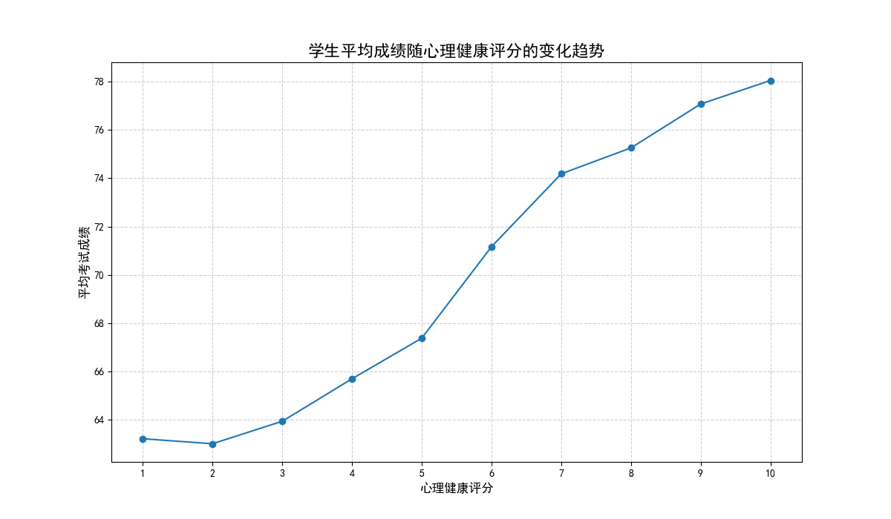

# 学生心理健康与学业成绩关系深度分析报告

## 报告摘要

本报告旨在深入探究学生心理健康状况与其学业成绩之间的关系。通过对包含1000名学生样本的数据进行分析，我们不仅考察了二者之间的总体趋势，还利用多元线性回归模型量化了在控制学习习惯与生活方式等混杂因素后，心理健康对成绩的边际影响，并进一步探索了其与其他变量的交互作用。

**核心洞察:**
1.  **显著正相关趋势**：学生的学业成绩随着其心理健康评分的提高而呈现出明显的、近乎线性的增长趋势。
2.  **独立的积极影响**：在控制了学习时间、社交、睡眠、锻炼等多个变量后，心理健康评分对考试成绩依然具有**高度显著的正面影响**。评分每增加1分，学生的考试成绩平均提高约1.83分。
3.  **影响的普适性**：心理健康对成绩的积极作用并未发现与“每天学习时间”存在显著的交互关系，表明其影响是广泛的，而非仅在特定学习时长的学生群体中表现出来。

---

## 1. 总体趋势分析：心理越健康，成绩越好

我们首先分析了学生的平均考试成绩随心理健康评分（范围从0到10）变化的总体趋势。如下图所示，结果非常直观清晰：

**图1：学生平均成绩随心理健康评分的变化趋势**

从图中可以观察到，平均考试成绩与心理健康评分之间存在强烈的正相关关系。随着心理健康评分的上升，学生的平均成绩几乎是单调递增的。评分较低（0-2分）的学生平均成绩在及格线以下，而评分达到8分及以上的学生，其平均成绩则普遍超过了80分。这初步表明，一个积极健康的心理状态是取得优异学业成绩的重要基础。

---

## 2. 边际效应分析：心理健康的独立贡献有多大？

为了剥离其他因素的干扰，探究心理健康的纯粹影响，我们构建了一个多元线性回归模型。该模型将`考试成绩`作为因变量，同时纳入了`心理健康评分`、`每天学习时间`、`社交媒体使用时间`、`睡眠时间`、`锻炼频率`等多个反映学生学习习惯和生活方式的变量。

**核心发现**：
根据主效应回归模型的结果，`心理健康评分`的系数为 **1.8307**，且P值（P>|t|）为 **0.000**，远小于0.05的显著性水平。

- **解读**：这意味着，**在控制了年龄、性别、学习时长、睡眠质量、家庭背景等一系列相同的情况下，学生的心理健康评分每提高1个单位，其考试成绩预期平均会提高1.83分。**
- **结论**：这一结果强有力地证明了心理健康对学业成绩的边际影响是**统计上高度显著的**。它不是其他良好生活习惯（如学习时间长、睡眠充足）的副产品，而是作为一个独立的、关键的积极因素在起作用。同时，模型也验证了`每天学习时间`、`睡眠时间`、`锻炼频率`等因素对成绩的显著积极影响，以及`社交媒体使用时间`的显著负面影响。

---

## 3. 交互作用分析：心理健康的影响是否因人而异？

为了探究心理健康的影响是否在不同学生群体中存在差异，我们进一步检验了`心理健康评分`与`每天学习时间`之间的交互作用。即，心理健康对成绩的提升效果，会不会因为学生每天学习时间的长短而有所不同？

**核心发现**：
在加入交互项 (`health_x_study_time`) 的新回归模型中，该交互项的系数非常接近于0（-0.0015），且其P值为 **0.975**，远大于0.05。

- **结论**：**心理健康评分与每天学习时间的交互作用在统计上不显著。** 这表明，心理健康对学业成绩的积极效应具有普遍性。无论一个学生每天学习1小时还是8小时，保持积极的心理状态都能为他们的成绩带来相似的、独立的正面增益。改善心理健康对于所有学生而言，都是一条提升学业表现的有效路径。

---

## 4. 结论与建议

综合以上分析，我们可以得出以下结论：

1.  **强关联性**：学生心理健康状况与学业成绩紧密相关，心理越健康，成绩越优秀。
2.  **独立效应**：心理健康是影响学业成绩的一个独立且关键的驱动因素，其积极作用不容忽视。
3.  **普适性效应**：这种积极影响广泛存在于不同学习投入程度的学生群体中。

基于这些数据驱动的洞察，我们提出以下**可行性建议**：

- **对于教育机构**：
    - **提升心理健康服务的战略地位**：应将心理健康支持服务视为提升教学质量的核心组成部分，而不仅仅是辅助或边缘项目。
    - **普及心理健康教育**：开设心理调适、压力管理等相关课程或工作坊，帮助学生掌握维持心理健康的知识和技能。
    - **建立预警与干预机制**：定期进行心理健康状况筛查，对评分较低的学生群体提供主动、及时的咨询与干预，这不仅能改善学生福祉，也可能成为提升整体学业水平的有效杠杆。

- **对于学生个人**：
    - **主动关注自身心理状态**：认识到心理健康对学习的重要性，当感到压力、焦虑或抑郁时，应主动寻求帮助。
    - **平衡学习与生活**：在努力学习的同时，确保充足的睡眠、规律的锻炼和健康的饮食，这些不仅直接有益于成绩，也是维持心理健康的基石。
