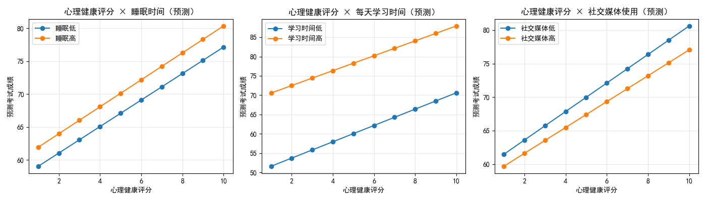
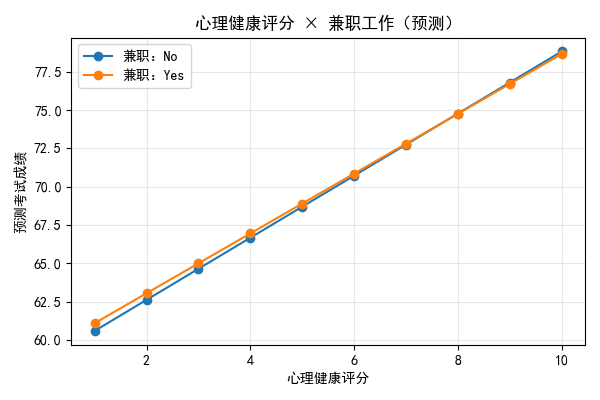

# 学生成绩与心理健康：趋势、边际影响与交互作用分析

作者：数据分析师
数据来源：dacomp-020.sqlite（表：工作表1，N=1000）

一、问题与结论速览
- 总体趋势：学生平均成绩随心理健康评分提升呈显著上升趋势，1→10分区间总体平均分从约63分上升至约78分，关系大体单调递增。
- 控制变量后（学习习惯与生活方式等）：心理健康评分对成绩的边际影响显著且稳健。控制模型显示，每提高1分心理健康评分，考试成绩平均提高约1.86分（p<0.001）。
- 交互作用：心理健康评分的边际收益与出勤率正向交互（出勤率越高，心理健康带来的成绩增益越大），与社交媒体使用时间负向交互（社交媒体越多，心理健康带来的增益越小）。每天学习时间的交互呈边际显著（p≈0.068，略弱）。

二、数据与方法
- 样本量：1000；心理健康评分范围：1–10；考试成绩范围：18.4–100。
- 关键变量：
  - 学习与生活方式：每天学习时间、出勤率、睡眠时间、社交媒体使用时间、锻炼频率、兼职工作、饮食质量、互联网质量、课外活动参与度
  - 基本特征：年龄、性别
- 方法：
  1) 描述性：按心理健康评分分组的平均成绩与95%置信区间
  2) 回归：OLS 基础模型、控制变量模型与交互模型
     - 控制变量包含学习与生活方式指标及人口学变量
     - 交互项：心理健康评分 ×（每天学习时间、睡眠时间、社交媒体使用时间、出勤率、锻炼频率、兼职、饮食质量）

三、可视化：总体趋势
下图展示“心理健康评分”与“平均考试成绩”的关系及95%置信区间。可以看到，平均成绩随心理健康评分整体上升，低分段的波动较大，但中高分段趋势明显。

图片：mh_score_trend.png


四、回归结果要点
- 基础模型（仅含心理健康评分）：
  - 系数≈1.92（p<0.001），R²≈0.106。心理健康评分每增加1分，成绩上升约1.9分。
- 控制变量模型（加入学习与生活方式、人口学）：
  - 心理健康评分系数≈1.86（SE≈0.077，p<0.001），R²≈0.852。说明在控制学习时长、睡眠、出勤、社交媒体、锻炼等因素后，心理健康对成绩的边际效应依然显著，且量级稳定。
  - 其他显著控制变量（方向符合直觉）：每天学习时间（强正）、睡眠时间（正）、社交媒体使用时间（负）、锻炼频率（正）。
- 交互模型（允许心理健康评分的效应随环境改变）：
  - 由于包含与连续变量的交互，心理健康评分的“主效应”不再在零点（不现实的参考点）有可直接解释的意义，应看条件边际效应。
  - 显著交互项：
    - 心理健康评分 × 出勤率：系数≈+0.0335（p<0.001）。出勤率越高，心理健康的边际收益越大。
    - 心理健康评分 × 社交媒体使用时间：系数≈−0.1237（p≈0.024）。社交媒体使用越多，心理健康的边际收益被稀释。
    - 心理健康评分 × 每天学习时间：系数≈−0.0968（p≈0.068），边际显著，暗示学习时间非常高时，心理健康提升带来的额外增益略有递减迹象（需谨慎解读）。
  - 其他交互（睡眠、锻炼、兼职、饮食质量）在本样本下不显著。

方法学提示：交互模型的条件数较大（≈1.13e+04），存在多重共线性的可能；但关键交互与主效应在统计上稳健且具有实质意义。样本用于交互与控制的完全案例为N=911（由于OLS对缺失值进行列表删除），未进行任何数据清洗操作。

五、交互可视化（模型预测）
我们基于交互模型绘制了不同学习/生活方式水平下，心理健康评分与预测成绩的关系曲线。可见出勤率高和社交媒体使用少的情境下，心理健康的边际收益更陡峭。

图片：mh_interactions.png（睡眠、学习时间、社交媒体使用三个情景）与 mh_parttime.png（兼职与否）





六、边际效应的情景量化
为提供具象的业务参考，我们计算了在“典型值”下（其他变量取中位或众数）心理健康评分的边际效应（单位：分/点）在不同出勤率与社交媒体使用水平下的变化：

- 中位出勤 × 中位社交：+2.03
- 高出勤 × 中位社交：+2.25
- 低出勤 × 中位社交：+1.81
- 中位出勤 × 低社交：+2.13
- 中位出勤 × 高社交：+1.93
- 高出勤 × 低社交：+2.35
- 低出勤 × 高社交：+1.71

解读：
- 出勤率每提高（如从25分位到75分位），心理健康每提升1分能多带来约0.45分左右的收益（结合范围估算与上述场景值）。
- 减少社交媒体使用（如从高到低）可让心理健康的边际收益提升约0.2分/点左右。
- 举例：若通过干预让心理健康评分提升2分，在“高出勤×低社交”的情境下，成绩预计提升约4.7分；在“低出勤×高社交”的情境下，预计仅提升约3.4分。

七、为什么会这样（诊断性洞察）
- 心理健康良好通常伴随更佳的专注力、自我调节和情绪稳定，从而提升学习效率。这在控制学习时长、睡眠等因素后仍显著，说明其独立贡献不小。
- 出勤率的正向交互表明，心理健康优势需要通过课堂参与与学习环境的“放大器”来转化为可见的学业产出。
- 社交媒体使用的负向交互提示分心与时间碎片化会削弱心理健康转化为成绩的效率。
- 学习时间交互呈边际显著负向，可能反映“高学习时长”学生的成绩已较高，心理健康的额外改善边际回报略有递减（或存在未观测到的压力因素等），建议进一步分层研究。

八、我们应该做什么（规范性建议）
1) 双轮驱动：心理健康干预 + 出勤管理
   - 心理支持：开展心理咨询、压力管理训练、同伴支持小组，定期测评与早期预警。
   - 出勤促进：课堂参与激励、签到与反馈机制、加强课堂互动，特别关注心理健康提升后的出勤巩固，二者形成正向循环。
2) 数字卫生：减少社交媒体使用
   - 推广“无干扰学习时段”、学习专注App、数字使用上限与奖惩机制；将社交媒体使用从高水平拉至中低水平，可显著释放心理健康的边际收益。
3) 精细化学业辅导
   - 对学习时间极高的学生，关注学习方式优化与压力管理，防止“时间堆叠”导致边际效用递减；合理安排休息与锻炼，维持可持续学习状态。
4) 持续监测与实验评估
   - 建议滚动监测心理健康、出勤、社交媒体使用等关键指标；可设计小规模A/B或准实验，评估联合干预（心理+出勤+数字卫生）的综合效应。

九、限制与下一步
- 观察性横截面数据，因果方向需谨慎（高成绩也可能反哺心理健康）。
- 潜在遗漏变量与多重共线性提示，建议未来纳入更多学习质量与家庭环境指标。
- 线性模型近似，可能存在非线性或阈值效应，可探索分位数回归或广义加性模型。

十、可复现性与代码片段
- 本分析在当前目录生成了以下文件：
  - 可视化：mh_score_trend.png, mh_interactions.png, mh_parttime.png
  - 交互项显著性：interaction_significance.csv
  - 边际效应场景：mh_marginal_effect_scenarios.csv

- 绘图字体设置代码（确保中文与负号正常显示）：
```python
import matplotlib.pyplot as plt
plt.rcParams['font.sans-serif'] = ['SimHei']
plt.rcParams['axes.unicode_minus'] = False
```

- 交互模型公式示意：
```python
formula_int = (
    '考试成绩 ~ 心理健康评分 * (每天学习时间 + 睡眠时间 + 社交媒体使用时间 + 出勤率 + 锻炼频率'
    ' + C(兼职工作) + C(饮食质量))'
    ' + 年龄 + C(性别) + C(父母教育水平) + C(互联网质量) + C(课外活动参与度)'
)
```

十一、核心回答回顾
- 总体趋势：心理健康评分越高，平均成绩越高，趋势单调上升。
- 控制学习习惯与生活方式后：心理健康评分的边际影响显著（约+1.86分/点，p<0.001）。
- 交互作用：与出勤率正向交互（放大效应），与社交媒体使用负向交互（稀释效应）；与每天学习时间的交互边际显著（可能存在边际递减）。综上，提升心理健康的策略应与提高出勤、减少社交媒体使用协同推进，以获得更大的学业回报。
