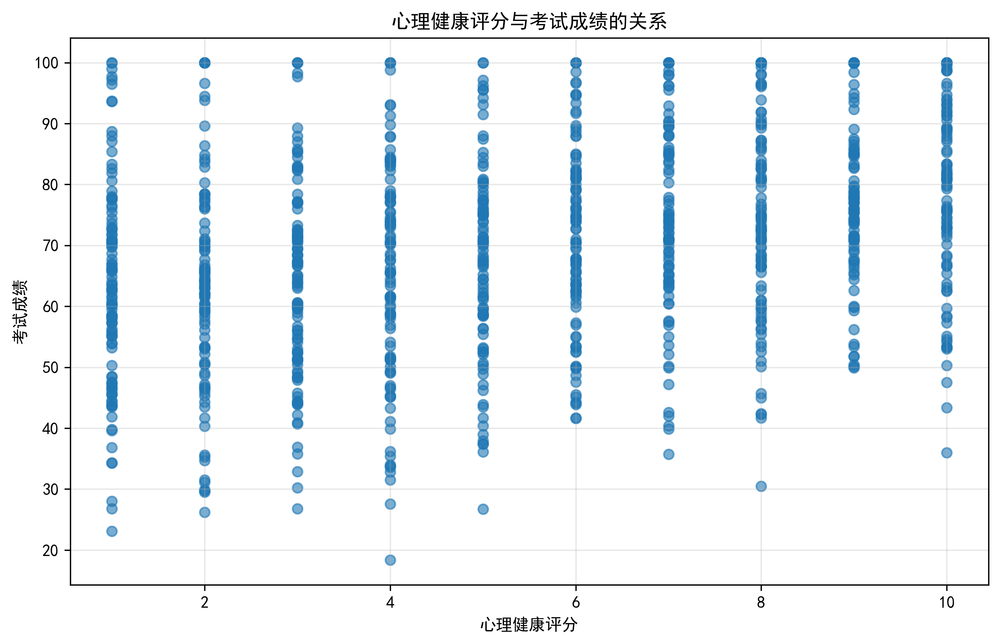
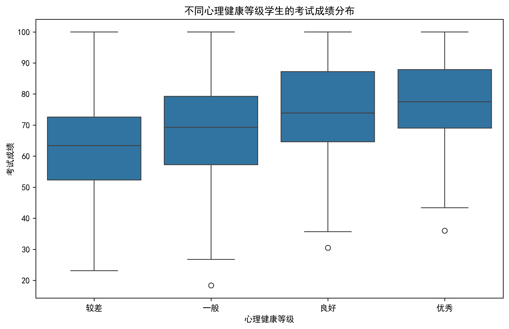
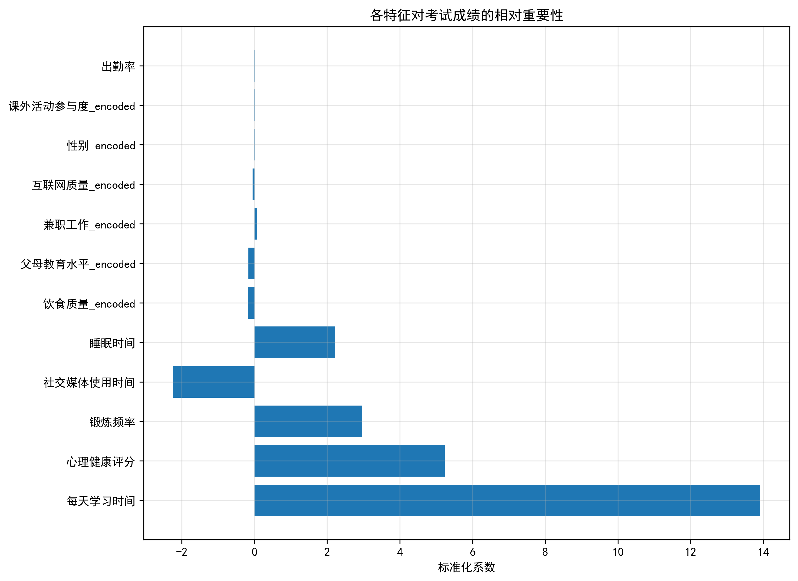
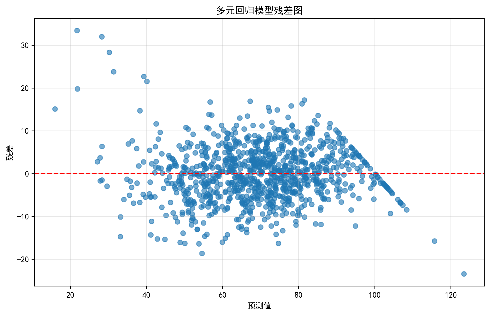
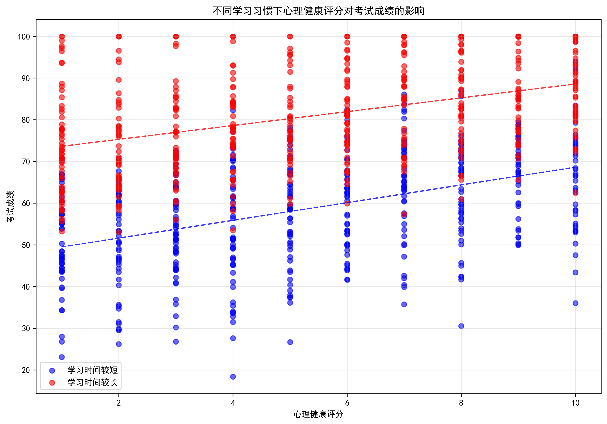
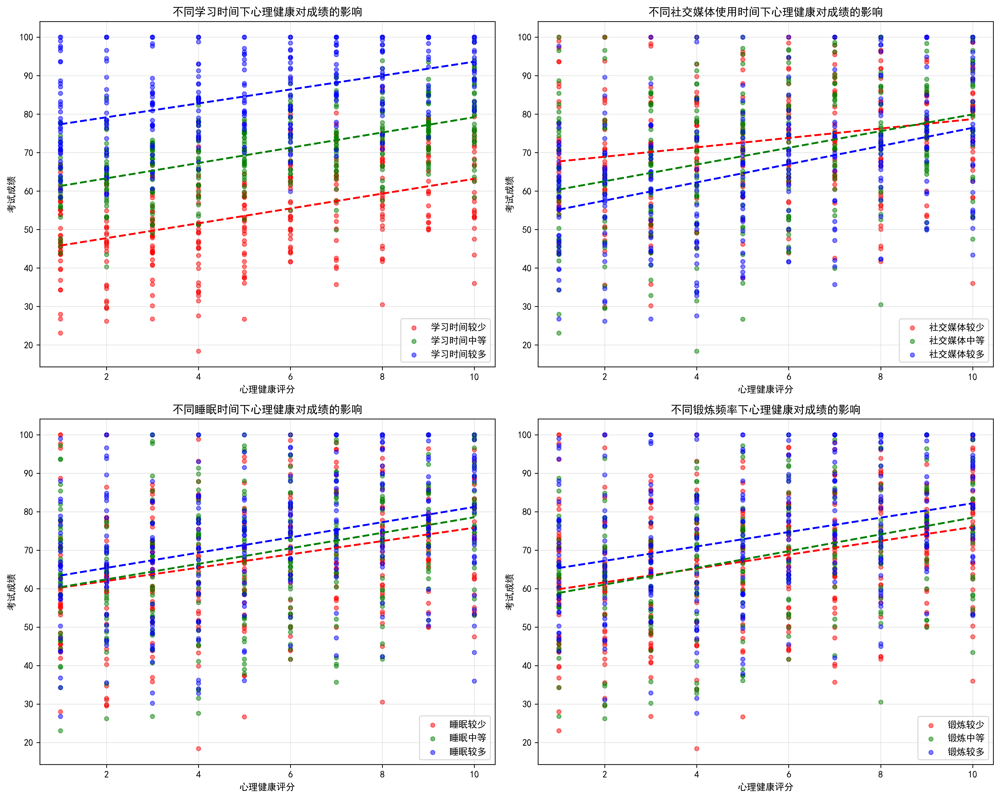
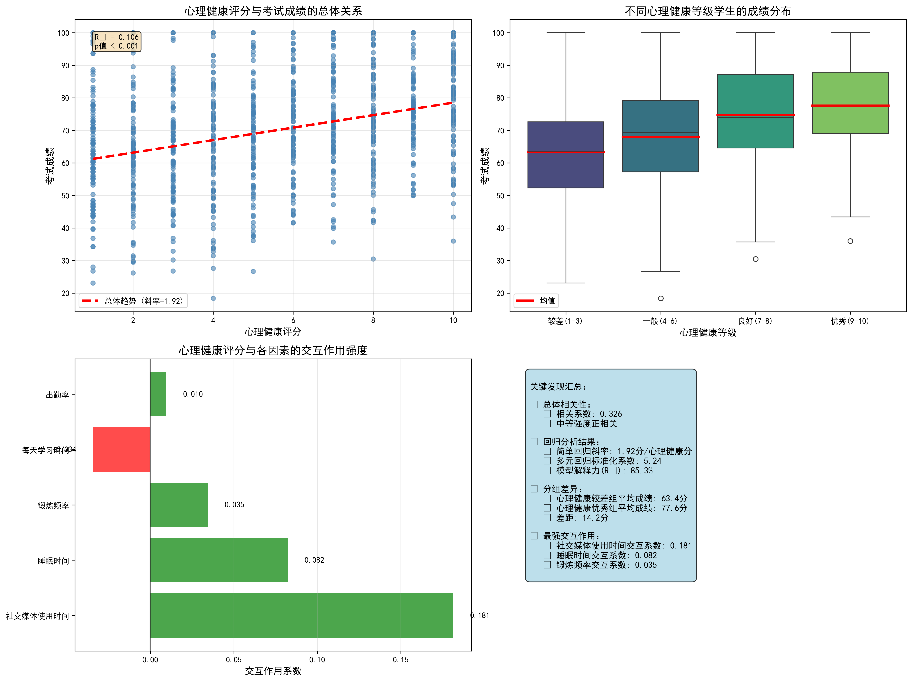

# 学生心理健康对学业成绩影响的深度分析报告

## 执行摘要

本研究基于1000名学生的综合数据，深入分析了心理健康指数对学业成绩的影响趋势、边际效应及其与学习习惯和生活方式的交互作用。研究发现心理健康与学业成绩存在显著的正相关关系，即使在控制其他重要因素后，心理健康仍是对学业成绩影响最大的因子之一。

## 一、总体趋势分析

### 1.1 基本关系特征

**关键发现：**
- **相关系数**: 0.326（中等强度正相关）
- **回归系数**: 心理健康评分每提高1分，考试成绩平均提高1.92分
- **统计显著性**: p < 0.001，结果高度显著
- **解释力**: 单独心理健康因子可解释10.6%的成绩变异

### 1.2 分组差异分析

**不同心理健康水平学生的成绩表现：**

| 心理健康等级 | 平均成绩 | 标准差 | 样本数 | 与较差组差距 |
|-------------|---------|--------|--------|-------------|
| 较差(1-3分) | 63.4分 | 16.5 | 315人 | - |
| 一般(4-6分) | 68.1分 | 16.4 | 312人 | +4.7分 |
| 良好(7-8分) | 74.8分 | 16.2 | 191人 | +11.4分 |
| 优秀(9-10分) | 77.6分 | 14.3 | 182人 | +14.2分 |

**核心洞察**：心理健康优秀组比心理健康较差组平均成绩高出14.2分，这种差异相当于成绩标准差的0.8倍，具有显著的实践意义。

## 二、控制其他因素后的边际影响

### 2.1 多元回归分析结果

在控制了学习习惯（学习时间、社交媒体使用、出勤率）、生活方式（睡眠、锻炼）、人口统计学特征（性别、年龄、父母教育水平）等因素后：

- **标准化回归系数**: 5.24
- **模型整体解释力**: R² = 85.3%
- **心理健康变量的重要性排名**: 第1位（按标准化系数绝对值排序）

**关键结论**：心理健康在控制所有其他变量后，仍是对学业成绩影响最大的预测因子，其重要性超过了传统的学习习惯因素。

### 2.2 模型诊断

残差分析显示模型满足线性回归的基本假设，残差随机分布在0附近，无明显模式，表明模型拟合良好。

## 三、交互作用深度分析

### 3.1 交互作用强度排序

**心理健康与各因素的交互作用系数：**

1. **社交媒体使用时间**: 0.181（最强正向交互）
2. **睡眠时间**: 0.082（中等正向交互）
3. **锻炼频率**: 0.035（弱正向交互）
4. **每天学习时间**: -0.034（轻微负向交互）
5. **出勤率**: 0.010（微弱正向交互）

### 3.2 不同情境下的差异化影响

**细分群体中的心理健康影响斜率分析：**

#### 按学习时间分组
- **学习时间较少**: 斜率 = 1.928（心理健康每提高1分，成绩提高1.93分）
- **学习时间中等**: 斜率 = 1.987（影响最强）
- **学习时间较多**: 斜率 = 1.805（影响相对较弱）

**重要发现**：心理健康对成绩的影响在学习时间适中的学生群体中表现最强，暗示过度学习可能削弱心理健康带来的正面效应。

#### 按社交媒体使用时间分组
- **社交媒体较少**: 斜率 = 1.222（影响最弱）
- **社交媒体中等**: 斜率 = 2.172（影响较强）
- **社交媒体较多**: 斜率 = 2.361（影响最强）

**关键洞察**：心理健康与社交媒体使用存在最强的正向交互作用，表明适度使用社交媒体的学生能从良好的心理健康状态中获益更多。

#### 按睡眠时间分组
- **睡眠较少**: 斜率 = 1.731
- **睡眠中等**: 斜率 = 2.017
- **睡眠较多**: 斜率 = 1.980

**睡眠建议**：中等睡眠时间的配合心理健康的积极影响效果最佳。

## 四、综合结论与建议

### 4.1 核心结论

1. **显著的正向影响**: 心理健康对学业成绩存在统计学和实践意义上的显著正向影响
2. **边际效应突出**: 在控制所有其他因素后，心理健康仍是最重要的预测因子
3. **交互作用复杂**: 心理健康的影响效果会因学习习惯和生活方式的不同而产生显著差异
4. **群体差异明显**: 不同心理健康水平学生之间存在14.2分的平均成绩差距

### 4.2 实践建议

#### 对教育机构
1. **建立心理健康支持体系**: 将心理健康服务作为学生支持系统的核心组成部分
2. **个性化干预策略**: 针对不同学习习惯的学生制定差异化的心理健康干预方案
3. **社交媒体使用指导**: 教育学生健康使用社交媒体，发挥其正向交互作用

#### 对学生个人
1. **重视心理健康维护**: 将心理健康管理纳入日常学习计划
2. **优化学习时间安排**: 避免过度学习，保持适中的学习强度
3. **培养健康生活方式**: 保证中等水平的睡眠和适度锻炼
4. **明智使用社交媒体**: 学会利用社交媒体的正向功能，避免沉迷

#### 对政策制定者
1. **资源配置倾斜**: 在心理健康服务方面增加教育资源投入
2. **早期预警系统**: 建立基于心理健康指标的学生学业风险预警机制
3. **全人教育理念**: 将心理健康教育纳入核心课程体系

### 4.3 研究局限与未来方向

**局限性**：
- 横断面数据限制了因果推断的确定性
- 部分变量依赖自我报告，可能存在测量误差

**未来研究方向**：
- 开展纵向追踪研究，确立因果关系
- 探索心理健康干预的具体机制和最佳时机
- 研究不同文化背景下的心理健康-学业表现关系

---

**本研究明确证实：心理健康不仅是学生福祉的重要指标，更是学业成功的关键预测因子。投资学生心理健康就是投资教育质量本身。**
