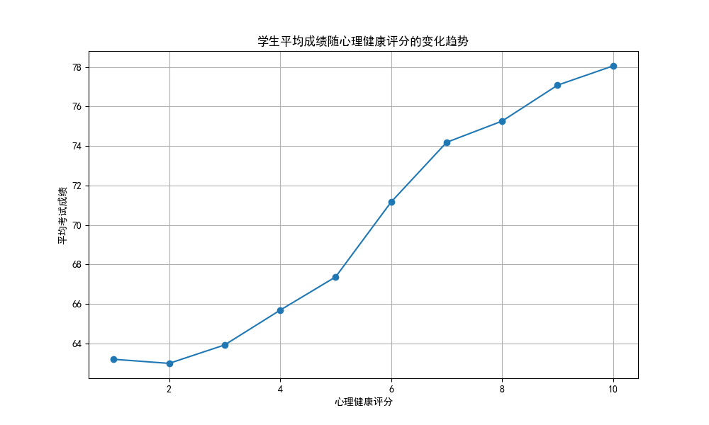
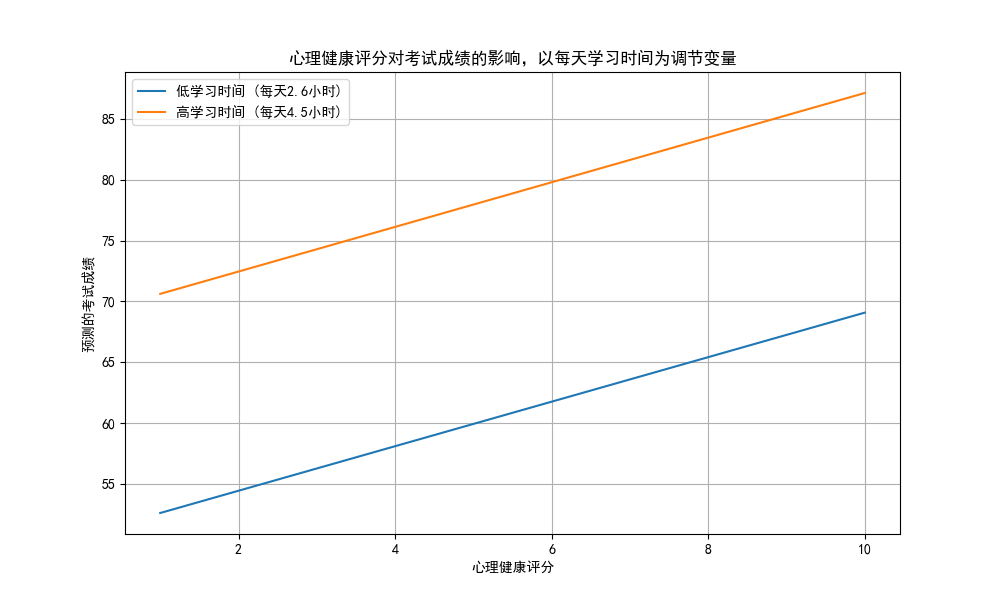

# 心理健康对学业成绩影响的深度分析报告

## 1. 引言

本报告旨在深入探究学生心理健康状况与其学业成绩之间的关系。我们不仅关注两者之间的总体趋势，还通过多元回归模型，在控制了学生的学习习惯（如每日学习时间、出勤率）和生活方式（如社交媒体使用、睡眠、锻炼、饮食等）等关键变量后，量化了心理健康对学业成绩的边际影响。此外，报告还进一步探索了这种影响是否会受到其他因素（如学习投入度）的调节。

## 2. 总体趋势：心理越健康，成绩越优秀

首先，我们对全体学生样本进行了初步分析，以探究平均考试成绩随心理健康评分变化的总体趋势。如下图所示，结果明确地揭示了一个正向关系。

**图1：学生平均成绩随心理健康评分的变化趋势**

从上图可以直观地看出，随着心理健康评分的提高，学生的平均考试成绩呈现出清晰的、近乎线性的上升趋势。这初步表明，良好的心理状态与优异的学业表现密切相关。

## 3. 边际效应分析：心理健康的净贡献有多大？

为了更精确地衡量心理健康对成绩的独立影响，我们构建了多元线性回归模型，将可能影响成绩的多个学习与生活方式变量作为控制变量。

**核心发现：**
在控制了每日学习时间、社交媒体使用、睡眠质量、锻炼频率等12个相关因素后，**心理健康评分对考试成绩仍然具有高度显著的正向影响**。

根据我们的主效应模型分析结果：
- **心理健康评分的系数为 +1.83 (p < 0.001)**。
- 这意味着，在其他所有条件（如学习时间、生活习惯等）都相同的情况下，**学生的心理健康评分每提高1分，其考试成绩平均会提高1.83分**。

这个结果强有力地证明了，心理健康并非仅仅是与好成绩伴生的现象，而是作为一种独立的积极因素，对学业成就有着实质性的贡献。

## 4. 交互作用探索：心理健康的影响是普适的吗？

我们进一步提出了一个问题：心理健康对成绩的积极影响，是否会因为学生学习投入程度的不同而有所差异？例如，对于学习非常努力的学生，更好的心理状态是否能带来更大的学业回报？

为了回答这个问题，我们在模型中加入了“心理健康评分”与“每天学习时间”的交互项。

**核心发现：**
- **交互项 `心理健康评分 * 每天学习时间` 的系数接近于0，且在统计上不显著 (p = 0.962)**。

如下图所示，代表“高学习时间”和“低学习时间”的两条预测线几乎完全平行，这直观地印证了交互效应不显著的统计结果。

**图2：心理健康评分对考试成绩影响的交互效应图（以每天学习时间为调节变量）**

这一结果表明，**心理健康对学业成绩的积极影响具有普适性**。无论学生每天投入的学习时间是长是短，保持良好的心理健康状态都能同等地帮助他们提升成绩。换言之，提升心理健康并非“学霸”的专属增益，对所有学生而言都是一项值得的“投资”。

## 5. 结论与建议

本次数据分析得出以下核心结论：

1.  **显著正相关**：学生心理健康水平与学业成绩之间存在明确的、强劲的正相关关系。
2.  **独立效应显著**：在控制了广泛的学习和生活习惯变量后，心理健康对学业成绩的积极影响依然显著。心理评分每提升1分，可带来约1.83分的成绩增益。
3.  **影响具有普适性**：心理健康的积极效应并不会因为学生学习时间的长短而发生改变，它对所有学生都同等重要。

**基于以上结论，我们提出以下可行性建议：**

*   **将心理健康服务纳入核心教育支持体系**：学校和教育机构不应将心理健康视为学业的附属品，而应将其作为提升教育质量和学生成就的核心环节。建议增加心理咨询资源，开设压力管理、情绪调节等课程。
*   **实施普适性心理健康促进计划**：鉴于心理健康的积极影响对所有学生都有效，应面向全体学生推广心理健康知识和技能，而非仅关注有心理问题的少数学生。
*   **鼓励健康生活方式**：分析结果同时表明，增加睡眠时间、减少社交媒体过度使用、增加锻炼频率均对成绩有益。学校和家庭应共同引导学生建立平衡、健康的生活方式，这不仅能直接提升学业，也能间接促进心理健康。
