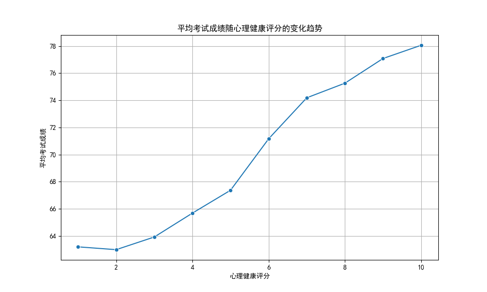

# 心理健康评分对考试成绩的影响分析

## 概述
此报告分析了心理健康评分对考试成绩的影响，并探讨了其与其他变量的交互作用。分析基于线性回归模型，该模型考虑了学习习惯和生活方式等因素。

## 数据可视化
### 心理健康评分与考试成绩的平均趋势

该图显示了学生的平均考试成绩如何随心理健康评分的变化而变化。趋势表明，总体上，随着心理健康评分的提高，考试成绩也趋于上升。

## 回归分析结果
### 心理健康评分的边际效应
- **心理健康评分的系数**: 1.92
- **解释**: 心理健康评分每提高 1 分，学生的考试成绩平均提高 1.92 分。这表明心理健康对学生学业成绩有显著的正向影响。

### 心理健康评分与学习时间的交互项
- **交互项系数 (心理健康评分 x 每天学习时间)**: -0.03
- **解释**: 心理健康评分与每天学习时间之间的交互项系数为负，这表明随着学习时间的增加，心理健康对考试成绩的积极影响减弱。这表明心理健康对成绩的影响取决于学生的学习习惯。

## 分析结论
1. **心理健康评分对学生考试成绩有显著正向影响**。这表明改善学生的心理健康状况可以提升其学业成绩。
2. **心理健康评分与学习时间的交互作用为负**。这表明长时间学习可能会削弱心理健康对成绩的正向影响。这可能是因为过度学习导致疲劳，从而削弱了心理健康对成绩的正向影响。

## 建议
1. **促进学生心理健康**：学校和教育机构应提供心理健康支持服务，如心理咨询和压力管理课程，以提高学生的心理健康评分，从而提升其学业成绩。
2. **优化学习时间**：鼓励学生采用更有效的学习方法，避免过长的学习时间，以减少心理健康对成绩的负面影响。
3. **进一步研究其他交互作用**：分析其他变量与心理健康评分的交互作用，例如锻炼频率、睡眠时间和饮食质量，以获得更深入的洞察。

## 未来研究方向
- **探索其他交互作用**：可以研究其他变量（如锻炼频率、睡眠质量、饮食质量）与心理健康评分的交互作用，以获得更全面的理解。
- **分析非线性关系**：探索心理健康评分与考试成绩之间的非线性关系，以确定是否存在最大效益点。
- **增加变量**：纳入新的变量，如学业压力、社会支持、经济状况等，以增强模型的预测能力。
