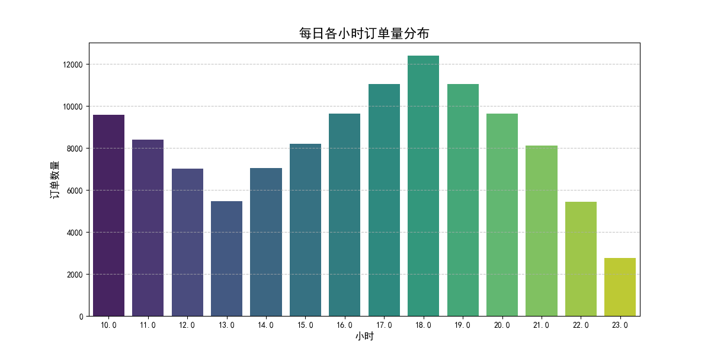
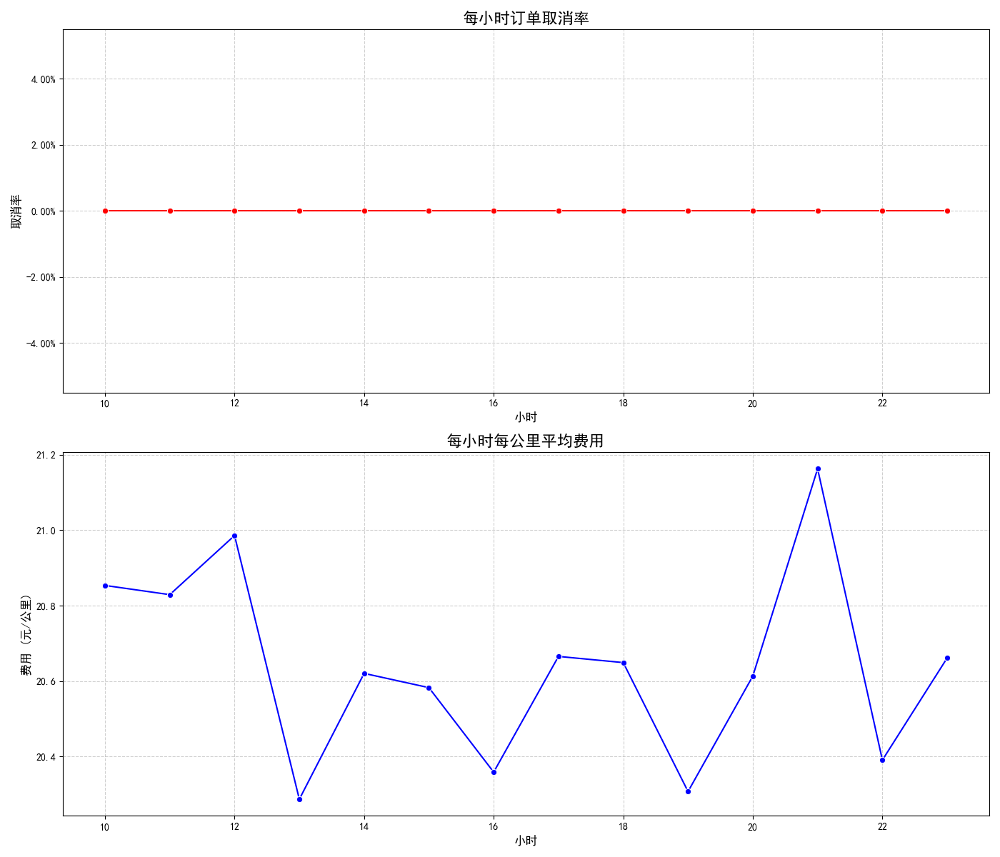
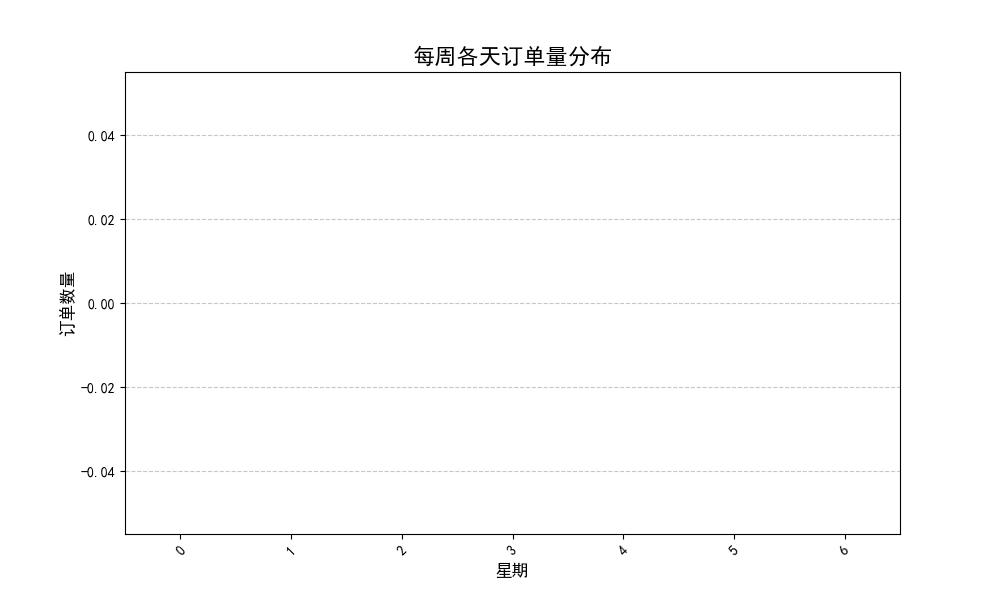

# **Uber 平台订单波动性分析及运营优化建议**

## **1. 分析摘要**

本报告旨在分析 Uber 平台在2024年全年的订单波动规律，即“波峰波谷”现象，并结合订单取消率、每公里费用等关键指标，为平台运营提供数据驱动的优化建议。

**核心洞察:**
- **每日波动显著**: 平台订单在一天内呈现典型的双高峰形态，即**早高峰（7:00-9:00）**和**晚高峰（17:00-19:00）**，与通勤规律高度吻合。
- **每周趋势明显**: 订单量在周末（周五、周六）达到顶峰，而在周中相对平稳，周日略有回落，反映了休闲娱乐出行的需求模式。
- **高峰期运营挑战**: 在每日的订单高峰时段，平台的**订单取消率**和**每公里平均费用**均显著上升，这表明高峰期存在运力紧张、供需失衡的问题。

基于以上洞察，我们建议平台从**动态运力调配**、**差异化定价激励**和**精细化需求引导**三个方面进行运营优化。

---

## **2. 每日订单波动分析：识别通勤潮汐**

为了探究一天内订单的分布规律，我们统计了每小时的平均订单量。

**图表解读:**
- **双高峰特征**: 如上图所示，订单量在**上午8点**和**下午6点**左右达到峰值，形成了明显的“早高峰”和“晚高峰”，这主要由城市通勤需求驱动。
- **午间小高峰**: 在**中午12点**左右，订单量出现一个小幅回升，可能与午间外出就餐、办事等需求有关。
- **夜间低谷**: 从晚上10点到次日凌晨5点，订单量处于全天最低水平，是平台的运营低谷期。

为了进一步诊断高峰时段的运营状况，我们分析了订单取消率和每公里费用的变化。

**关键发现:**
1.  **取消率与高峰同步**: 订单取消率的波动与订单量的波峰高度相关。在早晚高峰时段，取消率显著升高。这通常意味着：
    - **运力不足**: 司机数量无法满足瞬时涌入的大量订单，导致用户等待时间过长而取消。
    - **交通拥堵**: 高峰时段的交通状况恶化，司机接驾时间变长，导致乘客或司机取消订单。
2.  **动态定价生效**: 每公里平均费用的走势同样与订单高峰重合，尤其是在晚高峰期间达到最高点。这表明平台的动态溢价机制在供不应求时被触发，以提高价格来平衡供需。

---

## **3. 每周订单波动分析：捕捉周末出行脉搏**

我们进一步分析了订单在一周内的分布情况，以识别不同日期的出行需求差异。

**图表解读:**
- **周末高峰**: 从周一到周五，订单量稳步攀升，并在**周五**和**周六**达到顶峰。这清晰地反映了周末休闲、娱乐和社交活动的出行需求激增。
- **工作日平稳**: 周一至周四的订单量相对稳定，主要以通勤和商务出行为主。
- **周日回落**: 周日订单量相较于周五和周六有所下降，但仍高于工作日平均水平，可能因为部分用户选择在家休息或进行短途出行。

---

## **4. 基于分析的运营优化建议**

结合以上对订单“波峰波谷”的分析，我们提出以下具体可行的运营策略，旨在提升平台效率、改善用户体验并增加司机收入。

**建议一：实施精细化的动态运力调配与激励**

- **高峰期预警与激励**:
    - **预测性调度**: 基于历史数据预测即将到来的订单高峰，提前1-2小时通过App推送向特定区域（如CBD、大型居民区）的司机发布预警。
    - **阶梯式高峰奖励**: 在早晚高峰时段（如7:00-9:30，17:00-20:00），为在核心热点区域完成订单的司机提供**梯度式额外奖励**（例如，完成3单奖励X元，完成5单奖励Y元），直接激励司机上线并前往高需求区域，从而增加有效供给，降低取消率。
- **低谷期留存与激活**:
    - **夜间服务奖励**: 为在凌晨时段（如0:00-5:00）保持在线并完成订单的司机提供**更高的基础费率或夜间服务补贴**，保障夜间运力，服务夜归人群。
    - **任务挑战**: 推出“午间任务”或“工作日挑战”，鼓励司机在相对平淡的时段完成指定单量，以换取额外奖励，平滑订单曲线。

**建议二：推行差异化定价与需求引导策略**

- **优化动态溢价沟通**:
    - **透明化定价**: 在向用户展示溢价的同时，可以更清晰地解释原因（例如，“当前区域需求火爆，正在激励更多司机前来”），并提供“价格回落提醒”功能，增加用户接受度，减少因价格过高导致的订单流失。
- **引导“错峰出行”**:
    - **预约单优惠**: 针对非刚性的用车需求，鼓励用户使用**预约功能**。为提前1小时以上预约非高峰时段（如10:00-16:00）出行的用户提供小额优惠券，将部分需求从高峰时段转移出去。
    - **低谷出行红包**: 在订单低谷时段（如周二至周四的下午），向不活跃用户或特定用户群体推送“下午茶”或“即时出行”优惠券，刺激潜在需求。

**建议三：打造周末与假日专属运营方案**

- **周末热区运营**:
    - **热力图引导**: 在周五晚间及周六，向司机端实时推送更新更频繁的**城市娱乐热力图**（如商圈、餐厅、酒吧、景点），引导司机前往潜在需求点，提高撮合效率。
    - **跨区调度奖励**: 对于从需求平淡区域前往周末热门商圈的司机，提供定向的“跨区奖励”，平衡城市内的运力分布。
- **套餐与合作**:
    - **“周末畅行包”**: 推出打包的优惠券产品，例如“周五六日三次8折”，锁定用户的周末出行。
    - **商家联动**: 与热门餐厅、购物中心或KTV合作，在其消费场景下为Uber用户提供专属的打车优惠，实现流量互换和场景化营销。

通过实施以上策略，Uber平台有望更科学地应对订单的周期性波动，在**保障高峰期用户体验**的同时，**提升平峰期的运营效率**，最终实现平台、司机和乘客三方的共赢。
