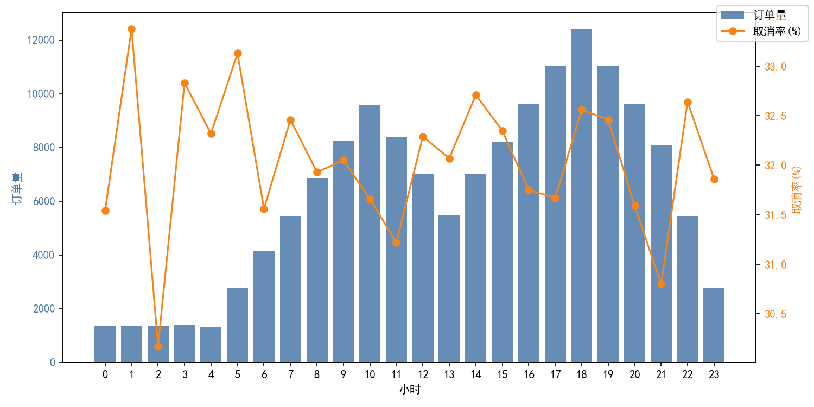
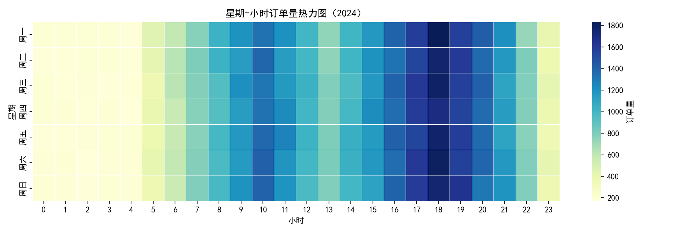
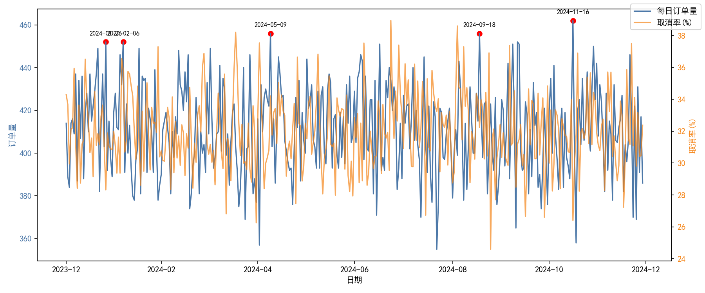
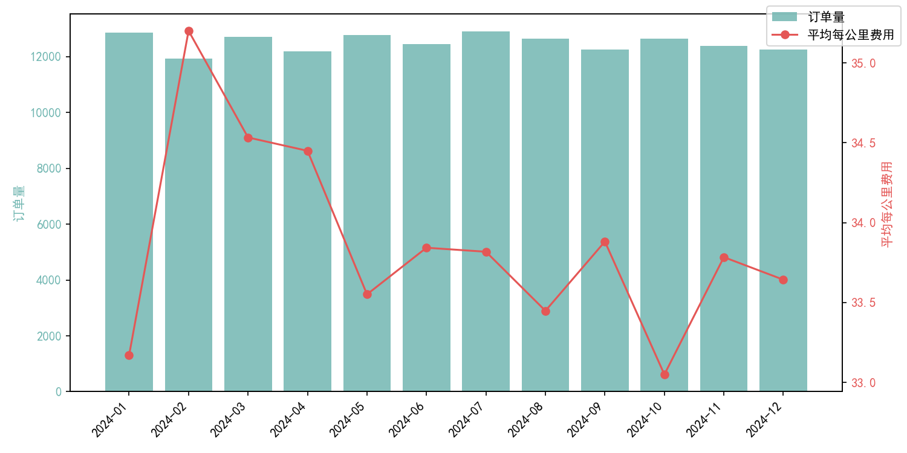

# 2024全年行程订单“波峰波谷”分析与运营建议（Uber平台）

> 数据来源：SQLite 数据库 dacomp-021.sqlite，表“工作表1”。不进行数据清洗，仅进行时间解析与逻辑限定（每公里费用仅针对完成且里程>0的订单）。

## 分析方法与可视化说明
- 时间解析：将“日期”“时间”合并为 datetime，筛选 2024 年记录；提取小时（hour）、日期（date）、星期（dow）。
- 指标口径：
  - 订单量：按小时/日期/星期统计订单数。
  - 取消率：取消（司机/乘客取消、无司机）÷ 全部订单。
  - 每公里费用：订单金额 ÷ 行程距离（仅针对完成且里程>0）。
- 可视化：
  - 每小时订单量与取消率双轴图：hourly_orders_cancel_rate.png
  - 星期-小时订单热力图：dow_hour_heatmap.png
  - 每日订单趋势与取消率：daily_orders_trend.png
  - 月度订单与平均每公里费用：monthly_unit_fare.png

Python绘图代码中的中文显示配置如下：
```python
import matplotlib.pyplot as plt
plt.rcParams['font.sans-serif'] = ['SimHei']
plt.rcParams['axes.unicode_minus'] = False
```

## 关键发现

### 1) 日内“波峰波谷”显著：傍晚为峰、凌晨为谷
- 峰时段（Top5小时，订单量）：18点(12,397)、19点(11,047)、17点(11,044)、16点(9,633)、20点(9,630)。
- 谷时段（Bottom5小时，订单量）：4点(1,321)、2点(1,339)、1点(1,360)、0点(1,373)、3点(1,383)。
- 峰时段（16–20点）订单占比约35.83%，是全天供需最紧张的时段。
- 小时取消率最高的时段并非晚高峰，而是：1点(33.38%)、5点(33.13%)、3点(32.83%)、14点(32.71%)、22点(32.64%)，显示取消更可能集中在凌晨和部分非通勤时段（可能受司机供给、接单意愿、等待时长影响）。

可视化：
- 每小时订单与取消率（识别峰谷与取消特征）


诊断性解读：
- 傍晚（16–20点）体现明显的通勤与出行高峰，订单需求集中，订单量显著高于其他时段。
- 凌晨（0–4点）订单显著减少，部分小时取消率却偏高，可能与司机可用性不足、接驾时间延长、乘客临时行程变化有关。
- 14点与22点取消偏高，前者可能受午后司机休息、需求分散影响；后者可能接近夜间时段、供给向夜班过渡，接单与履约不稳定。

### 2) 星期-小时分布：各工作日与周末在晚间18点均显峰
- 星期-小时订单量Top组合：周一/周六/周三/周五/周二/周日/周四的18点均为各自高峰（例如周一18点订单量最高）。
- 周末（周六、周日）晚间与工作日晚间的高峰形态相似，说明高峰是“全周一致的晚高峰”。

可视化：
- 星期-小时订单热力图（高峰在周一至周日的18点普遍突出）


运营含义：
- 晚间高峰是周期性稳定现象，应作为日常调度的重点时段。
- 周末晚高峰与工作日晚高峰都需加强运力与调度，说明“活动/社交/通勤”等复合需求叠加。

### 3) 每日趋势与“峰值日期”
- 2024年每日订单Top5日期：
  - 11-16（周末可能性高）：订单462、取消率26.41%
  - 05-09：订单456、取消率34.21%
  - 09-18：订单456、取消率32.24%
  - 01-26：订单452、取消率28.32%
  - 02-06（临近春节概率大）：订单452、取消率35.84%
- 峰值日期取消率差异较大，可能反映节假日、活动、天气或城市事件对供需与履约的影响。

可视化：
- 每日订单趋势与取消率（标注峰值日期）


### 4) 月度每公里费用：2月显著偏高，10月偏低
- 月度订单量平稳（约11.9k–12.9k/月），但平均每公里费用在2月显著高（~35.20），10月较低（~33.05）。
- 可能原因：
  - 2月（春节假期）：动态加价、夜间出行比例提升、长距离出行增多等因素抬升每公里费用。
  - 10月（可能国庆后平稳期）：旅行高峰过后，供需回归常态，平均每公里费用回落。

可视化：
- 月度订单与平均每公里费用对比


## 业务洞察（诊断/预测/规范性建议）

### A. 运力侧：晚高峰（16–20点）与周末晚间为重点保障
- 预测：晚高峰在全年稳定出现，预计未来仍持续。峰时订单占比达35.83%。
- 建议：
  - 高峰运力激励：在16–20点设置分时段“连单奖励/峰时补贴/目的地加成”，提升司机上线率与接单意愿。
  - 预匹配与动态调度：提前在高峰城区布点与动态引导司机（热区导航/热力图推送），降低ETA与接驾距离。
  - 区域精细化调度：针对周一与周末18点的城市核心区域，增加站点候驾，协调网约车与租赁车辆的临时运力。

### B. 取消率治理：凌晨与14、22点为重点治理时段
- 现象：峰时与非峰时整体取消率相近（32.04% vs 31.98%），但凌晨（1、3、5点）和14、22点的取消率明显偏高。
- 建议：
  - 夜间保供：为夜间司机提供“夜班保障包”（最低保障/里程补贴/安全支持），提高夜间接单稳定性，减少“无司机”导致的取消。
  - 等待时间管理：在高取消时段优化ETA预测与乘客提示（更准确的到达时间、候驾提示），并给予“超时等待补偿/代金券”，降低乘客主动取消。
  - 接单意愿优化：在14点、22点针对司机端推出“休息友好”策略（灵活接单开关、短途优先、连单节奏控制），减少因休息/疲劳造成的拒单或取消。
  - 产品策略：提高匹配容错（扩大临近司机搜索半径、智能重匹配、跨区域临时调度），降低“No Driver Found”。

### C. 定价与收益：节假日的价格弹性管理
- 现象：2月每公里费用显著偏高，可能与春节期间的动态加价与长途比例提升有关；0点的平均每公里费用也偏高（~36.06）。
- 建议：
  - 节假日价格策略：对节假日/活动期进行价格弹性测试，确保加价提升收益同时控制取消与投诉（封顶价、阶梯价、最低价保护）。
  - 夜间价格与供给：平衡夜间价格与司机补贴，既保持合理供给又避免因高价导致乘客流失，必要时配合“夜间预约”功能降低临时取消。
  - 渠道促销：在价格较低的月份（如10月）加大促销投放，提升客单量与日活。

### D. 需求培育：填补“谷时段”，提升平台利用率
- 现象：凌晨0–4点为显著“谷”，订单量最低。
- 建议：
  - 预约功能推广：针对凌晨出行（早班机、火车）推广预约打车与准时保障；合作航站楼/酒店进行固定里程包价。
  - 夜间保障营销：夜间出行“安心保障”，联合安全服务与客服上线夜间专项通道，增强用户信心。
  - 中午与午后时段（如14点）开展短途优惠券与拼车导流，减少取消与空驶。

## 风险与边界
- 数据口径：每公里费用仅针对完成且里程>0的订单计算；未对异常值进行清洗。
- 取消率定义包含乘客/司机取消与“无司机可接”情形，不同城市与季节事件可能影响。
- 原因解释为业务经验与模式识别推断，建议结合更细的地理区域、天气与事件数据进一步验证。

## 小结
- 2024年的订单明确存在日内“波峰波谷”特征：晚间16–20点为稳定峰、凌晨0–4点为稳定谷；各星期的18点均为高峰。
- 取消率整体在32%左右，但在凌晨与特定非通勤时段偏高，需针对性治理。
- 节假月（2月）每公里费用明显上浮，建议进行价格弹性与补贴的动态优化。
- 运营侧应围绕晚高峰、夜间与节假日三类场景制定差异化策略，兼顾供给稳定与用户体验，提升平台整体效率与收益。
