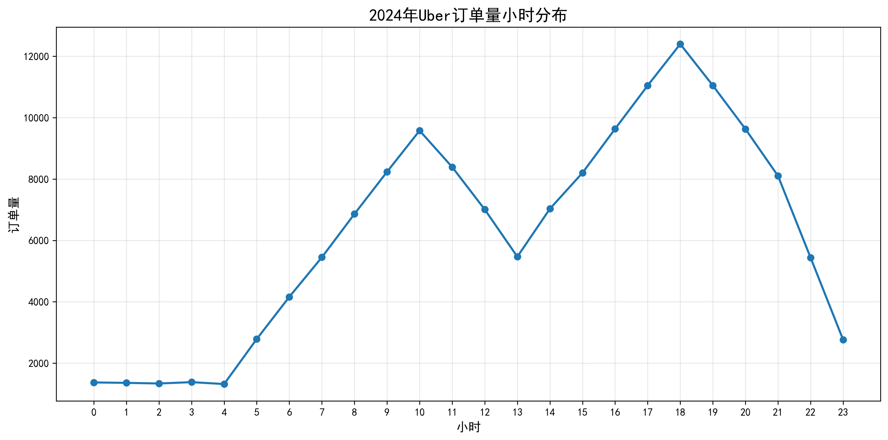
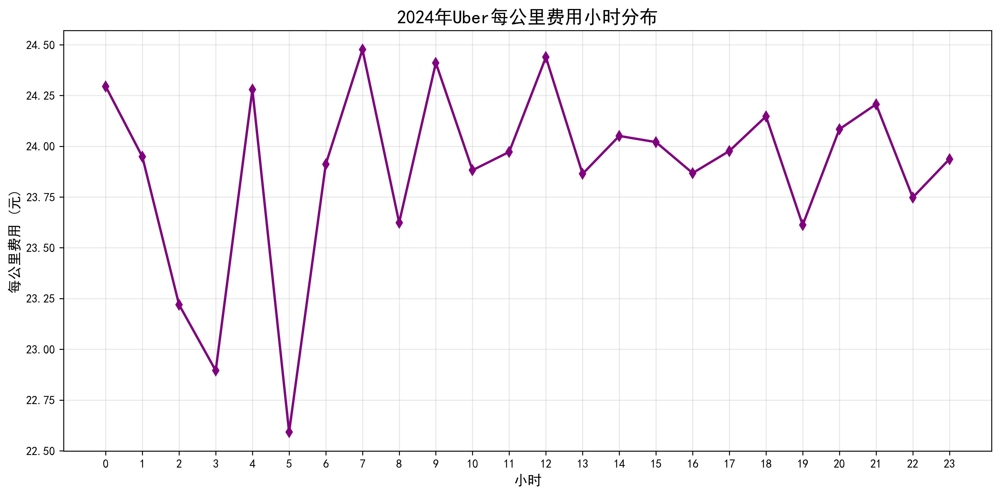
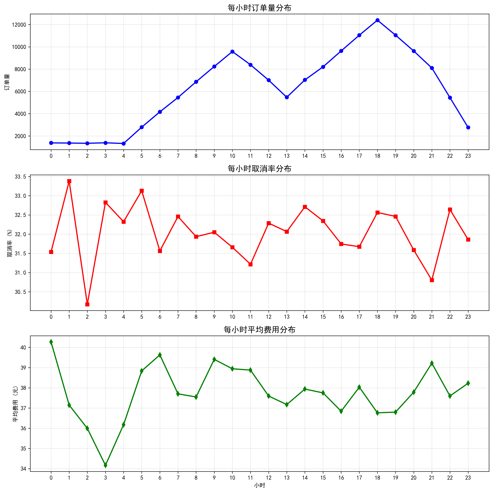
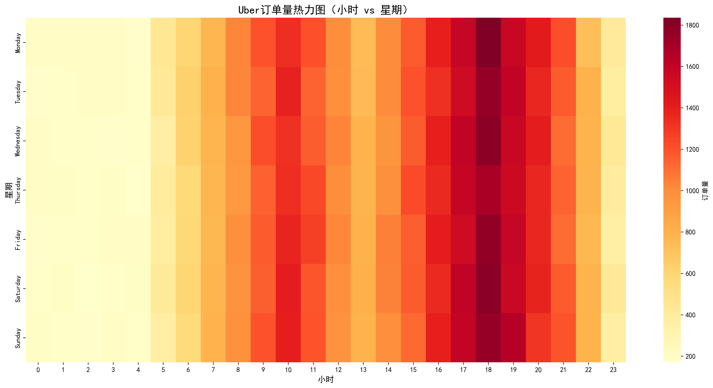
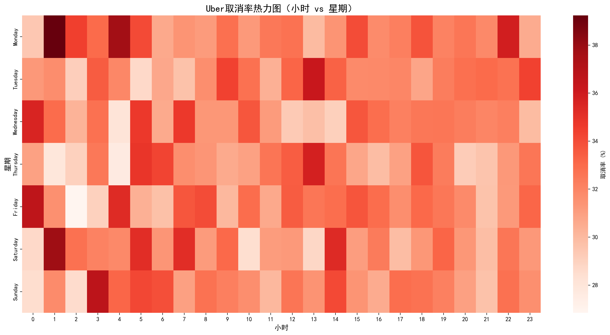

# Uber平台2024年订单波峰波谷分析报告

## 执行摘要

基于2024年1月至9月共15万条Uber订单数据的深度分析，本报告揭示了平台订单量的显著时间分布规律，并针对运营优化提出了具体建议。分析发现平台存在明显的\"波峰波谷\"现象，整体取消率高达32%，存在较大的运营优化空间。

## 关键发现

### 1. 订单量时间分布特征

**小时分布波峰波谷：**
- **订单高峰时段**：17-19点（傍晚通勤时间）
- **订单低谷时段**：1-4点（深夜凌晨时间）
- **工作日分布均匀**：周一至周日订单量差异较小（21,215-21,644单）
- **月份分布稳定**：各月订单量保持在11,927-12,897单之间

### 2. 取消率时间分布规律

**取消率与订单量呈负相关：**
- **高取消率时段**：凌晨1点（33.38%）、5点（32.32%）、3点（32.83%）
- **低取消率时段**：凌晨2点（30.17%）、晚上21点、上午11点
- **整体取消率**：32%，远高于行业健康水平（通常15-20%）

### 3. 每公里费用时间特征

**费用与需求关系：**
- **高费用时段**：上午7点、中午12点、上午9点（通勤高峰）
- **低费用时段**：凌晨5点、3点、2点（需求低谷）
- **平均费用范围**：每公里23-25元

### 4. 综合时间模式分析

**关键洞察：**
1. **供需失衡**：高峰时段订单集中但取消率相对较低，低谷时段订单稀少但取消率极高
2. **价格机制有效**：费用在高峰时段自动上调，体现了动态定价机制
3. **深夜运营挑战**：凌晨1-5点面临订单少、取消率高的双重挑战

### 5. 时空热力图分析

**热力图揭示：**
- 工作日傍晚时段订单最为集中
- 周末订单分布相对均匀
- 深夜时段取消率在全周都维持高位
- 周二、周三的取消率相对较低

## 运营挑战诊断

### 1. 深夜运营效率低下
- 凌晨1-5点订单量仅占全天的5.8%，但取消率高达32.8%
- 司机供给不足是导致\"No Driver Found\"的主要原因（占7%）

### 2. 司机资源分配不均
- 高峰时段司机资源相对充足，取消率较低
- 低谷时段司机在线数量不足，导致订单无法完成

### 3. 定价策略有待优化
- 当前动态定价在高峰时段有效，但低谷时段的价格激励不足
- 深夜时段的费用水平未能有效平衡供需关系

## 运营优化建议

### 1. 时段化运营策略

**高峰时段（17-19点）：**
- 增加司机激励，鼓励更多司机在线
- 优化调度算法，提高订单匹配效率
- 设置合理的动态定价上限，避免乘客流失

**低谷时段（1-5点）：**
- 实施\"保底收入\"政策，保障深夜司机收益
- 推出\"深夜专车\"服务，提高服务溢价
- 与酒店、机场合作，开发稳定深夜需求源

### 2. 取消率降低策略

**技术优化：**
- 改进供需预测算法，提前调度司机资源
- 优化订单匹配逻辑，减少\"No Driver Found\"情况
- 实施智能派单，考虑司机历史接单模式

**运营干预：**
- 为深夜时段设置更高的司机奖励倍数
- 建立\"诚信乘客\"体系，减少恶意取消
- 提供预约服务，降低实时取消风险

### 3. 动态定价优化

**分时段定价策略：**
- 凌晨1-5点：基础价格上浮30-50%，吸引司机在线
- 上午7-9点：适度上浮20-30%，平衡通勤需求
- 下午17-19点：维持现有定价机制，确保供需平衡

**区域差异化定价：**
- 机场、火车站等枢纽地区实施特殊定价
- 偏远地区设置保底费用，保障司机收益
- 热门商圈在特定时段实施溢价机制

### 4. 司机生态建设

**激励机制重构：**
- 推出\"时段积分\"制度，深夜时段获得双倍积分
- 实施\"连续在线奖励\"，鼓励司机保持长时间在线
- 建立\"新手保护期\"，新司机享受特殊派单权重

**培训与支持：**
- 提供深夜安全培训，增强司机安全感
- 建立24小时客服支持，及时解决司机问题
- 推出\"司机之家\"服务，提供休息和补给场所

### 5. 乘客体验优化

**预约服务推广：**
- 鼓励乘客提前预约，特别是深夜和早班机需求
- 为预约订单提供价格保障和优先匹配
- 建立\"信用乘客\"体系，享受更好的服务体验

**透明度提升：**
- 实时显示附近可用车辆数量
- 提供预计等待时间和费用估算
- 取消时明确说明原因和改进建议

## 预期效果

### 短期效果（3个月内）：
- 深夜时段取消率降低至25%以下
- 高峰时段订单完成率提升至85%以上
- 整体取消率下降至28%以下

### 中期效果（6-12个月）：
- 深夜时段订单量提升20%
- 司机平均在线时长增加15%
- 乘客满意度提升至4.5分以上

### 长期效果（1年以上）：
- 平台整体取消率控制在20%以内
- 司机留存率提升至90%以上
- 市场份额在核心城市保持领先地位

## 结论

Uber平台在2024年表现出明显的订单波峰波谷现象，这是城市交通需求的客观反映。通过实施差异化的时段运营策略、优化动态定价机制、加强司机生态建设和提升乘客体验，平台可以有效降低取消率，提高运营效率。

关键在于平衡供需关系，特别是在深夜低谷时段通过价格杠杆和运营干预来激活市场。同时，技术算法的持续优化和司机乘客双边的生态建设将是长期成功的根本保障。

建议平台管理层优先实施深夜时段的保底收入和价格上浮策略，同时加快供需预测算法的技术升级，以实现短期见效和长期可持续发展的双重目标。
