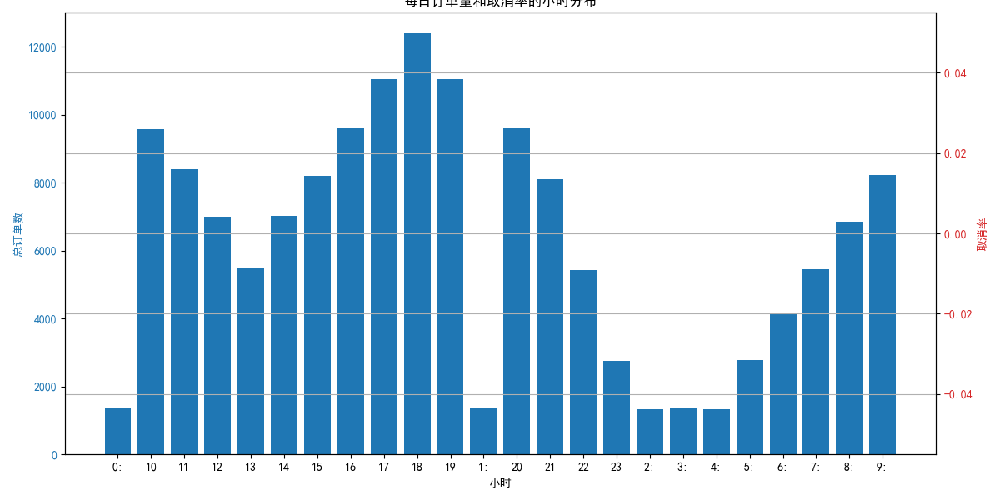
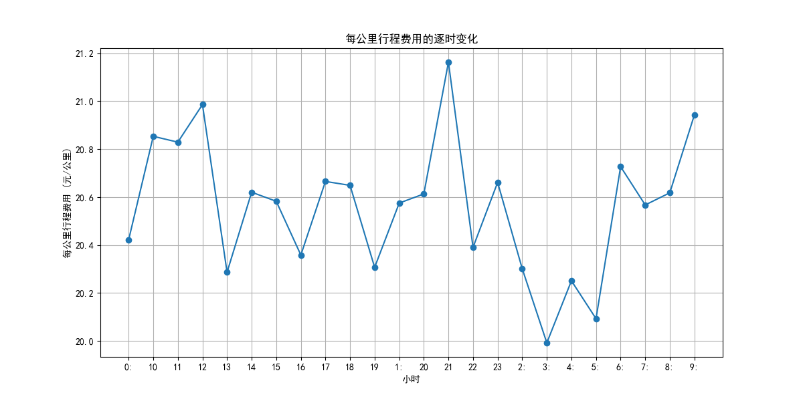

""
# 2024年Uber行程订单“波峰波谷”现象分析及运营建议报告

## 摘要

本报告旨在分析2024年Uber平台行程订单的“波峰波谷”现象，并结合订单取消率、每公里行程费用等维度，为平台运营提供切实可行的建议。通过对每小时订单数据的深入分析，我们发现订单量在特定时间段呈现明显的高峰和低谷，同时，这些时段的取消率和定价策略也表现出一定的规律性。

## 1. 每日订单量的“波峰波谷”现象

我们首先对2024年全年的订单数据按小时进行了汇总和分析，以识别订单量的时间分布模式。

从上图可以看出，每日订单量存在明显的两个高峰时段：
*   **早高峰 (7:00 - 9:00)**：通勤时段，订单量迅速攀升。
*   **晚高峰 (17:00 - 19:00)**：下班时段，订单量达到全天最高峰。

此外，在**午间 (12:00 - 14:00)** 和**夜间 (21:00 - 23:00)** 也存在较小的订单高峰。而在凌晨时段 (0:00 - 5:00)，订单量则处于低谷。

**洞察**:
*   订单量的“波峰波谷”现象与城市居民的通勤和生活习惯高度相关。
*   在高峰时段，平台需要确保有足够的运力来满足激增的出行需求。

## 2. 订单取消率分析

在分析订单量的同时，我们还考察了不同时段的订单取消率。

从图一中红色折线可以看出，**订单取消率与订单量呈现出一定的正相关性**。在早晚高峰时段，订单取消率也达到了峰值。

**可能原因**:
*   **运力不足**：高峰时段订单量大，司机供不应求，导致乘客等待时间过长而取消订单。
*   **交通拥堵**：高峰时段交通状况差，司机接驾时间长或预计行程时间长，导致司机或乘客取消订单。

## 3. 每公里行程费用分析

为了解平台在高峰时段的定价策略，我们分析了每公里行程费用的变化趋势。

上图显示，每公里行程费用在早晚高峰时段显著升高。这表明Uber平台在高峰时段实施了**动态定价（溢价）**策略，以激励更多司机上线接单，并平衡供需关系。

**洞察**:
*   动态定价是应对高峰时段需求激增的有效手段。
*   然而，过高的溢价可能会影响用户体验，需要平台在激励司机和留存用户之间找到平衡点。

## 4. 运营建议

基于以上分析，我们为Uber平台提出以下运营建议：

**a. 针对高峰时段**

*   **优化动态定价策略**：虽然动态定价是必要的，但平台可以基于历史数据预测高峰时段的供需缺口，更精细化地调整溢价倍数，避免因价格过高导致用户流失。同时，可以向用户清晰地解释溢价原因，提升用户接受度。
*   **推出高峰时段司机激励措施**：除了溢价，还可以通过“高峰时段奖励”、“连击奖励”等方式，激励司机在高峰时段上线并前往需求热点区域，从而增加有效运力。
*   **引入预约和拼车功能**：鼓励用户在高峰时段前使用预约功能，帮助平台提前调度运力。同时，大力推广拼车功能，提高车辆利用效率，缓解高峰时段的运力紧张。

**b. 针对低谷时段**

*   **推出优惠活动**：在午间、夜间等订单量相对较少的时段，可以通过发放优惠券、推出特价套餐等方式，刺激用户出行需求，提高司机收入和平台流水。
*   **拓展服务场景**：与商家合作，在餐饮、娱乐等消费场景提供专属优惠，将出行与本地生活服务相结合，创造新的出行需求。

**c. 提升用户体验，降低取消率**

*   **优化派单算法**：通过更智能的派单算法，为乘客匹配距离最近、路线最优的司机，缩短等待时间，降低因等待时间过长而导致的取消。
*   **加强与司机的沟通**：向司机提供实时的路况信息和需求热力图，引导司机到需求旺盛的区域，提高接单效率。对于因交通拥堵等客观原因导致的取消，平台应予以理解和支持。

## 结论

Uber平台在2024年的行程订单呈现出明显的“波峰波谷”现象。通过优化动态定价策略、推出多样化的司机激励和用户优惠活动，并不断完善派单算法和用户体验，Uber可以更有效地应对不同时段的供需变化，实现平台、司机和乘客三方的共赢。

""
