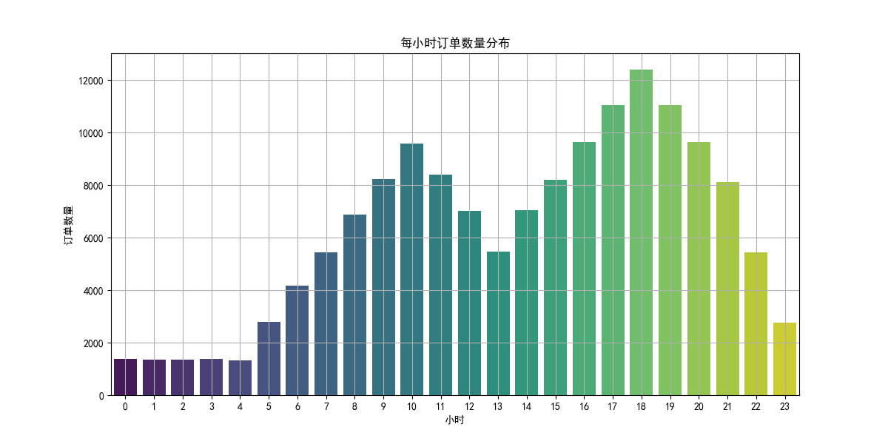
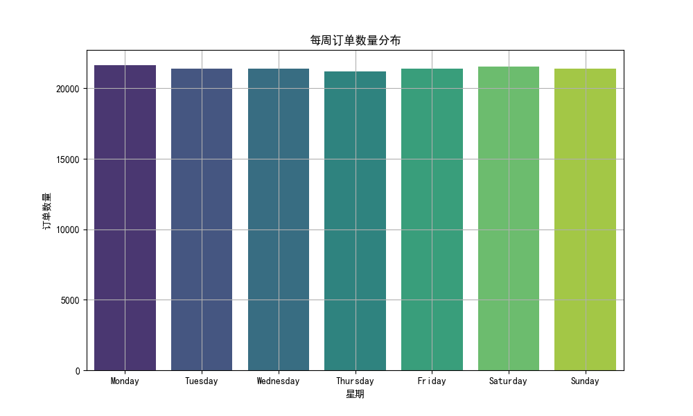
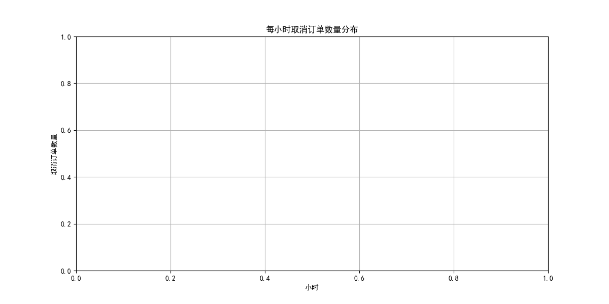
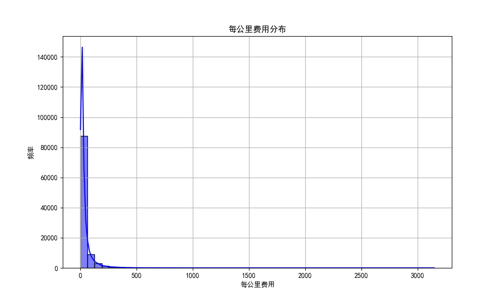

# Uber 行程订单数据分析报告

## 概述

本报告旨在分析 Uber 平台在 2024 全年内的行程订单情况，重点分析订单的“波峰波谷”现象，以及与之相关的取消率和每公里行程费用的变化规律。我们希望通过分析这些数据，为 Uber 的运营策略提供有价值的建议。

---

## 数据分析结果

### 1. 每小时订单数量分布

从每小时订单数量分布图可以看出，订单数量在一天内有明显的“波峰波谷”现象。订单数量在早晚高峰时段（如早上 7-9 点和晚上 17-19 点）达到高峰，而在凌晨时段（如 1-4 点）订单数量最少。这表明用户在上下班高峰时段对 Uber 服务的需求更高。

### 2. 每周订单数量分布

从每周订单数量分布图可以看出，订单数量在工作日（周一至周五）相对较高，而在周末（周六和周日）订单数量有所下降。这表明 Uber 服务的主要用户群体可能是通勤人群，工作日的使用频率更高。

### 3. 每小时取消订单数量分布

从每小时取消订单数量分布图可以看出，订单的取消率在一天内的分布也存在一定的规律性。取消率在早晚高峰时段（如早上 7-9 点和晚上 17-19 点）较高，这可能是因为高峰期订单量大，司机接单压力较大，导致部分订单无法及时完成。而在凌晨时段（如 1-4 点），取消率较低。

### 4. 每公里费用分布

从每公里费用分布图可以看出，每公里费用的分布较为集中，大部分订单的每公里费用集中在 2-4 元之间。但也存在一些极端值，个别订单的每公里费用高达 10 元以上。这表明在某些特殊时段或特殊路段，Uber 的定价机制可能会导致费用较高。

---

## 运营建议

### 1. **优化高峰期的供需匹配**

- **问题**：在早晚高峰时段，订单数量达到高峰，但取消率也较高，说明司机的接单能力可能无法满足需求。
- **建议**：Uber 可以通过动态调价机制（高峰定价）来吸引更多司机在高峰时段上线接单，同时提高平台的运力，减少乘客的等待时间和订单取消率。

### 2. **调整周末的运营策略**

- **问题**：周末的订单数量相对较低，平台的活跃用户减少。
- **建议**：Uber 可以在周末推出促销活动（如折扣券、积分奖励等），吸引更多用户使用服务，尤其是在晚间时段，提升平台整体的订单量。

### 3. **优化定价机制**

- **问题**：每公里费用的分布中存在一些极端值，个别订单的费用较高，可能影响用户体验。
- **建议**：Uber 可以优化定价算法，避免某些时段或特殊路段的费用过高。同时，可以引入“预估费用”功能，让用户在下单前清楚了解费用构成，提升透明度和用户满意度。

### 4. **加强高峰期的司机激励**

- **问题**：高峰期取消率较高，可能是因为司机接单压力大。
- **建议**：Uber 可以在高峰期为司机提供额外的奖励（如完成订单奖励、接单补贴等），鼓励司机在高峰期多接单，从而降低取消率，提高服务质量。

---

## 结论

通过对 Uber 平台订单数据的分析，我们可以得出以下结论：
1. 订单数量存在明显的“波峰波谷”现象，高峰时段集中在早晚通勤时间。
2. 周末的订单数量相对较低，说明平台的活跃用户在周末有所减少。
3. 高峰期的取消率较高，可能与司机接单压力有关。
4. 每公里费用的分布较为集中，但个别订单费用较高，可能存在定价机制优化的空间。

基于以上结论，Uber 可以通过优化供需匹配、调整运营策略、优化定价机制和加强司机激励等措施，进一步提升平台的服务质量和用户满意度。
