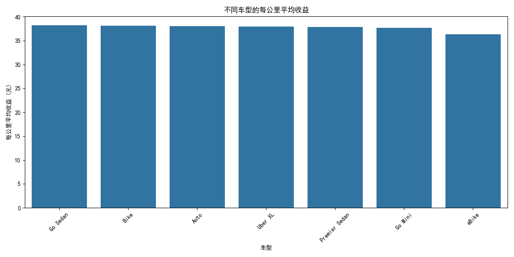
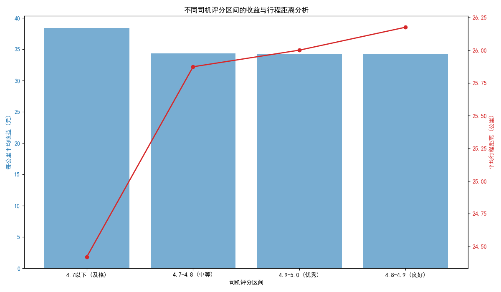

# 网约车司机如何提升收益？—— 基于2024年平台数据的分析报告

作为一名网约车司机，如何在激烈的竞争中获得更高的收益，是大家普遍关心的问题。本报告基于平台2024年的运营数据，从**车型选择**和**服务评分**两个关键维度进行深入分析，旨在为您提供切实可行的收益提升策略。

## 一、 车型选择：精明决策，领先一步

选择合适的车型是影响收入的第一个重要决策。我们对不同车型的“每公里平均收益”（即 `订单金额 / 行程距离`）进行了分析，结果如下图所示：

**洞察与建议：**

*   **“Go Sedan” 收益最高**：数据显示，`Go Sedan` 车型的每公里平均收益最高，达到了38.22元。如果您正在考虑更换或选择新车，`Go Sedan` 是一个值得优先考虑的选项。
*   **各车型差距微小**：虽然 `Go Sedan` 领先，但实际上各类车型的每公里收益差距非常微小。这意味着，您不必过分纠结于车型的选择，更应该关注如何通过其他方式提升运营效率。
*   **避免 “eBike”**: `eBike` 的每公里平均收益最低，如果您追求更高的收入，应尽量避免选择此类车型。

## 二、 服务评分：高分≠高收益？深挖背后的真相

我们通常认为，更高的服务评分能带来更高的收入。然而，数据分析的结果却给了我们一个意外的发现。

**洞察与建议：**

*   **反常现象：低评分司机的“高收益”**：数据显示，评分在“4.7分以下”的司机，其每公里平均收益反而最高。与此同时，他们的平均行程距离也是最低的。
*   **原因揭秘：短途订单的“红利”**：这种反常现象，很可能是因为低评分司机接了更多的短途订单。短途订单由于有较高的起步价，会显著拉高每公里的平均费用。但这并不代表一种健康的、可持续的盈利模式。
*   **长期策略：追求高分，赢得未来**：
    *   **切勿盲目追求低分**：低评分可能导致平台减少派单、限制接单等惩罚，甚至有被封号的风险。这种“高收益”是不可持续的，并且会损害您的长远利益。
    *   **高评分的隐性价值**：高评分是优质服务的体现，能够为您带来更多的乘客信任和平台奖励。虽然在每公里收益上没有直接体现，但高评分司机通常能获得更稳定的客源和更优质的订单推荐。
    *   **平衡之道**: 建议您在保证服务质量、维持高分的同时，可以有策略地选择性接受一些起步价高的短途订单，以优化整体收益。

## 结论与核心建议

为了在2024年取得更好的收益，我们建议您：

1.  **首选 `Go Sedan` 车型**：在选择或更换车辆时，优先考虑 `Go Sedan`，以获得微弱但稳定的收益优势。
2.  **维持高水平服务评分**：不要被“低分高收益”的假象迷惑。长期来看，**维持在4.8分以上的良好或优秀评分**，是保障稳定单量和获得平台青睐的关键。
3.  **优化接单策略**：在维持高分的基础上，可以通过智能接单工具，适当倾向于接受高峰时段、热点区域的短途订单，以提高单位时间的收入效率。

总而言之，成为一名成功的网约车司机，不仅需要辛勤的付出，更需要智慧的决策。希望本报告的数据洞察，能为您在新的一年里“精打细算”，实现收益的最大化！
