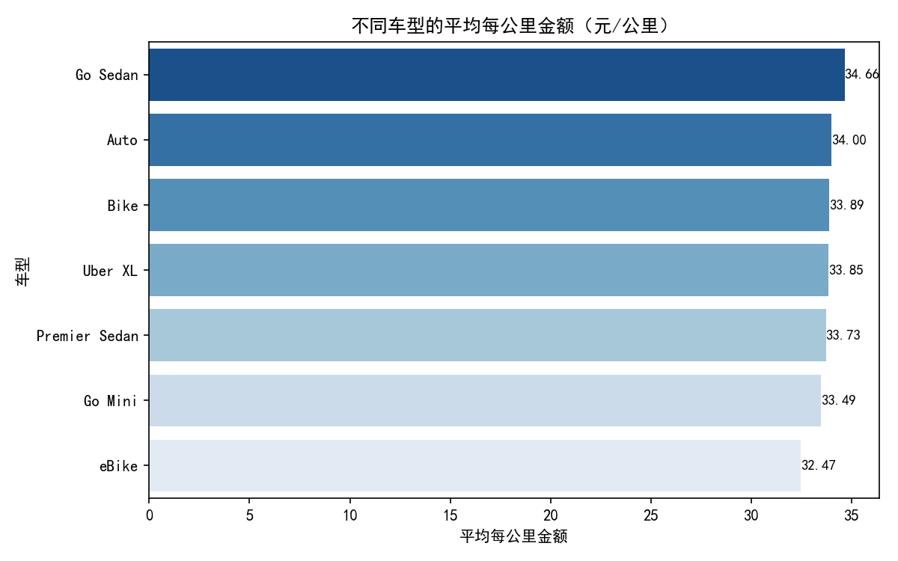
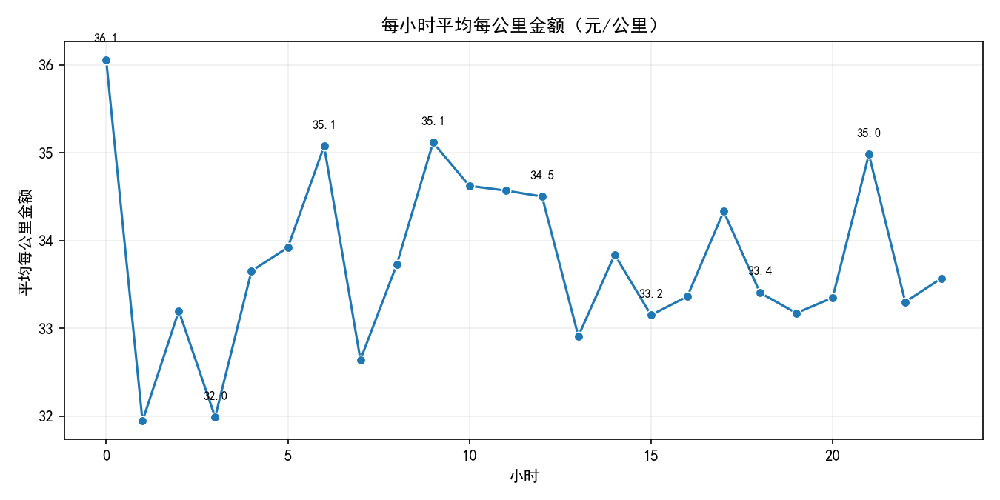
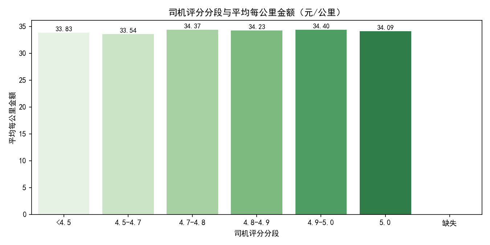
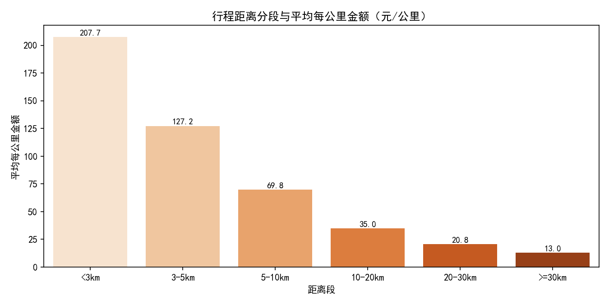

# 2024年网约车司机收益优化分析（以每公里费用为目标）

以下分析基于平台2024年的订单数据（2024/1/1 至 2024/9/9）。我们重点关注“每公里行程费用”（即订单金额/行程距离），并从车型、评分、时段、距离与支付方式等多个维度进行诊断分析，给出针对性的策略建议。

## 数据概览
- 数据量：共150,000条记录，其中已完成订单93000条（用于核心分析）。
- 核心指标：在完成订单中，平均每公里金额约为33.86元/公里，单个订单的每公里金额最小约1.01、最大约1666.99（存在极端值，但不进行清洗，按要求保留）。
- 分析样本：仅使用“订单状态=Completed且行程距离>0且订单金额>0”的订单参与单价指标计算。
- 可视化图表：
  - 
  - 
  - 
  - 
  - 

代码绘图时使用了如下字体设置，保障中文显示：
```python
plt.rcParams['font.sans-serif'] = ['SimHei']
plt.rcParams['axes.unicode_minus'] = False
```

## 关键诊断发现

### 1) 行程距离是影响“每公里金额”的最强因素
- 距离段的每公里金额呈显著“反比”关系：
  - <3km：约207.65元/公里
  - 3–5km：约127.21元/公里
  - 5–10km：约69.77元/公里
  - 10–20km：约35.04元/公里
  - 20–30km：约20.78元/公里
  - ≥30km：约13.00元/公里
- 解释：短途单通常存在起步价和最低消费的占比更高；越长的里程，边际每公里费率越低（平台计价结构决定）。因此“追求每公里价格高”的核心是“优先承接短途城市内订单”。

配图：

### 2) 时段差异明显，清晨、工作日上午、晚间表现较好
- 每小时平均每公里金额（部分时段）：
  - 0点：36.06（样本量较小）
  - 6点：35.08
  - 9点：35.12
  - 10点：34.62
  - 11点：34.57
  - 17点：34.33
  - 21点：34.98
- 较低时段例子：7点约32.64、13点约32.91、15点约33.15。
- 解释：清晨与工作日上午有“通勤+调度”需求，晚间有“娱乐出行+局部加价”，单位里程价格表现更优。

配图：

### 3) 车型差异：Go Sedan、Auto 等车型的单位里程价格更高
- 车型平均每公里金额（Top 3）：
  - Go Sedan：34.66
  - Auto（三轮/三轮代步类）：34.00
  - Bike（摩托/两轮）：33.89
- 其他：Uber XL 33.85、Premier Sedan 33.73、Go Mini 33.49、eBike 32.47。
- 解释：不同车型的供需结构与定价系数不同；Go Sedan受欢迎度与舒适性较高，单位里程费率更优。

配图：

### 4) 司机评分的影响：总体而言评分偏高有助于提升单价，但不同车型上存在差异
- 按评分段（总体）：
  - <4.5：33.83
  - 4.7–4.8：34.37
  - 4.8–4.9：34.23
  - 4.9–5.0：34.40
  - 5.0：34.09
- 综述：评分提升至4.7以上，整体每公里金额有明显提升趋势，但在不同车型上存在异质性（例如个别车型在特定评分段的样本较小、波动较大）。
- 实操要点：将司机评分保持在4.7及以上是具有统计意义的“稳健水平”。

配图：

### 5) 支付方式差异（可控性有限）
- 平均每公里金额（支付方式）：
  - 现金：34.14
  - UPI：33.91
  - 信用卡：33.68
  - 借记卡：33.50
  - 平台钱包：33.44
- 解释：现金略高，但司机对支付方式的可控程度较低；可作为“不拒绝现金支付”的细节偏好，但不建议作为主要策略。

### 6) 车型 x 小时的交互
- 热力图展示了不同时段下各车型的单位里程价格表现差异，有助于精细化排班与车型使用策略。

配图：

## 策略建议（规范性）
围绕“全年每公里费用较高”的目标，建议采取以下组合策略：

1) 订单结构优化：聚焦短途高密度订单
- 核心动作：优先在中心城区/商业区/地铁站周边接单，主动靠近短途需求集中区域。
- 明确阈值：尽量以3–10km为主，避免≥30km的订单（除非处于高峰溢价/加价时段）。
- 操作技巧：利用目的地筛选与路线偏好，减少“超长距离”概率；晚间娱乐区与早高峰通勤区是短途高单价的关键来源。

2) 排班与驻点策略：选择高单价时段与位置
- 时段建议：重点覆盖6点、9–11点、21点；如安全许可且本地需求旺盛，可适度覆盖0点。
- 驻点建议：工作日上午靠近商务区与地铁枢纽；晚间靠近餐饮酒吧街区、商圈活动区。

3) 车型策略：若可选车型，优先考虑Go Sedan，其次Auto/Bike
- Go Sedan在单位里程价格上相对占优；若升级车型的成本与维护费用可控，优先考虑。
- eBike整体单价较低，如使用两轮车型，需更依赖时段与短途策略来提升单价。

4) 评分管理：目标评分≥4.7，稳定提升至4.8+
- 服务规范：车内整洁、准时到达、礼貌沟通、路线透明；高峰期耐心解释等待与绕行。
- 操作细节：尽量避免司机主动取消与不必要的拒载；减少争议性事件（如绕路、急刹）。
- 预期效果：评分≥4.7与≥4.8段在多数车型上带来1–2+元/公里的提升空间（实际提升随车型与时段而变）。

5) 支付与体验：不拒绝现金支付，保持流畅收款
- 虽然支付方式可控性有限，但不设置对现金的偏好限制，保障交易流畅、减少乘客等待。

6) 风险控制与弹性策略
- 拥堵与空驶：短途高单价可能带来更多频次与上下客时间，注意平衡等待时间与空驶成本。
- 夜间安全：0点时段单价高但安全风险与需求波动较大，需结合本地实际谨慎选择。
- 动态定价：遇到加价/溢价时段，适度接受中远途订单以提升总收入（即使每公里单价偏低）。

## 预测性情景示例（粗略估算）
- 情景A（短途策略）：在高峰时段（例如9–11点+21点），以3–5km为主的订单，预期每公里金额约127元/公里，是整体均值的约3.75倍。若日均完成10单（假设平均4km），里程40km的总金额约5080元（不计平台抽成与成本，仅示意“单价效应”）。
- 情景B（长途策略）：若以≥30km为主，每公里约13元/公里，40km总金额约520元。由此可见，在追求“每公里费用较高”的目标下，短途策略优势显著。

## 执行清单（可落地）
- 每周排班固定覆盖：6点、9–11点、21点；如条件允许，增加周五/周六的晚间时段。
- 驻点：商务区（早高峰）、地铁站/交通枢纽（全天）、餐饮娱乐区（晚间）。
- 车型：优先选择或升级至Go Sedan；若保持现有车型，按热力图优化时段切入。
- 评分：服务细则清单（迎宾语、车内整洁、路线确认、平稳驾驶、主动帮助装卸）。
- 订单筛选：尽量倾向3–10km；遇到≥30km订单，除非存在明显加价，不作为优先。
- 支付：不拒绝现金，保证收款顺畅；减少因支付问题导致的纠纷与取消。

## 结论
- 若以“每公里费用较高”为核心目标：短途为王、时段为纲、车型加成、评分稳固。
- 实施上述组合策略，可在全年维持相对较高的单位里程收入水平；在加价时段灵活调整，兼顾总收入与安全与效率。

附：所有图表已生成并保存在当前目录，引用图片名即可查看。
