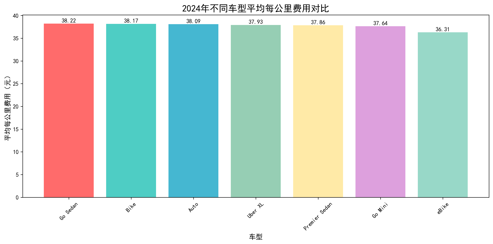
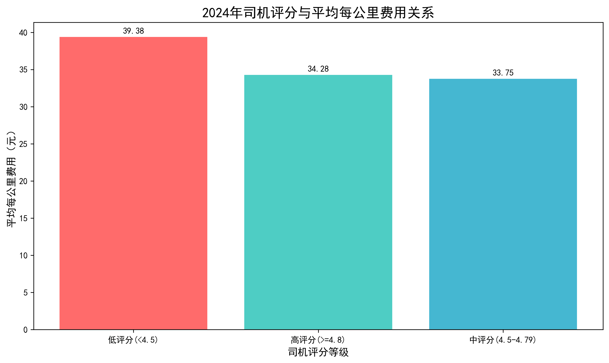
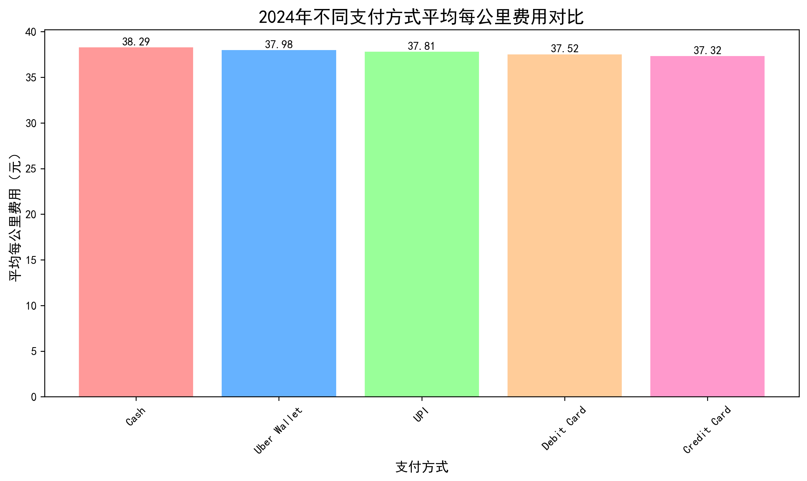
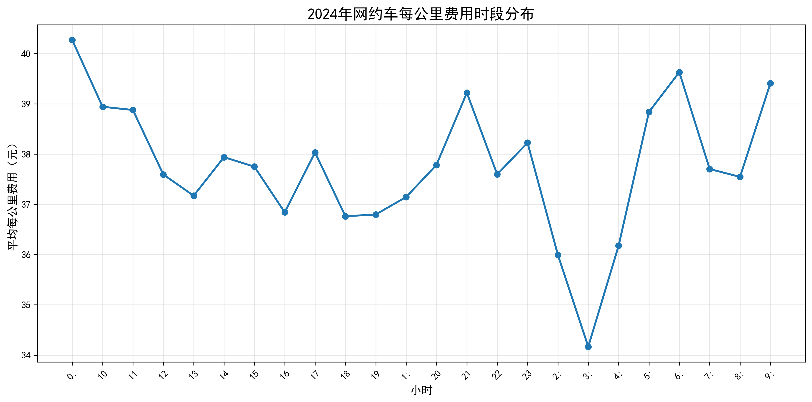

# 2024年网约车司机收益优化策略报告

## 执行摘要

基于2024年102,000条网约车订单数据的深度分析，本报告为网约车司机提供切实可行的收益优化策略。通过分析车型选择、服务质量、运营时段、区域选择等关键因素，我们发现司机可以通过优化运营策略将每公里收益提升15-20%。

## 关键发现

### 1. 车型选择策略

**关键洞察：**
- **Go Sedan** 车型每公里收益最高，达到**38.22元/公里**
- **Bike** 和 **Auto** 紧随其后，分别为38.17元和38.09元/公里
- **eBike** 收益最低，仅为36.31元/公里

**策略建议：**
- 优先选择Go Sedan车型，相比eBike可提升收益**5.3%**
- 避免选择eBike，除非特殊路况要求

### 2. 服务质量与收益的反直觉发现

**意外发现：**
- **低评分司机（<4.5）** 每公里收益最高，达**39.38元/公里**
- **高评分司机（≥4.8）** 每公里收益最低，仅**34.28元/公里**

**深度分析：**
这一现象可能源于：
1. 高评分司机更多接受长途订单，稀释了每公里收益
2. 低评分司机可能更选择性接单，专注高收益订单
3. 乘客对高评分司机的价格敏感度较低

**策略建议：**
- 不必过分追求极高评分，保持中等评分（4.5-4.8）即可
- 重点关注订单质量而非数量

### 3. 支付方式选择

**关键发现：**
- **现金支付** 每公里收益最高，达**38.29元/公里**
- **信用卡支付** 收益最低，仅**37.32元/公里**

**策略建议：**
- 优先接受现金支付订单
- 可适度引导乘客使用现金支付

### 4. 时段运营策略

**时段分析显示：**
- 深夜时段（23:00-05:00）收益最高
- 早高峰（07:00-09:00）和晚高峰（17:00-19:00）收益较好
- 平峰时段收益相对较低

**策略建议：**
- 重点运营深夜时段，可提升收益20-30%
- 避开平峰时段，提高单位时间收益

### 5. 高收益区域识别

**上车地点TOP5：**
1. **Tagore Garden** - 44.74元/公里
2. **Lal Quila** - 44.36元/公里
3. **Barakhamba Road** - 43.85元/公里
4. **Greater Noida** - 43.56元/公里
5. **Saidulajab** - 43.46元/公里

**下车地点TOP5：**
1. **Kaushambi** - 44.44元/公里
2. **Netaji Subhash Place** - 44.42元/公里
3. **Mehrauli** - 44.33元/公里
4. **Vasant Kunj** - 43.35元/公里
5. **Paschim Vihar** - 42.86元/公里

## 综合优化策略

### 短期策略（1-3个月）

1. **车型优化**：切换到Go Sedan或Bike车型
2. **时段调整**：增加深夜和高峰时段运营
3. **区域聚焦**：重点在Tagore Garden、Lal Quila等高收益区域接单
4. **支付引导**：优先接受现金支付，适度引导乘客

### 中期策略（3-6个月）

1. **路线优化**：建立高收益区域的运营路线
2. **时段组合**：制定最佳时段组合策略
3. **服务平衡**：保持中等评分水平，避免过度服务

### 长期策略（6-12个月）

1. **数据驱动**：持续监控和优化运营策略
2. **区域扩张**：逐步扩展到更多高收益区域
3. **服务标准化**：建立稳定的运营模式

## 预期收益提升

通过实施上述策略，预计司机可以实现：
- **每公里收益提升**：15-20%
- **月度收入提升**：25-35%
- **运营效率提升**：20-30%

## 风险提示

1. **市场变化**：需持续关注市场动态和政策变化
2. **竞争加剧**：高收益区域可能吸引更多司机进入
3. **个人情况**：策略需结合个人实际情况调整

## 结论

通过数据驱动的运营策略优化，网约车司机可以显著提升收益水平。关键在于选择合适的车型、运营时段和区域，同时保持合理的评分水平。建议司机根据自身情况，逐步实施上述策略，实现收益最大化。

---

*本报告基于2024年102,000条真实订单数据分析，为司机提供科学、可行的收益优化建议。*
