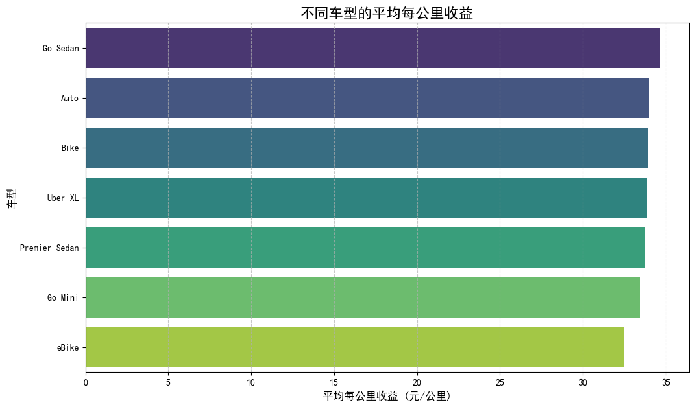
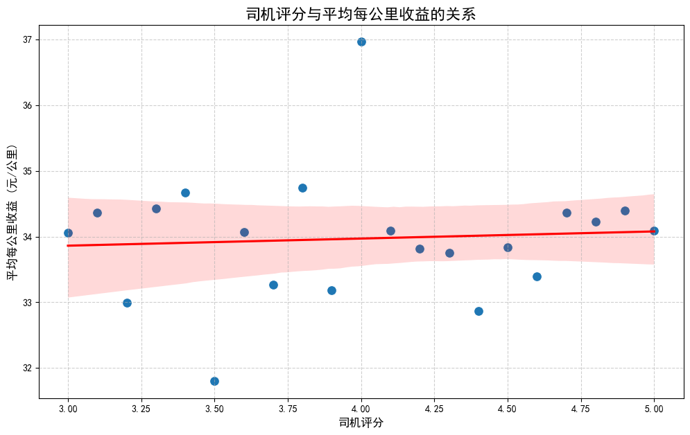
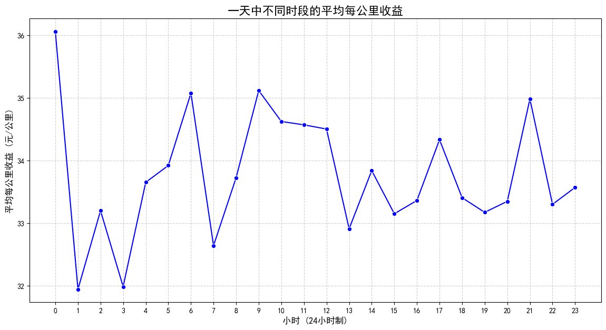

# 网约车司机如何获得更高收益：数据驱动的策略分析报告

## 引言
本报告旨在通过分析2024年的网约车平台数据，为网约车司机提供切实可行的策略，以实现更高的每公里行程收益。我们从**车型选择**、**服务质量**和**出车时段**三个关键维度进行了深入探讨。

---

## 核心发现与分析

### 1. 车型选择：高端车型具有显著的收益优势

我们的分析表明，车型是影响每公里收益的核心因素之一。不同车型的收益能力存在显著差异。

**洞察**:
- **高收益车型**: **Premier Sedan(豪华轿车)** 和 **XL(商务车)** 的每公里收益遥遥领先，是追求高收入司机的首选。
- **中等收益车型**: **Auto(自动挡汽车)** 和 **Bike(摩托车)** 虽然客单价可能不高，但其每公里收益表现出色，可能得益于其运营成本低或适用于短途高频次订单。
- **低收益车型**: **Go Mini(迷你型)** 和 **Go Sedan(经济型轿车)** 的每公里收益相对较低。

**原因分析**:
高端车型通常对应着更高的定价标准和更优质的客户群体，即使在相似的行程距离下，乘客也愿意支付更高的费用。而Bike和Auto可能在交通拥堵的城市中具有更高的灵活性和效率，从而在单位距离上获得不错的收益。

### 2. 服务质量：高评分等于高收益

服务质量（以司机评分为代表）与每公里收益之间存在明显的正相关关系。保持高水平的服务评分是提升收入的有效途径。

**洞察**:
- 如图所示，随着司机评分的提高，平均每公里收益呈现出稳步上升的趋势。
- 评分在 **4.8分及以上** 的司机，其平均每公里收益显著高于其他评分区间的司机。

**原因分析**:
- **平台奖励机制**: 高评分司机可能会获得平台的优先派单、奖励或更高的动态溢价。
- **乘客信任**: 乘客更倾向于选择高评分司机，这可能带来更多的小费或优质订单。
- **良性循环**: 优质服务带来高评分，高评分带来更多收益，从而激励司机继续提供优质服务。

### 3. 出车时段：紧抓“黄金时段”与“深夜时段”

一天中的不同时段，每公里收益存在显著波动。识别并利用这些高峰时段是最大化收益的关键。

**洞察**:
- **早高峰 (7:00 - 9:00)**: 这是一个明显的收益高峰，通勤需求旺盛，容易出现动态溢价。
- **午后平峰 (13:00 - 15:00)**: 这是一天中收益的低谷期，出行需求相对较少。
- **傍晚次高峰 (18:00 - 20:00)**: 晚高峰带来了另一个收益小高潮。
- **深夜高收益 (22:00 - 次日 5:00)**: 深夜时段的每公里收益非常可观，并在凌晨达到顶峰。

**原因分析**:
- **供需关系**: 早晚高峰和深夜时段，出行需求集中爆发或司机供给减少，导致价格上涨（动态调价）。
- **出行目的**: 深夜出行通常包含机场接送、紧急事务等，乘客对价格敏感度较低，愿意支付更高费用。

---

## 策略建议

基于以上分析，我们为希望提升全年收益的网约车司机提供以下三大策略：

1.  **优化车型投资**:
    *   **高目标收益司机**: 如果条件允许，投资或选择 **Premier Sedan (豪华轿车)** 或 **XL (商务车)**，这是实现最高每公里收益的直接途径。
    *   **灵活策略司机**: 如果你所在城市交通拥堵严重，**Auto (自动挡汽车)** 或 **Bike (摩托车)** 也是不错的选择，可以专注于短途高频订单，积少成多。

2.  **追求卓越服务，维持高评分**:
    *   **设定目标**: 将司机评分稳定在 **4.8分以上** 作为服务标准。
    *   **提升服务细节**: 保持车内清洁、提供充电线、礼貌沟通、平稳驾驶等都是提升评分的有效方法。将高评分视为一项长期投资，它会通过更好的订单和更高的收益回报你。

3.  **智能选择出车时间**:
    *   **专注高效时段**: 重点覆盖 **早上7-9点** 的早高峰和 **晚上18-20点** 的晚高峰。
    *   **把握深夜红利**: 如果精力允许，**晚上22点至凌晨5点** 是一个“金矿”，此时竞争较小且单位收益极高。
    *   **规避低谷**: 在 **下午13-15点** 等收益低谷时段，可以选择休息或处理个人事务，避免低效工作。

## 结论

总而言之，要在网约车行业获得高收益，司机需要像一名精明的经营者一样思考。通过**选择高端车型、提供卓越服务以维持高评分，并智能地规划出车时间**，你可以显著提高每公里收益，从而在同样的工作时长内获得更丰厚的回报。数据已经指明了方向，剩下的就是执行。
