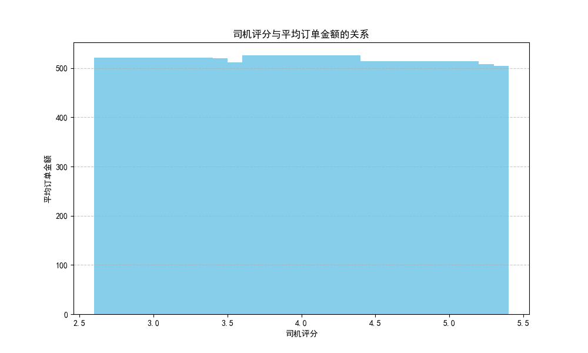

## 网约车司机收益优化分析报告

### 1. 订单状态分布
根据分析，订单状态的分布如下：
- 完成（Completed）: 93000单
- 乘客取消（Cancelled by Customer）: 10500单
- 司机取消（Cancelled by Driver）: 27000单
- 未完成（Incomplete）: 9000单
- 未找到司机（No Driver Found）: 10500单

订单完成率较高，但司机取消订单的比例较高，这可能影响乘客体验和收益。

### 2. 不同车型的收益分析
分析结果显示，不同车型的平均订单金额和使用频率如下：
- Auto: 平均金额 506.73元
- Bike: 平均金额 510.20元
- Go Mini: 平均金额 507.68元
- Go Sedan: 平均金额 511.50元
- Premier Sedan: 平均金额 509.57元
- Uber XL: 平均金额 501.82元
- eBike: 平均金额 503.90元

Go Sedan 和 Bike 的平均订单金额相对较高，建议选择这些车型以提高收益。

### 3. 司机评分对收益的影响
通过数据分析，司机评分与平均订单金额的关系如下图所示。

从图中可以看出，较高的司机评分（4.5及以上）通常与较高的平均订单金额相关。建议司机保持较高的服务质量评分，以提高收益。

### 4. 结论与建议
1. **选择合适的车型**：建议选择 Go Sedan 或 Bike，因为它们的平均订单金额较高。
2. **提高服务质量评分**：司机评分在4.5及以上时，订单金额较高，应努力提高并维持评分。
3. **减少取消订单**：司机取消订单的比例较高，建议优化调度，以减少取消订单的数量，提高乘客满意度。

以上分析基于2024年的数据，旨在提高网约车司机的全年收益。
