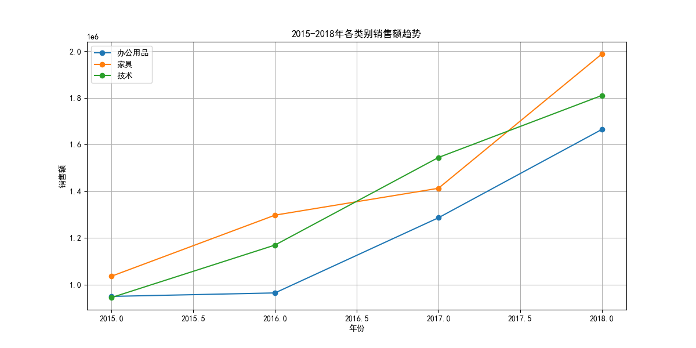
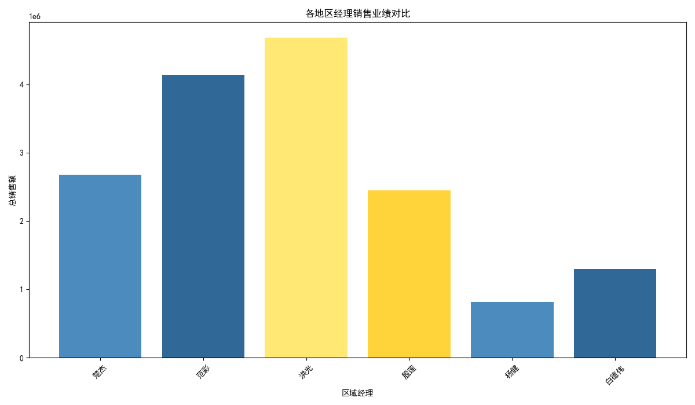

# 2015-2018年销售数据分析报告

## 摘要

本报告旨在分析2015年至2018年期间办公用品、技术和家具三大类别的销售趋势，识别每年销售增长最快的产品类别，并评估不同地区经理的业绩表现。分析结果表明，全部产品类别的销售额均呈上升趋势，其中家具和技术产品的销售额增长尤为显著。此外，地区经理的业绩存在显著差异，华东和中南地区的表现远超其他地区。

## 一、各产品类别销售趋势分析

根据2015年至2018年的销售数据，办公用品、技术和家具三大产品类别的销售额均实现了持续增长。

*   **技术产品**：在2017年实现了显著增长，并于2017年和2018年成为销售额最高的类别。
*   **家具**：在2016年和2018年实现了最快的销售增长，是推动整体销售额增长的重要动力。
*   **办公用品**：虽然销售额最低，但在2017年实现了33.35%的最高增长率，显示出巨大的市场潜力。

| 年份 | 增长最快的类别 |
|---|---|
| 2016 | 家具 (25.22%) |
| 2017 | 办公用品 (33.35%) |
| 2018 | 家具 (40.71%) |

## 二、地区经理业绩评估

地区经理的业绩表现存在显著差异，具体如下：

*   **华东地区**经理洪光以468万的销售额位居榜首，业绩表现最为出色。
*   **中南地区**经理范彩以413万的销售额紧随其后。
*   **东北**和**华北**地区的销售额表现中等。
*   **西北**和**西南**地区的销售额表现明显落后，有较大的提升空间。

## 三、结论与建议

*   **产品策略**：
    *   **加大对技术和家具产品的投入**：这两个类别是主要的收入来源，应继续加大在产品创新和市场营销方面的投入。
    *   **关注办公用品的增长潜力**：鉴于办公用品在2017年的高速增长，建议深入分析其增长原因，并制定相应策略以激发其市场潜力。

*   **区域管理**：
    *   **推广成功经验**：建议对华东和中南地区的成功管理经验进行总结，并在公司内部进行分享和推广。
    *   **支持落后地区**：对于西北和西南地区，建议公司提供额外的支持，例如市场分析、销售培训和资源倾斜，以帮助其提升销售业绩。

*   **未来分析方向**：
    *   **深入分析退货数据**：结合退货数据，评估产品质量和客户满意度，以减少退货率。
    *   **客户细分分析**：对不同客户群体的购买行为进行深入分析，以实现更精准的市场营销。
