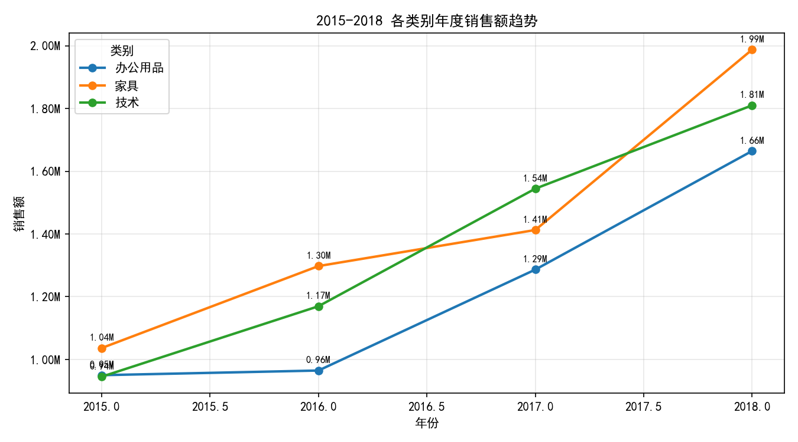
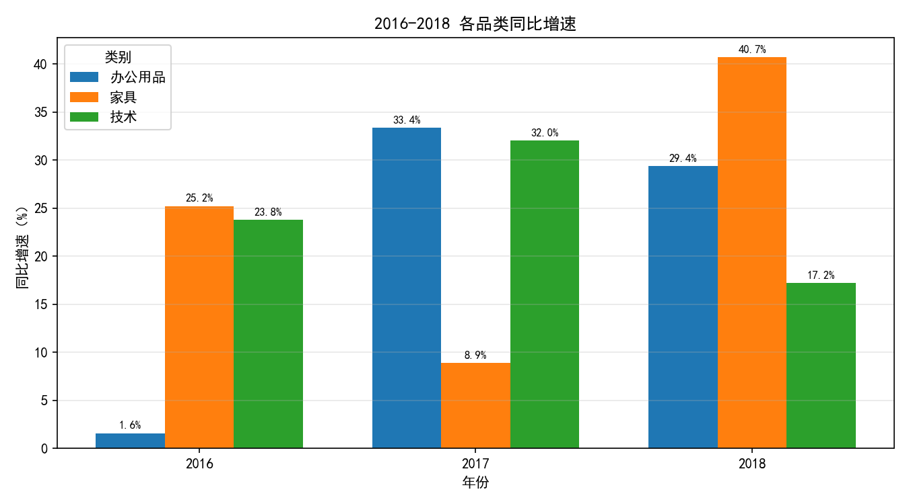
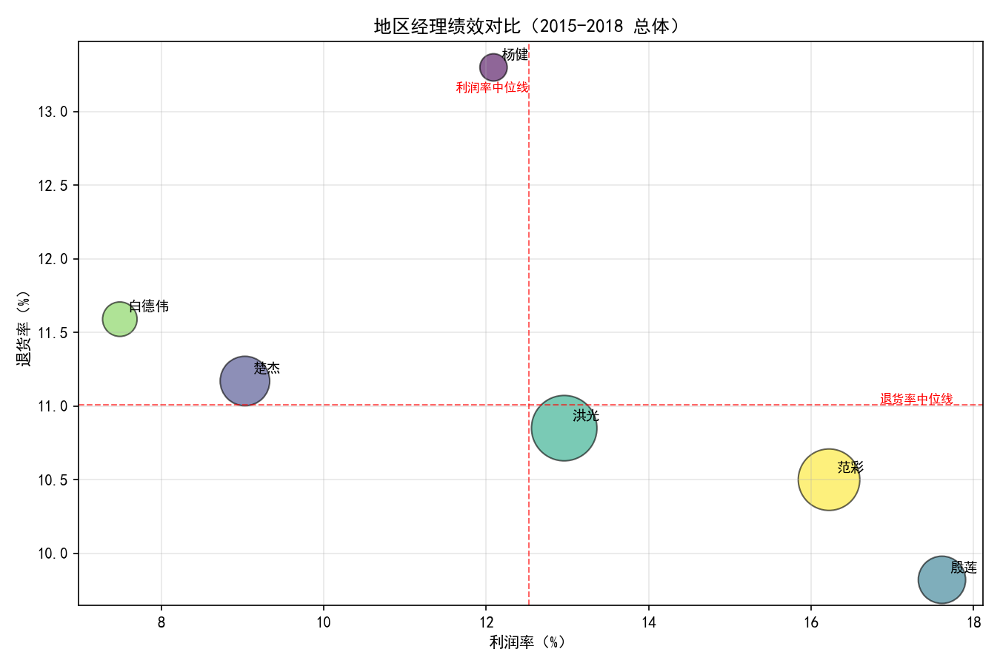

# 2015-2018三大品类销售趋势与地区经理绩效分析报告

## 摘要
- 销售总体：2015-2018全品类合计销售额从293.1万增长至546.2万，总体年复合增长约22%-23%。
- 品类趋势：三大类均呈增长，其中家具在2016与2018是增长主力；办公用品在2017增长更为突出；技术品类在2017显著跃升后延续增长至2018。
- 年度增长最快品类：
  - 2016：家具（同比+25.22%）
  - 2017：办公用品（同比+33.35%）
  - 2018：家具（同比+40.71%）
- 经理绩效：整体看“洪光”规模最大（销售额约468万），但利润率不及“殷莲”（17.61%）与“范彩”（16.22%）；退货率最低的是“殷莲”（9.82%）。

---

## 数据与方法
- 数据来源：SQLite数据库（表：订单、退货、销售人员）。日期范围为2015-01-01至2018-12-30。
- 关键字段：订单日期、类别（办公用品/技术/家具）、地区、销售额、利润、折扣；退货表按订单ID标记退货；销售人员表提供地区-地区经理映射。
- 方法步骤：
  1) 用SQL按“年-品类”汇总销售额，并计算同比增速（2016-2018）。
  2) 用SQL构建“经理-年”与“经理总体”绩效指标（销售额、利润率、退货率、加权折扣）。
  3) 用Python绘制趋势图与经理绩效对比图。
- 不进行数据清洗，仅做分析与可视化。

---

## 1. 三大品类销售额变化趋势（2015-2018）



观察与量化：
- 家具：2015→2018从103.6万增至198.8万，增长曲线在2016与2018出现明显加速，2018同比+40.71%，为三品类中当年最强。
- 办公用品：2015→2018从94.98万增至166.46万，2017同比+33.35%表现亮眼（2016小幅增长后在2017跳升）。
- 技术：2015→2018从94.49万增至181.01万，2017同比+32.05%带来跃升，2018仍增长但增速回落至+17.19%。
- 总体规模：2015-2018总销售额由293.1万增至546.2万，年复合约22%-23%，显示强劲扩张态势。

诊断与可能原因：
- 家具的周期性驱动：可能受办公空间扩张、更新换代与项目型采购影响，在2016与2018形成两轮强劲扩张。
- 办公用品在2017的跃升：或受一次性批量补货与渠道拓展驱动（例如新增客户或区域覆盖增强）。
- 技术品类在2017的波峰：或与技术升级潮（软硬件更新）/促销活动相关，随后增速回归理性。

---

## 2. 年度销售增长最快的产品类别



- 2016：家具（同比+25.22%，当年129.76万；上年103.63万）
- 2017：办公用品（同比+33.35%，当年128.64万；上年96.47万）
- 2018：家具（同比+40.71%，当年198.78万；上年141.27万）

启示：
- 家具在两年（2016、2018）领跑增速，是拉动整体规模的主力；需重点保障其供应链能力与大单交付质量。
- 办公用品在2017增速领先，表明渠道与客户覆盖的扩张能迅速转化为收入；值得在淡季做结构性促销与交叉销售。
- 技术品类虽非每年增速冠军，但在2017贡献显著增量，是产品升级周期的受益者；在2018仍保持稳健增长。

---

## 3. 不同地区经理的业绩表现差异



解读方式：横轴为利润率（%），纵轴为退货率（%），气泡大小代表销售额规模，红色虚线为中位数参考。

关键发现（总体2015-2018）：
- 规模领先：
  - 洪光：销售额约468万，规模第一，利润率12.96%，退货率10.85%。规模能力突出，但利润率略低于头部高利润经理。
  - 范彩：销售额约414万，利润率16.22%，退货率10.50%，兼具规模与质量，是综合能力标杆。
- 质量与盈利领先：
  - 殷莲：销售额约245万，利润率17.61%居首，退货率最低9.82%，质量与盈利能力兼优，值得推广其作业方法。
- 提升空间：
  - 楚杰：销售额约268万，利润率9.03%、退货率11.17%，需从折扣策略与客户结构优化入手。
  - 白德伟：销售额约130万，利润率7.49%、退货率11.59%，需要针对性提升毛利与质量控制。
  - 杨健：销售额约81万，利润率12.09%，但退货率最高13.30%，应优先降低退货。

中位数参考（基于当前样本粗算）：利润率约12.5%，退货率约11.0%。据此可将经理分为四象限：
- 高利润率&低退货（优）：殷莲、范彩
- 高利润率&高退货（次优但风险偏高）：—（当前样本未明显出现）
- 低利润率&低退货（需改善盈利）：洪光（利润率略高于中位，但与领跑者差距），楚杰、白德伟
- 低利润率&高退货（需重点改进）：杨健

补充指标：加权折扣（销售额加权）显示部分经理在折扣策略较为激进时利润率与退货率可能受影响；建议进一步做折扣-退货率关联分析以制定更精准的折扣边界（本报告先给出方向性建议）。

---

## 4. 综合洞察与建议（规范性、预测性）

品类策略：
- 家具：在2016与2018两次增速领跑，建议在旺季前加大备货与供应商协同；对大单项目建立交付SOP与质量验收机制，以巩固增长同时降低退货。
- 办公用品：聚焦2017式的渠道扩张打法，针对新增客户群体设计“入门组合包+交叉销售”方案，推动办公用品与家具/技术的打包销售，提高客单价。
- 技术：延续2017升级潮的窗口期，推进以旧换新与延保服务，减少价格战，突出价值型方案；通过服务延展提升利润率。

经理运营策略：
- 标杆复制：以殷莲、范彩的客户管理、售前选型与交付质量流程为模板，开展同岗辅导与最佳实践分享。
- 折扣治理：对利润率低于中位值的经理（如楚杰、白德伟）设定折扣红线与审批机制；对大单采用“价值捆绑”替代单纯降价。
- 退货管控：针对杨健优先启动“售后体验提升+售前选型准确性提升”的专项，设定季度性退货率降幅目标（如从13.3%逐步降至≤11%）。
- 区域产品结构优化：在家具高速增长年度（2016、2018），优先将家具推广与高质量经理挂钩（殷莲、范彩），在技术升级期（2017）由规模经理（洪光）带动覆盖，提升整体转化。

预测性展望（基于趋势，不做模型训练）：
- 继续增长的可能性较高：整体销售额2015-2018的增长具备动能基础；若家具与技术能延续结构性需求，2019仍有望保持双位数增长。
- 风险提示：若折扣过度或退货率上升，将侵蚀利润与口碑；建议建立利润率与退货率双KPI的年度目标，看板化监控。

---

## 5. 附：绘图Python代码片段（含中文字体设置）
以下为本次报告绘图的核心代码片段（简化版），完整代码已在运行环境中：

```python
import pandas as pd
import numpy as np
import matplotlib.pyplot as plt
from matplotlib.ticker import FuncFormatter

# 中文显示配置
plt.rcParams['font.sans-serif'] = ['SimHei']
plt.rcParams['axes.unicode_minus'] = False

# 读取CSV（已通过SQL导出）
cat_sales = pd.read_csv('cat_sales_2015_2018.csv')
trend = cat_sales.pivot(index='年份', columns='类别', values='销售额')
trend.index = trend.index.astype(int)

# 1) 各类别年度销售趋势
fig, ax = plt.subplots(figsize=(9,5))
for cat in trend.columns:
    ax.plot(trend.index, trend[cat], marker='o', linewidth=2, label=cat)
ax.set_title('2015-2018 各类别年度销售额趋势')
ax.set_xlabel('年份')
ax.set_ylabel('销售额')
ax.legend(title='类别')
ax.grid(alpha=0.3)
ax.yaxis.set_major_formatter(FuncFormatter(lambda x, p: f\"{x/1e6:.2f}M\"))
plt.tight_layout()
plt.savefig('类别年度销售趋势.png', dpi=150)

# 2) 各年品类同比增速（分组柱状图）
cat_yoy = pd.read_csv('cat_yoy_2016_2018.csv')
yoy_pivot = cat_yoy.pivot(index='年份', columns='类别', values='同比增速百分比').sort_index()
import numpy as np
x = np.arange(len(yoy_pivot.index))
width = 0.25
fig2, ax2 = plt.subplots(figsize=(9,5))
for i, c in enumerate(yoy_pivot.columns):
    vals = yoy_pivot[c].values
    ax2.bar(x + (i - (len(yoy_pivot.columns)-1)/2)*width, vals, width, label=c)
ax2.set_xticks(x)
ax2.set_xticklabels(yoy_pivot.index.astype(str))
ax2.set_title('2016-2018 各品类同比增速')
ax2.set_xlabel('年份')
ax2.set_ylabel('同比增速（%）')
ax2.legend(title='类别')
plt.tight_layout()
plt.savefig('各年品类同比增速.png', dpi=150)

# 3) 地区经理绩效对比（气泡图）
mgr_overall = pd.read_csv('manager_overall_metrics.csv')
mgr_plot = mgr_overall.dropna(subset=['地区经理']).copy()
if not mgr_plot.empty:
    sizes = (mgr_plot['销售额'] / max(mgr_plot['销售额']) * 1800).values
    fig3, ax3 = plt.subplots(figsize=(9,6))
    sc = ax3.scatter(mgr_plot['利润率']*100, mgr_plot['退货率']*100, s=sizes, alpha=0.6, edgecolor='k')
    ax3.set_title('地区经理绩效对比（2015-2018 总体）')
    ax3.set_xlabel('利润率（%）')
    ax3.set_ylabel('退货率（%）')
    ax3.grid(alpha=0.3)
    plt.tight_layout()
    plt.savefig('地区经理绩效对比.png', dpi=150)
```

---

## 6. 结论
- 家具在2016与2018两次成为增长冠军，是驱动整体跃升的关键；办公用品在2017增速最强，技术在2017贡献显著增量。
- 经理层面，“范彩”与“殷莲”兼具高利润率与低退货，是可复制的标杆；“洪光”以规模见长，需在利润改善上进一步发力；“杨健”应优先降低退货率。
- 建议围绕家具与技术的结构性需求窗口，优化促销-折扣-交付链条，并设利润率与退货率双KPI管理，持续提升质量与盈利。
