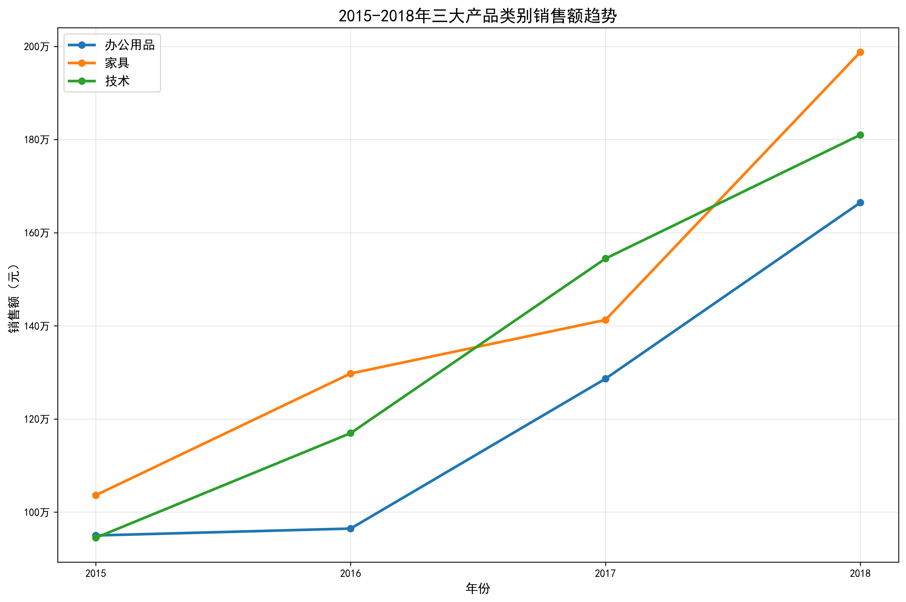
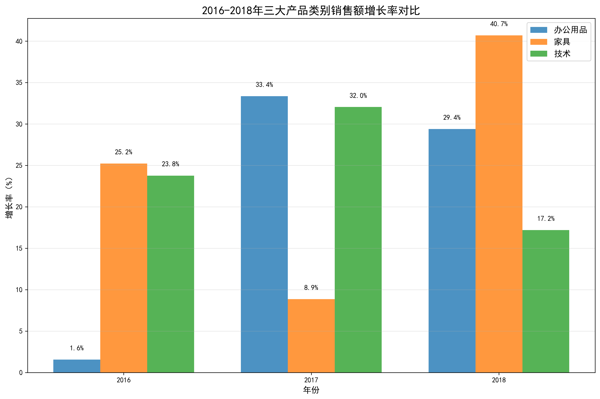
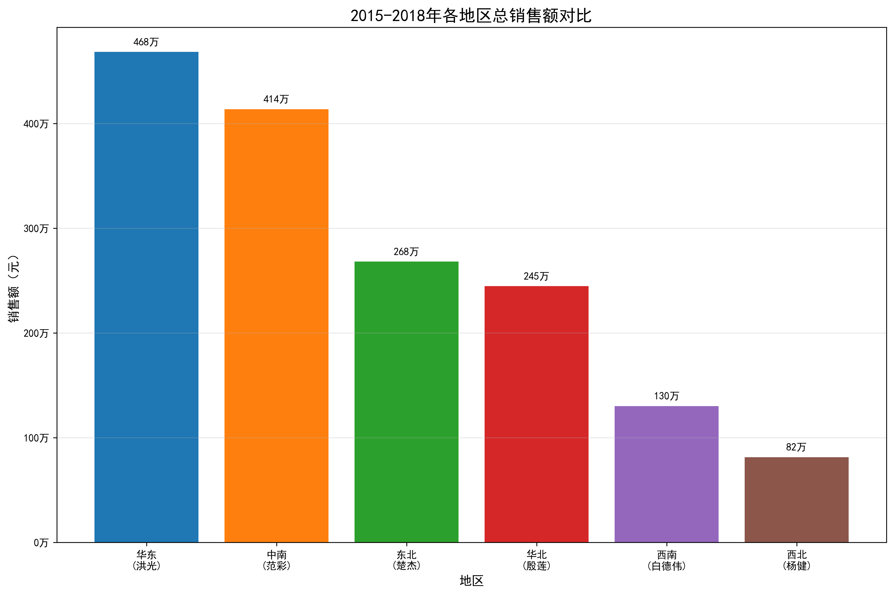
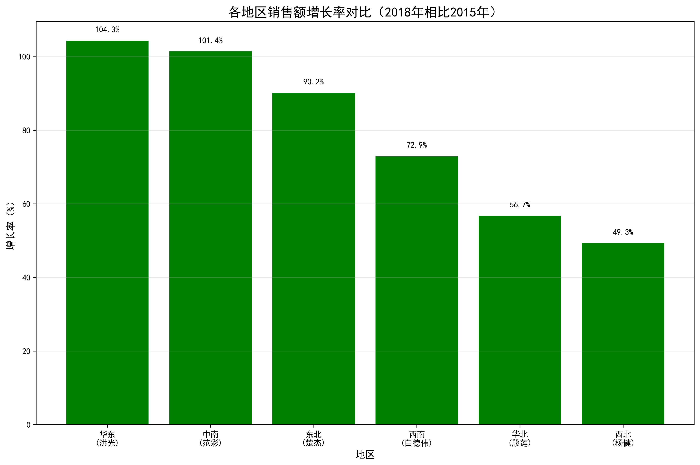
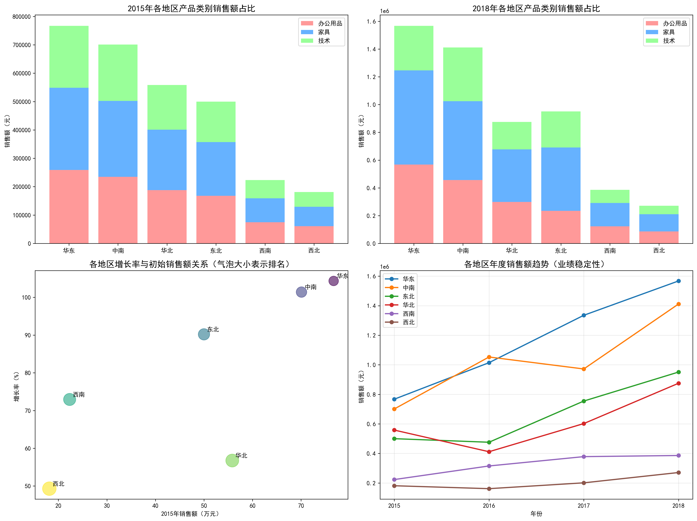

# 2015-2018年产品销售与地区业绩分析报告

## 执行摘要

本报告分析了2015年至2018年期间办公用品、技术产品和家具三大类别的销售额变化趋势，识别出每年销售增长最快的产品类别，并结合各地区销售数据，评估了不同地区经理的业绩表现差异。分析结果显示，家具类别在2016年和2018年表现最为突出，而办公用品在2017年领先。地区业绩方面，华东和中南地区持续领先，但增长率和稳定性存在显著差异。

## 一、产品类别销售趋势分析

### 1.1 整体趋势

从2015年到2018年，三大产品类别均呈现稳步增长态势：

**关键发现：**
- **家具类别**：从2015年的103.6万元增长至2018年的198.8万元，累计增长92.1%
- **办公用品**：从2015年的95.0万元增长至2018年的166.5万元，累计增长75.3%
- **技术产品**：从2015年的94.5万元增长至2018年的181.0万元，累计增长91.5%

### 1.2 年度增长率分析

**每年销售增长最快的产品类别：**
- **2016年**：家具，增长率25.22%
- **2017年**：办公用品，增长率33.35%
- **2018年**：家具，增长率40.71%

**洞察分析：**
1. 家具类别在2016年和2018年表现最为强劲，特别是在2018年达到了40.71%的高增长率
2. 办公用品在2017年异军突起，增长率达到33.35%，这可能与当年企业办公升级需求增加有关
3. 技术产品虽然整体增长稳定，但未有年度领先表现，需要进一步分析原因

## 二、地区业绩表现分析

### 2.1 总体业绩排名

**2015-2018年累计销售额排名：**
1. **华东地区（洪光）**：468.5万元
2. **中南地区（范彩）**：413.7万元
3. **东北地区（楚杰）**：268.2万元
4. **华北地区（殷莲）**：244.7万元
5. **西南地区（白德伟）**：130.3万元
6. **西北地区（杨健）**：81.5万元

### 2.2 增长率表现

**增长率排名（2018年相比2015年）：**
1. **华东（洪光）**：104.35%
2. **中南（范彩）**：101.40%
3. **东北（楚杰）**：90.20%
4. **西南（白德伟）**：72.94%
5. **华北（殷莲）**：56.75%
6. **西北（杨健）**：49.30%

### 2.3 业绩稳定性分析

各地区业绩稳定性（变异系数，越小越稳定）：
- **西南（白德伟）**：20.03% - 最稳定
- **西北（杨健）**：20.21% - 较稳定
- **中南（范彩）**：24.54% - 中等稳定
- **华东（洪光）**：26.04% - 中等稳定
- **华北（殷莲）**：27.39% - 较不稳定
- **东北（楚杰）**：29.15% - 最不稳定

## 三、综合洞察与建议

### 3.1 产品策略建议

1. **家具类别**：作为增长引擎
   - 继续加大家具类别的投入，特别是办公桌椅、储物家具等细分品类
   - 分析2018年家具高增长的具体驱动因素，复制成功经验

2. **办公用品**：潜力挖掘
   - 2017年的高增长表明办公用品有巨大潜力，需要分析当年的成功因素
   - 关注企业数字化转型带来的新型办公用品需求

3. **技术产品**：需要重点关注
   - 技术产品增长相对平缓，需要分析是否因为产品更新迭代慢或市场竞争激烈
   - 考虑引入新技术产品或升级现有产品线

### 3.2 地区管理建议

1. **优秀经验复制**
   - **华东洪光**和**中南范彩**的管理经验值得推广，他们在高增长的同时保持了较好的稳定性
   - 组织经验分享会，让表现优秀的地区经理分享管理心得

2. **重点关注区域**
   - **华北殷莲**：虽然基数较大，但增长率偏低，需要分析市场饱和度和竞争态势
   - **西北杨健**：基数小且增长率低，可能需要重新评估市场策略或资源配置

3. **稳定性提升**
   - **东北楚杰**：虽然总业绩排名第三，但波动性最大，需要建立更稳定的销售体系和客户基础
   - 建议为波动性大的地区制定更稳健的销售目标和激励机制

### 3.3 战略建议

1. **资源配置优化**
   - 根据各地区增长潜力重新配置销售资源
   - 在高增长地区加大投入，在成熟市场注重效率提升

2. **产品组合策略**
   - 根据不同地区特点制定差异化的产品推广策略
   - 在发达地区推广高价值技术产品，在发展中地区重点推广性价比高的办公用品

3. **绩效考核体系**
   - 建立综合考虑销售额、增长率和稳定性的绩效考核体系
   - 对于基数小但增长快的地区给予更多激励和支持

## 结论

2015-2018年期间，公司整体呈现良好的增长态势，但不同产品类别和地区之间存在显著差异。家具类别成为增长的主要驱动力，华东和中南地区持续领跑。未来需要在保持优势地区业绩的同时，重点关注增长乏力的地区和产品类别，通过优化资源配置、复制成功经验和制定差异化策略，实现更均衡、更可持续的增长。
