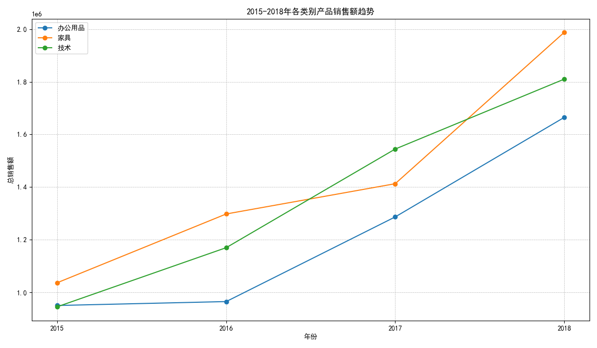
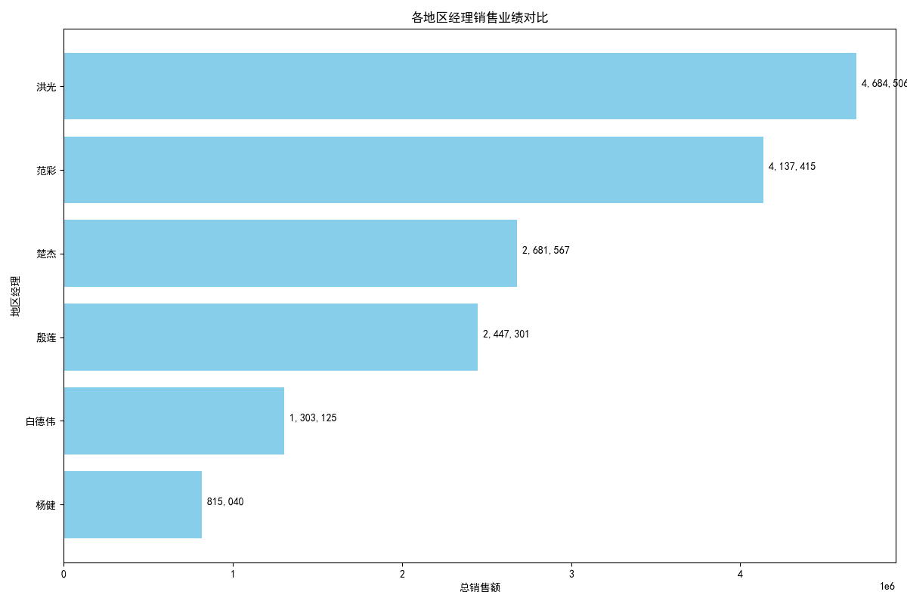

# 2015-2018年销售数据分析报告

## 摘要

本报告旨在分析2015年至2018年期间，办公用品、技术产品和家具三大产品类别的销售表现，并评估不同地区经理的业绩。分析结果显示，**技术产品**和**家具**是销售增长的主要驱动力，而不同地区经理之间的业绩存在显著差异。本报告将深入探讨这些趋势背后的原因，并为未来的业务策略提供 actionable insights。

---

## 一、产品类别销售趋势分析

### 1.1 总体销售趋势

从2015年到2018年，所有三个产品类别的销售额均呈现持续增长的态势。其中，**技术产品**的销售额从2015年的约94万增长到2018年的超过181万，成为销售额最高的类别。**家具**类别的销售额也实现了强劲增长，从约104万增长到近199万，表现突出。**办公用品**虽然销售额基数较低，但也保持了稳健的增长。

*图1：2015-2018年各类别产品销售额趋势* 

### 1.2 年度增长冠军

为了更深入地了解增长动态，我们计算了每个类别的年同比增长率（YoY Growth Rate）。

- **2016年：** **家具**类别以 **25.22%** 的增长率领先，成为当年的增长冠军。
- **2017年：** **办公用品**类别异军突起，以 **33.35%** 的惊人增长率位居榜首。
- **2018年：** **家具**类别再次发力，以高达 **40.71%** 的增长率夺冠。

**结论：** 尽管技术产品在总销售额上领先，但**家具**类别在增长势头上表现最为抢眼，两次成为年度增长最快的类别。这表明市场对家具产品的需求正在迅速扩大，可能与消费升级或房地产市场发展等宏观因素有关。办公用品在2017年的爆发式增长也值得关注，可能与特定的市场活动或客户需求变化有关。

---

## 二、地区经理业绩评估

为了评估不同地区经理的业绩表现，我们统计了每位经理负责区域的总销售额。

*图2：各地区经理销售业绩对比* 

### 2.1 业绩排名与分析

从上图可以看出，地区经理的业绩存在明显的分层现象：

- **第一梯队（业绩卓越）：** **洪光**（468万）和 **范彩**（414万）的业绩遥遥领先，他们所负责的地区是公司的核心收入来源。
- **第二梯队（业绩中坚）：** **楚杰**（268万）和 **殷莲**（245万）表现稳健，是公司的中坚力量。
- **第三梯队（有待提升）：** **白德伟**（130万）和 **杨健**（82万）的业绩与领先者差距较大，尤其是杨健，其销售额不足洪光的五分之一。

**结论：** 地区经理之间的巨大业绩差异表明，不同区域的市场潜力、竞争环境或经理的个人能力可能存在显著不同。公司需要深入探究业绩差距背后的具体原因。

---

## 三、业务洞察与建议

基于以上分析，我们提出以下业务洞察和建议：

1.  **重点关注高增长类别：**
    *   **加大对家具类别的投入：** 鉴于家具类别持续的高增长率，建议公司将其作为战略重点，在产品采购、库存管理和市场营销方面给予更多资源倾斜。
    *   **挖掘技术产品的潜力：** 作为销售额最高的类别，应继续巩固技术产品的市场地位，探索新的细分市场和产品线，以维持其领先优势。

2.  **优化区域管理策略：**
    *   **标杆学习与经验分享：** 组织业绩突出的经理（如洪光、范彩）进行经验分享，将其成功的销售策略和管理方法推广到其他地区，特别是业绩落后的地区。
    *   **深入分析业绩落后原因：** 针对白德伟和杨健所负责的区域，需要进行深入的市场调研，分析是市场潜力不足、竞争过于激烈，还是经理的管理能力或资源支持存在问题，并采取针对性的改进措施。
    *   **差异化激励机制：** 考虑设立更加差异化的销售目标和激励机制，充分激发所有地区经理的潜力，同时对业绩持续落后的经理进行必要的调整或培训。

3.  **数据驱动决策：**
    *   建议公司建立常态化的数据分析机制，定期审视各产品类别和区域的销售表现，以便更敏捷地响应市场变化，做出科学的业务决策。
