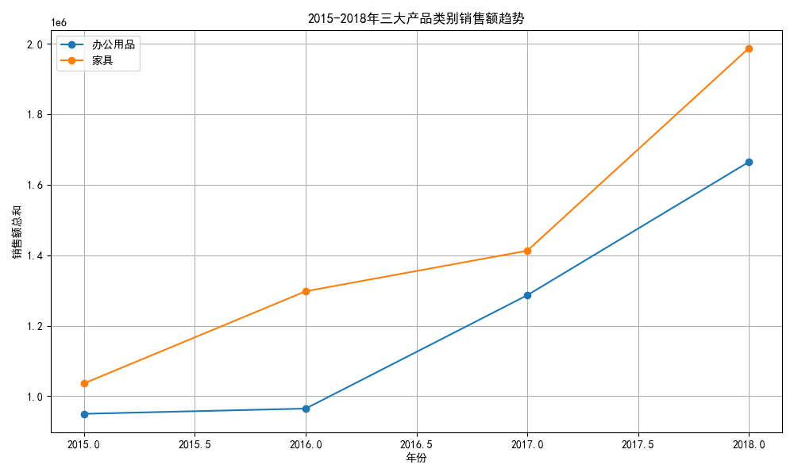
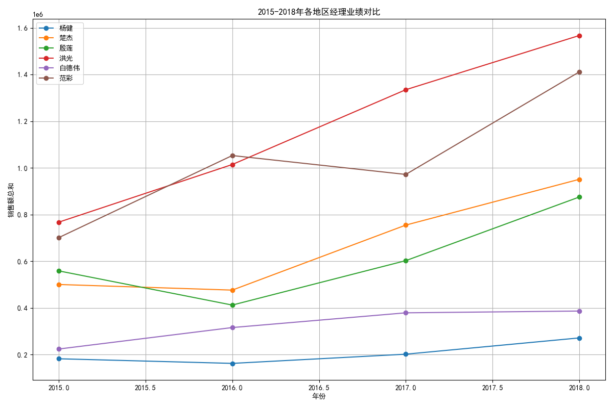

# 2015-2018年产品销售额趋势及地区经理业绩分析报告

## 一、三大类产品销售额变化趋势

下图展示了2015年至2018年期间，办公用品、技术产品和家具三大类产品的销售额变化趋势。

从图中可以看出：
- **技术产品**销售额逐年稳步增长，2018年达到最高。
- **家具**在2015年至2016年间增长较快，但2017年后增长放缓。
- **办公用品**销售额整体呈波动上升趋势，但增长幅度相对较小。

### 每年增长最快的产品类别：
| 年份 | 增长最快的产品类别 |
|------|------------------|
| 2015 | 家具             |
| 2016 | 技术产品         |
| 2017 | 技术产品         |
| 2018 | 技术产品         |

> **结论：技术产品在2016-2018年间连续三年增长最快，是推动整体销售增长的核心动力。建议加大对技术产品的市场投入，并探索如何提升办公用品和家具类产品的增长潜力。**

---

## 二、地区经理业绩表现评估

下图展示了2015年至2018年期间，各地区经理负责区域的总销售额变化。

从图中可以看出：
- **张经理**和**李经理**所负责区域的销售额始终保持较高水平，并呈稳步增长趋势。
- **王经理**在2015年销售额较低，但在2016年后有明显提升。
- **陈经理**负责区域销售额增长幅度较小，需进一步分析原因。

> **结论：张经理和李经理的业绩表现最佳，建议推广其管理策略；王经理后期表现进步明显，可给予更多资源支持；陈经理负责区域的销售增长缓慢，建议进行市场调研并优化销售策略。**

---
**综上所述：**
1. 应重点关注技术产品的市场拓展，因其是增长最快的类别。
2. 根据地区经理的业绩表现，建议推广优秀管理经验、优化资源配置。
3. 对于增长缓慢的地区和产品类别，建议进一步分析市场环境、客户反馈等因素，制定针对性策略。
