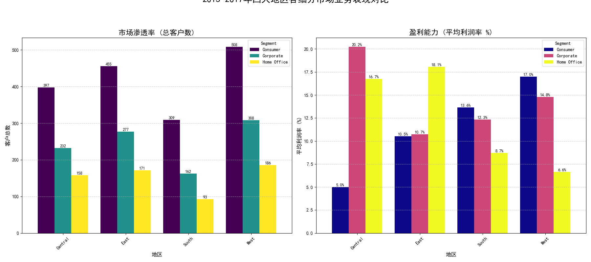

# 四大地区业务表现分析报告：市场渗透与盈利能力洞察

## 1. 分析背景与目标

本报告旨在深入分析公司在 **Central、East、South、West** 四大地区的业务表现。我们聚焦于 **2015 至 2017 年** 的数据，旨在评估各地区在 **Consumer（消费者）、Corporate（公司）和 Home Office（家庭办公室）** 三个核心细分市场的 **市场渗透率** 和 **盈利能力** 差异。最终目标是找出表现最佳的“地区-市场”组合，并为未来的业务扩张提供数据驱动的战略建议。

## 2. 核心分析结果

通过对销售数据的聚合与可视化分析，我们得到了各地区在不同细分市场的表现对比图。下图直观展示了市场渗透率（以独立客户总数衡量）和盈利能力（以平均利润率衡量）的差异。

## 3. 核心洞察解读

### 3.1. 市场渗透率：西部地区一马当先

从左侧的“市场渗透率”图表可以看出：

- **西部 (West) 表现最为强势**：无论是在消费者、公司还是家庭办公室市场，西部的客户数量都显著高于其他地区，表明其拥有最广泛的客户基础和最高的市场渗透率。特别是其消费者市场，客户规模遥遥领先。
- **东部 (East) 基础扎实**：东部作为第二大市场，在所有细分市场的客户数量也相当可观，市场基础稳固。
- **中部 (Central) 与南部 (South) 规模尚待增长**：这两个地区的客户基数相对较小，市场渗透率有较大的提升空间。

### 3.2. 盈利能力：高渗透不等于高利润

从右侧的“盈利能力”图表我们发现，客户规模与盈利能力并非完全正相关，一些关键的盈利亮点出现在非优势市场：

- **中部-公司 (Central-Corporate) 市场是“利润奶牛”**：尽管客户数量不多，但中部地区的公司业务平均利润率高达 **20.2%**，是所有“地区-市场”组合中盈利能力最强的。这表明该区域的公司客户极具价值。
- **南部 (South) 市场盈利潜力巨大**：南部地区虽然客户规模小，但其公司和消费者市场的利润率均表现出色（分别为 18.0% 和 16.9%），显示出健康的盈利能力和增长潜力。
- **东西部利润率差异**：东部所有细分市场的利润率稳定在 10%-12% 之间，表现均衡。而客户规模最大的西部，其利润率却相对平庸，尤其是在消费者和家庭办公室市场，盈利能力有待提高。

## 4. 战略建议与扩张方向

基于以上分析，我们提出以下几点可行的扩张与优化建议：

1.  **在西部市场“深耕”而非“扩张”**
    - **核心问题**：西部地区客户多但利润率偏低。
    - **建议**：战略重点应从“获取新客户”转向“**提升单客价值**”。建议对西部市场的产品组合进行优化，推广利润率更高的产品线；同时，审查定价策略和供应链成本，以提高整体盈利水平。

2.  **复制“中部-公司”市场的成功模式**
    - **核心机会**：中部公司业务的高利润模式是一个亟待推广的成功范例。
    - **建议**：深入分析中部公司市场成功的原因（是特定的产品组合、销售策略还是客户行业分布？）。将这些**成功经验和打法系统化，并复制到客户基数庞大的西部和东部公司市场**。这有望为公司带来指数级的利润增长。

3.  **加大对南部市场的“投资渗透”**
    - **核心潜力**：南部市场展示了“小而美”的健康盈利模型。
    - **建议**：南部地区是明确的增长型市场。应**增加在该地区的市场营销和销售投入**，扩大品牌知名度和客户覆盖面，以期在保持高利润率的同时，实现客户规模的快速增长。

4.  **发掘“家庭办公室”这一蓝海市场**
    - **共同趋势**：在所有四个地区，家庭办公室细分市场都表现出稳定且可观的利润率，但客户基数普遍较小。
    - **建议**：这可能是一个被全公司低估的细分市场。建议**制定全国性的、针对家庭办公室客户的专项营销活动**，发掘其增长潜力，将其培养成新的业务增长点。

通过采纳以上策略，公司可以更有针对性地分配资源，不仅能巩固现有优势，还能有效复制成功模式，挖掘潜在市场，最终实现规模与利润的协同增长。
