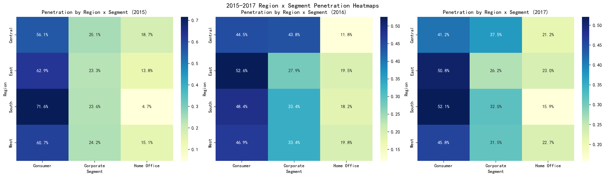
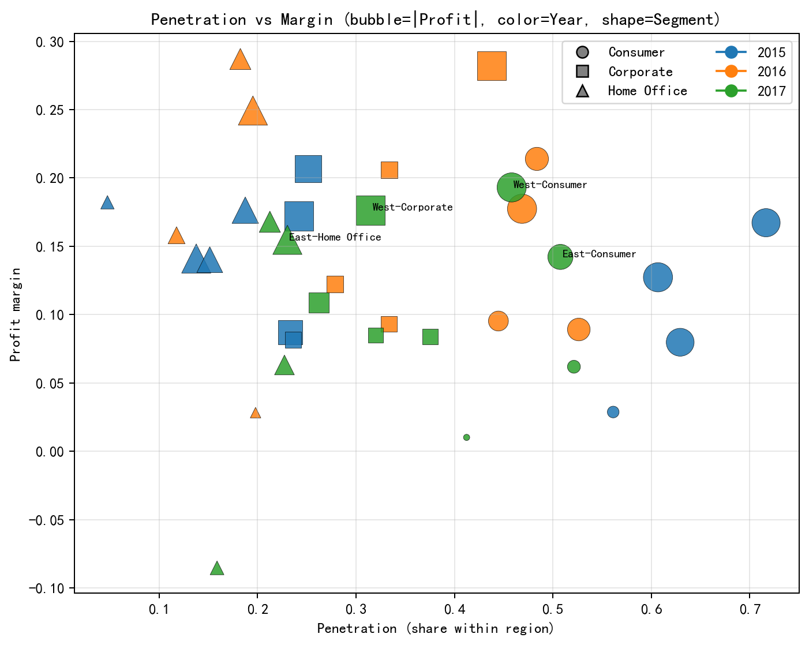
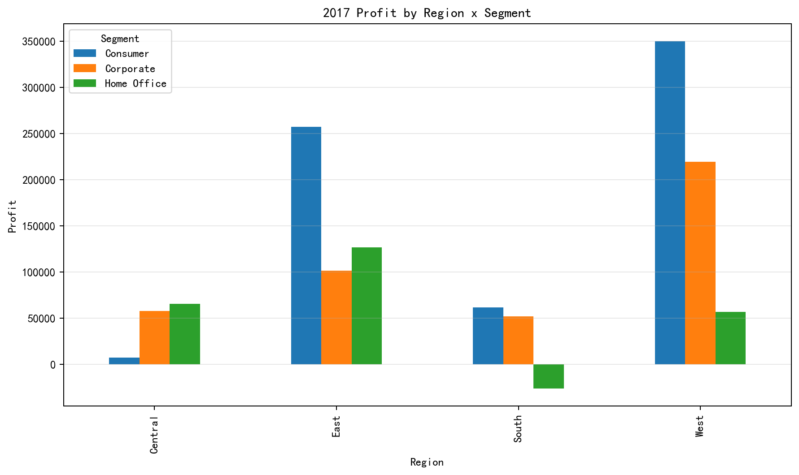
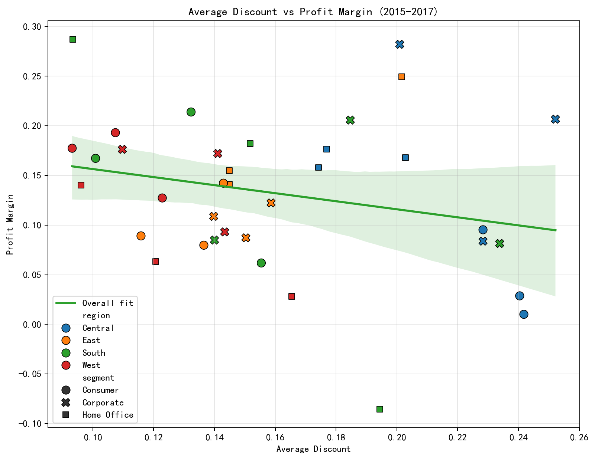

# 四大地区×细分市场（2015-2017）渗透率与盈利能力对比：最佳组合与扩张建议

以下分析基于提供的SQLite数据：
- 表“工作表1”：包含订单日期、地区、细分市场等信息
- 表“工作表2”：包含产品、销售额/每件、利润/每件、数量、折扣等信息

通过订单ID联表，计算2015-2017年“地区×细分市场”的销售额、利润、利润率与地区内渗透率（该细分市场销售额 / 该地区年度总销售额）。

为保证中文显示正常，绘图前使用如下Python设置：
```python
plt.rcParams['font.sans-serif'] = ['SimHei']
plt.rcParams['axes.unicode_minus'] = False
```

## 可视化总览

- 2015-2017渗透率热力图（各地区×细分市场）
  

- 渗透率 vs 利润率气泡散点（气泡大小=利润总额，颜色=年份，形状=细分市场）
  

- 2017年利润额柱状图（各地区×细分市场）
  

- 折扣与利润率关系（2015-2017）
  

## 关键口径说明
- 渗透率：某地区内某细分市场销售额占该地区总销售额的比例，衡量份额与覆盖度。
- 利润率：利润 / 销售额，衡量盈利能力。
- 指标来源：SQL联接“工作表1”“工作表2”，提取年、地区、细分市场；销售额=数量×销售额/每件，利润=数量×利润/每件。

## 发现一：渗透率差异（2015-2017）
- Consumer在多数地区渗透较高：
  - 2017：South≈52.1%，East≈50.8%，West≈45.8%，Central略低（从热力图观察）
- Corporate渗透率居中：West≈31.5%（2017），其他地区更低。
- Home Office渗透率整体偏低：2017 East≈23.0%，其他地区更低。

解释：
- East与South的Consumer渗透率领先，表明B2C渠道铺设与终端覆盖较为充分。
- Home Office作为小型办公场景，整体份额较小，可能受品类结构与客户规模限制。

## 发现二：盈利能力差异（以2017为例）
- West-Consumer利润率≈19.3%，利润额≈349,910，为当年表现最强单元。
- West-Corporate利润率≈17.6%，利润额≈219,542，盈利能力出色。
- East-Home Office利润率≈15.5%，利润额≈126,972，利润率良好但份额中等。
- East-Consumer利润率≈14.2%，利润额≈257,276，份额高但利润率略低。
- South-Consumer利润率≈6.18%，尽管渗透率高，但盈利偏弱。

诊断线索（为什么会有差异）：
- 折扣与利润率整体呈负相关（Pearson≈-0.243，2015-2017），见“折扣与利润率关系”图。
  - 折扣越高，利润率越低的倾向明显；South的低利润率很可能与较高折扣策略、品类结构更偏低毛利有关。
  - East-Consumer尽管渗透高，但利润率受折扣影响，存在提价/控折的改善空间。

## 发现三：最佳组合评估
采用两套评估视角：
- 当年综合评分（2017）：对渗透率、利润率、利润额进行标准化后等权平均
  - Top 5（摘录）：
    - West-Consumer：销售≈1,812,427，利润≈349,910，利润率≈19.3%，渗透率≈45.8%（综合第一）
    - East-Consumer：销售≈1,809,294，利润≈257,276，利润率≈14.2%，渗透率≈50.8%
    - West-Corporate：销售≈1,245,311，利润≈219,542，利润率≈17.6%，渗透率≈31.5%
    - South-Consumer：销售≈1,001,154，利润≈61,894，利润率≈6.18%，渗透率≈52.1%
    - East-Home Office：销售≈820,769，利润≈126,972，利润率≈15.5%，渗透率≈23.0%

- 三年稳定性评分（2015-2017）：考察平均渗透率、平均利润率、累计利润与利润率波动性（波动越小越好）
  - Top 5（摘录）：
    - West-Consumer：平均渗透≈51.1%，平均利润率≈16.6%，三年利润累计≈718,031，利润率波动低（稳居第一）
    - East-Consumer：平均渗透≈55.4%，平均利润率≈10.4%，三年利润累计≈524,095，波动低
    - South-Consumer：平均渗透≈57.4%，平均利润率≈14.8%，累计≈338,913
    - Central-Corporate：平均利润率≈19.1%（极佳），但渗透中等（≈35.5%），是潜力股
    - West-Corporate：平均利润率≈14.7%，累计≈382,453，稳定性较好

结论：综合当前表现与三年稳定性，West-Consumer为最佳地区-市场组合；West-Corporate、East-Home Office次之。East-Consumer具备份额优势，但利润率偏低，是“提质增效”的关键战场。South-Consumer应先提升利润率再扩张。

## 预测性场景：渗透率提升5个百分点（2017）
在维持当年地区销售规模与利润率不变的近似下，若某地区-细分市场渗透率+5个百分点，潜在利润增量≈0.05 × 地区销售额 × 当年利润率。
- West-Consumer：Δ利润≈38,197
- West-Corporate：Δ利润≈34,879
- East-Home Office：Δ利润≈27,573
- East-Consumer：Δ利润≈25,345
- South-Consumer：Δ利润≈5,937

启示：West市场的渗透提升，单位增量的利润产出更高；East的Home Office/Consumer也有可观增量。

## 规范性建议（What should we do）
- 优先扩张（攻势型）
  - West-Consumer：加仓渠道与覆盖（大盘稳、利润率高、稳定性强），目标渗透+5pp，预计增利≈38k；可搭配轻促销+组合包装，避免折扣侵蚀。
  - West-Corporate：深耕企业客户（集中采购、服务合约），目标渗透+5pp，预计增利≈35k；突出高毛利SKU与服务绑定，保持利润率。
- 结构优化（提质型）
  - East-Consumer：控制折扣（折扣-利润率负相关显著），推进高毛利品类与加价策略；在CRM中对高价值客群差异化促销，预计既能稳份额又能提升利润率。
  - East-Home Office：在稳定利润率基础上加大获客与渠道合作，目标渗透+5pp，预计增利≈27.6k；强调易耗/高毛利办公品类。
  - Central-Corporate：利润率优势明显但渗透中等，建议通过行业活动与招投标提升覆盖，优先争取大客户，以渗透换规模。
- 纠偏与守正（谨慎型）
  - South-Consumer：渗透虽高但利润率偏低，短期不建议以大幅折扣换增量；应聚焦定价治理、产品结构调整与成本控制，先修复利润率后再扩张。
- 管理抓手与KPI
  - 折扣治理：设置各地区-市场折扣红线，监控“折扣-利润率”关系（目标相关系数向0收敛）。
  - 品类结构：提高高毛利SKU占比与联动销售占比（如配件+耗材）。
  - 客户与渠道：制定地区×细分的渗透提升KPI（季度+5pp试点），同时锁定利润率不下降的约束。

## 方法与数据说明
- SQL联接按订单ID，年份通过“订单日期”后4位提取。
- 指标计算：
  - sales = 数量 × 销售额/每件
  - profit = 数量 × 利润/每件
  - margin = profit / sales
  - penetration = 该地区-细分销售额 / 该地区年度总销售额
- 无数据清洗，仅按原始字段计算。
- 最佳组合评分与稳定性评分均采用等权标准化模型，辅以利润率波动惩罚项。

## 限制与后续
- 年份解析依赖日期字符串后4位，适用于样例格式；若存在异构格式需进一步统一。
- 折扣数据以订单行平均折扣近似反映策略强度，未细分到SKU层级的毛利结构。
- 后续可在SKU/类别层面开展细化分析，识别提价空间与结构性机会。

以上建议与结论均由所附图表与SQL/Python输出支持。
