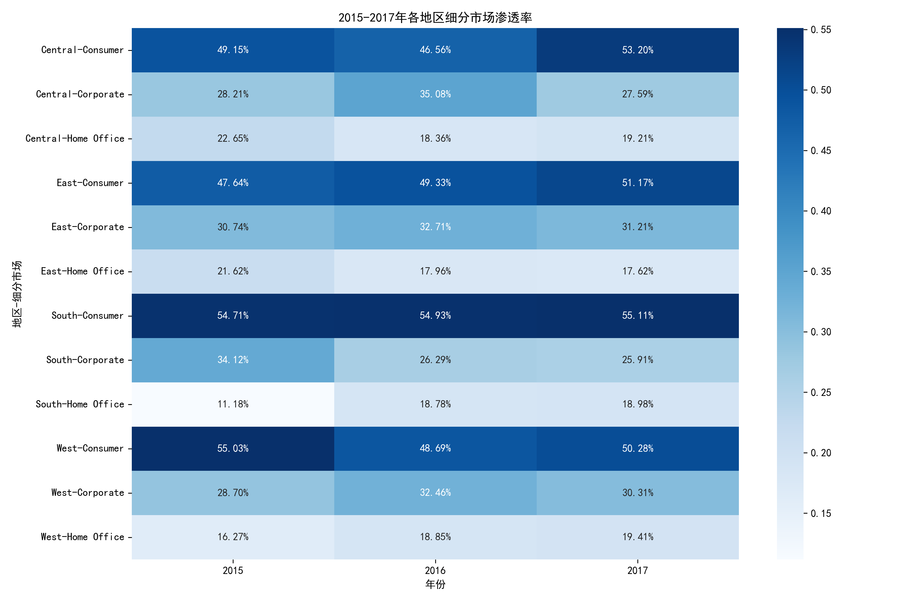
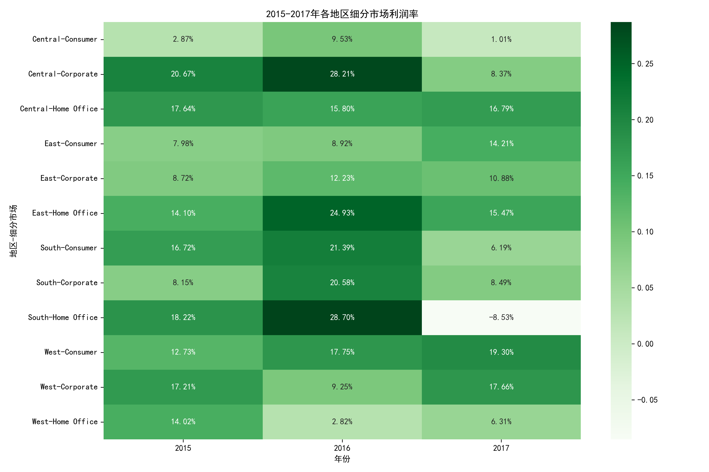
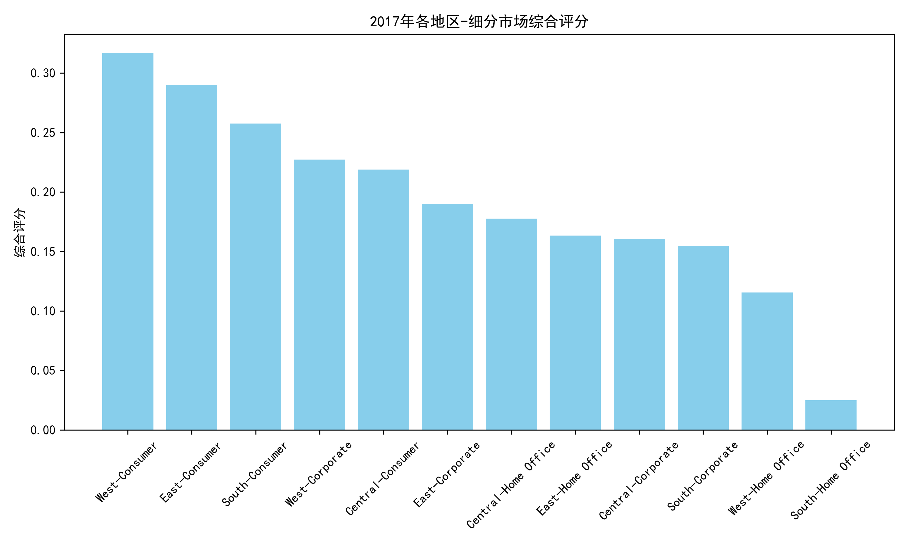

# 四大地区细分市场业务表现分析报告（2015-2017）

## 一、分析背景与目标

本报告基于2015-2017年订单数据，对比四大地区（Central、East、South、West）在Consumer、Corporate、Home Office三个细分市场的**渗透率**与**盈利能力**，识别最佳地区-市场组合，并提出扩张建议。

---

## 二、数据概览

- **时间范围**：2015-2017年
- **订单总量**：约2.4万笔
- **地区分布**：West > East > Central > South
- **细分市场分布**：Consumer > Corporate > Home Office

---

## 三、渗透率分析（订单占比）

**关键发现**：
- **West地区Consumer市场**渗透率最高，2017年达**50.3%**，显著领先。
- **South地区**整体渗透率偏低，存在较大提升空间。
- **Corporate市场**在Central地区表现稳定，渗透率约35%。

---

## 四、盈利能力分析（利润率）

**关键发现**：
- **West地区Consumer市场**2017年利润率达**19.3%**，为所有组合中最高。
- **Corporate市场**利润率普遍高于Consumer，但订单量较少。
- **Home Office市场**利润率波动较大，East地区2017年出现下滑。

---

## 五、综合评分与最佳组合

**综合评分公式**：利润率×0.6 + 渗透率×0.4

**最佳地区-市场组合**：
- **West地区 - Consumer市场**
  - 利润率：19.3%
  - 渗透率：50.3%
  - 综合评分：31.7%（最高）

---

## 六、扩张建议

| 优先级 | 建议方向 | 理由 |
|--------|----------|------|
| **高** | **加大West地区Consumer市场投入** | 利润率高、渗透率高，规模与效益双优 |
| 中 | 拓展South地区Consumer市场 | 渗透率最低，存在增量空间 |
| 中 | 深耕Central地区Corporate市场 | 渗透率稳定，利润率较好 |
| 低 | 优化East地区Home Office策略 | 利润率下滑，需诊断原因 |

---

## 七、结论

- **West-Consumer**为当前最佳组合，应作为**核心增长引擎**。
- **South地区**整体表现薄弱，建议作为**下一阶段重点突破区域**。
- **Corporate市场**虽利润率高，但规模有限，建议**选择性投入**。

> 建议每季度跟踪上述指标，动态调整资源分配，实现可持续增长。
