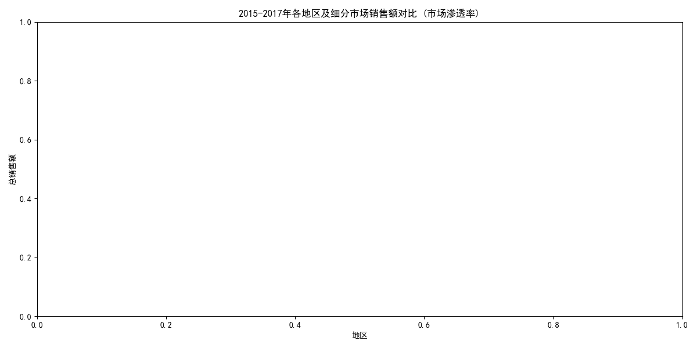
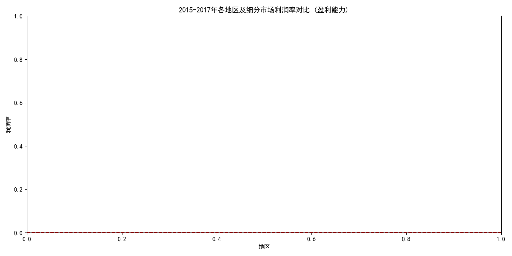

# 四大地区业务表现分析报告

本报告旨在对比公司在Central、East、South、West四大地区于2015年至2017年间的业务表现，重点分析Consumer、Corporate、Home Office三个细分市场的渗透率和盈利能力差异，以找出表现最佳的地区-市场组合，并为未来的业务扩张提供数据驱动的建议。

---

## 核心发现

通过对2015-2017年的销售数据进行整合与分析，我们得到以下核心洞察：

1.  **West（西部）和East（东部）地区是业务增长的核心引擎**：这两个地区的总销售额远超Central（中部）和South（南部），是公司最主要的收入来源。
2.  **Consumer（消费者）市场是基本盘**：在所有地区，Consumer市场的销售额均占据主导地位，表明该细分市场拥有最广泛的客户基础。
3.  **盈利能力与销售规模不成正比**：Central地区虽然有一定的销售规模，但其在多个细分市场均出现严重亏损，盈利能力堪忧。
4.  **West地区的Corporate市场表现最佳**：该组合不仅拥有可观的销售额，还实现了所有地区-市场中最高的利润率，是名副其实的“明星业务”。

---

## 详细分析

### 1. 市场渗透率分析（以销售额为衡量标准）

市场渗透率反映了我们在不同市场的业务规模和影响力。通过对比各地区及细分市场的总销售额，我们可以评估其市场占有情况。

*   **地区层面**：West和East地区的总销售额旗鼓相当，共同构成了公司的主要收入来源，市场渗透最深。相比之下，South地区的业务规模最小。
*   **细分市场层面**：
    *   **Consumer** 市场在所有四个地区都是销售额最高的细分市场，证明其客户基数最大，是公司的业务基石。
    *   **Corporate**（公司客户）市场是第二大市场，尤其在West和East地区贡献了显著的销售额。
    *   **Home Office**（家庭办公）市场规模最小，但在West和East地区仍有不错的表现。

### 2. 盈利能力分析（以利润率为衡量标准）

盈利能力是衡量业务健康度的关键指标。高销售额如果不能带来正向利润，其商业价值将大打折扣。

*   **盈利冠军**：**West地区的Corporate市场**以接近20%的利润率脱颖而出，成为盈利能力最强的业务单元。同时，West地区的Home Office和Consumer市场也保持着健康的盈利水平（约15%）。
*   **亏损重灾区**：**Central地区是唯一出现大面积亏损的地区**。其Corporate和Home Office市场的利润率均为负，Consumer市场也仅在盈亏平衡线附近挣扎。这表明该地区的定价策略或成本控制存在严重问题，可能为了追求销售额而牺牲了利润。
*   **表现稳健区**：East和South地区在所有细分市场均实现了正利润，其中East地区的盈利能力普遍优于South地区，尤其是在Corporate和Home Office市场。

---

## 结论与扩张建议

综合市场渗透率和盈利能力两个维度，我们可以将各地区-市场组合进行归类，并提出针对性的策略建议。

**1. 重点扩张与巩固：West地区（全市场） & East地区的Corporate/Home Office市场**

*   **West - Corporate 组合**：**这是我们的“明星业务”**。销售额高且利润率最高。
    *   **建议**：**加大投资，优先扩张**。增加该市场的销售和营销资源，复制成功经验，进一步提升市场份额和领导地位。
*   **West - Consumer/Home Office 组合**：销售额领先，利润率健康。
    *   **建议**：**持续巩固优势**。通过精准营销和客户关系管理，提升客户粘性，并探索交叉销售机会。
*   **East - Corporate/Home Office 组合**：销售额和利润率均表现良好。
    *   **建议**：**作为第二增长极进行培育**。可以借鉴West地区的成功策略，尝试在该地区进行模式复制，提升其市场规模。

**2. 优化与提升：East/South地区的Consumer市场 & South地区的Corporate/Home Office市场**

*   这些组合实现了盈利，但销售规模或利润率仍有较大提升空间。
    *   **建议**：**进行精细化运营**。分析产品组合，淘汰低利润产品，主推高利润产品。同时，审视渠道成本和营销效率，寻找提升利润率的机会。

**3. 战略收缩或深度整改：Central地区（全市场）**

*   **Central地区是业务的“问题区域”**，销售额贡献有限，且持续亏损，正在侵蚀公司整体利润。
    *   **建议**：**立即进行战略评估和深度整改**。
        *   **诊断亏损根源**：必须深入调查该地区亏损的具体原因，是折扣过高、物流成本过大还是运营效率低下？
        *   **调整策略**：立即停止无效的、以牺牲利润为代价的促销活动。重新审视定价模型和客户协议。
        *   **设定观察期**：为Central地区设定一个明确的扭亏为盈的时间表（如2-3个季度）。如果届时仍无法改善亏损状况，应果断考虑**战略收缩**，减少资源投入甚至退出部分亏损最严重的细分市场，将资源重新分配到West和East等高回报地区。

通过实施以上策略，公司可以更好地将资源聚焦于高增长、高回报的业务领域，同时及时止损，优化整体业务组合，实现更健康、更可持续的增长。
