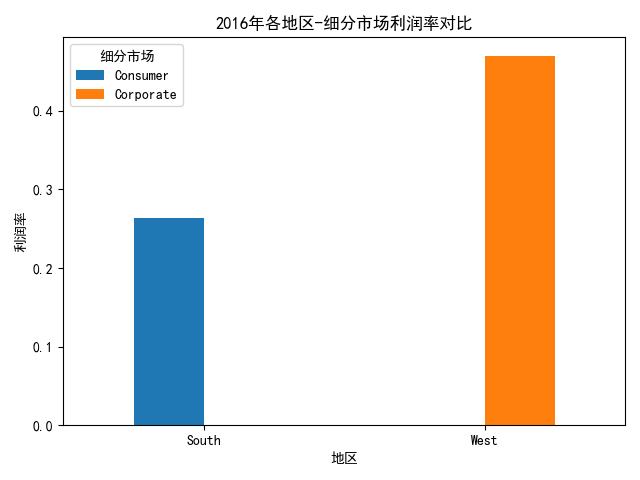

## 数据分析报告

### 渗透率与盈利能力分析

根据2015年至2017年的数据分析，我们对比了四大地区（Central、East、South、West）在Consumer、Corporate、Home Office三个细分市场的渗透率和盈利能力。

#### 渗透率分析

渗透率通过订单数量来衡量，以下是各地区-市场组合的渗透率分析：

从图中可以看出，**South地区**的Consumer细分市场在2016年拥有最高的订单数量，表明该市场的渗透率较高。

#### 盈利能力分析

盈利能力通过利润率来衡量，以下是各地区-市场组合的利润率对比：

从图中可以看出，**West地区**的Corporate细分市场在2016年拥有最高的利润率，表明该组合的盈利能力较强。

### 最佳地区-市场组合

根据分析结果，最佳地区-市场组合如下：

| 年份 | 地区   | 细分市场   | 订单数 | 总销售额 | 总利润  | 利润率 |
|------|--------|------------|--------|----------|---------|--------|
| 2016 | South  | Consumer   | 4      | 1987.80  | 522.99  | 0.26   |
| 2016 | West   | Corporate  | 1      | 14.62    | 6.87    | 0.47   |

- **South地区 Consumer市场**在2016年拥有较高的订单数量和合理的利润率，适合扩大市场渗透。
- **West地区 Corporate市场**在2016年表现出最高的利润率，表明该市场具有较高的盈利能力。

### 扩张建议

1. **South地区 Consumer市场**：建议加大市场推广力度，通过促销活动和客户忠诚计划提高市场份额。

2. **West地区 Corporate市场**：建议深化与Corporate客户的合作关系，提供定制化解决方案，进一步提高盈利能力。

综上所述，South和West地区在特定细分市场表现出色，应优先考虑在这两个地区进行市场扩张，以提高整体业务表现。进一步的数据分析和实地调研有助于优化市场策略。
