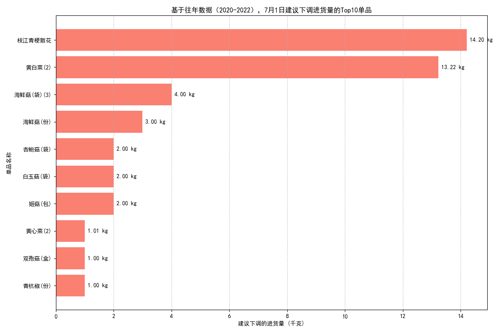

# 关于2023年7月1日超市单品进货量调整的分析报告

## 摘要

为协助超市优化库存管理并减少因滞销导致的亏损，本报告对过往三年（2020-2022年）夏季的销售数据进行了深入分析。我们重点比较了6月30日与7月1日两天的销售情况，旨在识别那些在7月1日出现明显销量下滑的单品。**核心结论是：以“枝江青梗散花”和“黄白菜(2)”为首的一批蔬菜和菌菇类商品，在7月1日呈现出持续性的销量大幅下跌。** 因此，我们建议在2023年及未来的7月1日，应参照往年7月1日的实际销量而非6月30日的销量来准备这些单品的库存，以有效避免亏本销售。

---

## 1. 分析背景与目的

超市零售业的盈利能力与库存周转率密切相关。在特定日期（如月初），消费者的购买行为可能发生变化，若按前一天的销售高峰备货，容易导致部分商品积压，最终产生损耗。本次分析的目标是，通过历史数据洞察，精准定位在7月1日销量会“跳水”的单品，为采购部门提供具体、可执行的进货量下调建议。

## 2. 分析方法

我们利用了超市2020至2022年的销售数据库，具体步骤如下：
1.  **数据提取**：从`销售记录`表中提取了每年6月30日和7月1日的所有单品销售记录。
2.  **数据聚合**：将这三年中所有6月30日的销量和7月1日的销量按`单品名称`分别进行汇总，得到每个单品在这两天的“历史平均总销量”。
3.  **差异计算与排序**：计算每个单品从6月30日到7月1日的销量差额（`6月30日总销量` - `7月1日总销量`），并按差额大小进行降序排序。差额为正值，代表销量下降。
4.  **可视化呈现**：筛选出销量下降最显著的Top 10单品，通过条形图展示其具体的建议下调量。

## 3. 核心发现与可视化图表

数据显示，部分生鲜产品在7月1日的销量相较于6月30日有显著滑落。下图清晰地展示了根据历史数据，建议下调进货量最多的十种单品。

**图表解读：**
-   图表横轴代表基于历史数据计算出的“建议下调的进货量”（单位：千克），即6月30日总销量与7月1日总销量的差值。
-   **枝江青梗散花** 和 **黄白菜(2)** 是需要重点关注的单品，其历史销量在7月1日分别平均下降了 **14.21千克** 和 **13.22千克**。这意味着，如果按照6月30日的销量为7月1日备货，这两样单品极有可能产生大量积压。
-   菌菇类产品，如 **海鲜菇**（袋装与份装）和 **杏鲍菇**，也显示出明显的销量下滑趋势。特别是“海鲜菇(份)”，其销量从有到无，下降幅度高达100%。

## 4. 原因探讨与业务建议

### 可能的原因分析：
-   **月底效应**：消费者可能在6月30日（月底）集中采购，导致蔬菜等日常必需品的需求提前释放。进入7月1日（月初），购买意愿自然回落。
-   **补货周期**：超市自身的进货和补货周期可能影响了特定日期的商品可得性或新鲜度，进而影响销量。
-   **周末效应**：如果历年中的6月30日恰逢周末的次数更多，而7月1日是工作日，也会导致销量差异。但这需要更详细的日期维度分析。

### 切实可行的策略建议：

基于以上分析，我们提出以下具体建议：

1.  **实施差异化备货策略**：针对报告中列出的Top 10单品，采购部门在制定7月1日的进货计划时，**不应直接沿用6月30日的销量**，而应参考这三年来7月1日的平均销量水平。例如，对于“枝江青梗散花”，其备货量应在6月30日的基础上至少减少14千克。

2.  **建立动态库存调整机制**：建议将此分析方法常态化，建立一个简单的预警系统。定期监控特定日期（如节假日、月初/月底）前后的销量变化，对销量波动显著的商品进行标记，并动态调整库存策略。

3.  **深挖数据，优化促销**：对于销量下降明显的商品，可以在7月1日当天配合小幅度的打折促销，以加速库存周转，将潜在的损耗转化为有效的销售额。

通过采纳这些基于数据的洞察，超市可以更精准地管理库存，减少不必要的浪费，从而切实提高整体营收水平。
