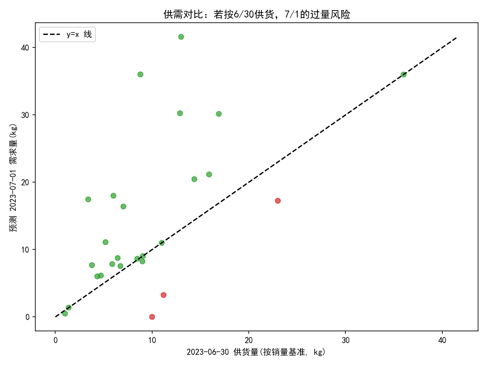
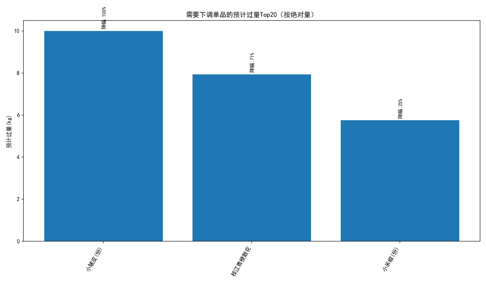

# 7月1日进货下调建议（基于往年夏季数据与2023-06-30销量）

## 背景与目标
- 目标：为提高总营收、尽可能避免亏本销售，识别若2023年7月1日“按6月30日销量供货”情况下，进货量需要明显下调的单品。
- 数据来源：SQLite 库 dacomp-025.sqlite 中的“销售记录”“商品信息”“商品损耗”。销售数据最晚到 2023-06-30。
- 方法要点：利用2020-2022年历史上 7/1 相对 6/30 的各单品销量比率，作为季节性与日期相邻效应的参考，对2023-06-30各单品销量进行缩放，预测2023-07-01需求，进而识别需“明显下调”的单品。

说明：未对原始数据进行清洗，仅进行分析与汇总。损耗率仅用于风险权重，不改变原始销量与预测。

## 方法与计算
- 历史比率计算：对每个单品，计算 ratio = (历史 7/1 总销量) / (历史 6/30 总销量)，按2020-2022可用年份累加。
- 预测：pred_2023_0701 = qty_2023_0630 × ratio。
- 下调判定阈值（业务可调）：
  - 同比预计下降幅度 ≥ 15%（即 1 - ratio ≥ 0.15）；
  - 绝对过量 ≥ 2 kg（即 max(qty_2023_0630 - pred_2023_0701, 0) ≥ 2）。
- 风险加权：考虑损耗率，risk_adjusted_overstock = expected_overstock × (1 + 损耗率%)，作为排序参考。

可视化脚本的中文显示设置（已用于生成图片）：
```python
plt.rcParams['font.sans-serif'] = ['SimHei']
plt.rcParams['axes.unicode_minus'] = False
```

## 结果总览与可视化
- 供需对比散点图（红色为建议下调）：



- 需要下调单品的预计过量Top20（按绝对量）：



同时输出了明细CSV：down_adjustment_suggestions.csv（含每个单品的 2023-06-30销量、预测的2023-07-01需求、预计过量、降幅、损耗率、历史年份数、下调标记）。

## 明显需要下调的单品（建议与理由）
基于上述判定阈值，以下单品满足“明显需要下调”的条件（括号中包含建议下调幅度与预计新进货量）：

- 小皱皮(份)（单品编码 102900011032022）
  - 2023-06-30销量：约 10.00 kg；历史比率预测 2023-07-01需求：约 0.00 kg。
  - 建议：下调约 10.00 kg（降幅约 100%），新进货量≈ 0 kg。
  - 理由：历史显示 7/1 较 6/30 明显走低，且损耗率约 9.43%，过量风险加权后更高。

- 枝江青梗散花（单品编码 102900011034026）
  - 2023-06-30销量：约 11.19 kg；预测 2023-07-01需求：约 3.25 kg。
  - 建议：下调约 7.93 kg（降幅约 70.9%），新进货量≈ 3.25 kg。
  - 理由：历史 7/1 较 6/30 大幅下滑，且损耗率约 9.43%，叶菜类易损耗，过量会侵蚀毛利。

- 小米椒(份)（单品编码 102900011031100）
  - 2023-06-30销量：约 23.00 kg；预测 2023-07-01需求：约 17.25 kg。
  - 建议：下调约 5.75 kg（降幅约 25.0%），新进货量≈ 17.25 kg。
  - 理由：历史显示 7/1 相对 6/30 有一定降幅，且损耗率约 9.43%，应适度收缩，避免亏本销售。

注：其余品虽有预测值，但未同时满足“降幅≥15%”与“绝对过量≥2kg”的双阈值，故未列入“明显下调”。

## 诊断分析：为何需下调？
- 日期相邻效应与季节性：6月末与7月初在蔬菜等品类常出现“月初/周内变化”导致的需求波动。历史（2020-2022）所示，部分叶菜、菌菇、调味椒在 7/1 的销量较 6/30 有明显下降。
- 品类特征与损耗：上述三品的损耗率均不低（约 9.43%），叶菜类和鲜品的保鲜期短、温度敏感，过量将快速转化为损耗与打折出清，直接侵蚀毛利。
- 历史样本覆盖：部分品的历史年份数为 1，预测置信度相对一般，建议结合门店运营经验与近几周趋势进行微调，但对于降幅显著且绝对过量大的品，仍建议优先下调以保利润。

## 预测性洞察与量化影响
- 若 2023-07-01 按 6/30 供货：仅上述三个“明显需要下调”的品，就可能出现合计约 23.7 kg 的过量；考虑损耗权重后，过量风险进一步放大。
- 对利润的影响：过量通常会导致打折销售或报损，尤其是损耗率较高的叶菜与菌菇类，因此及时下调可直接避免亏损、提升毛利。

## 规范性建议（可执行策略）
1. 当日订货下调建议（与最小订货单位结合执行）：
   - 小皱皮(份)：下调约 10 kg；建议本日不进或按极小量备货以保证陈列。
   - 枝江青梗散花：下调约 7.9 kg；建议本日进货量≈ 3.25 kg。
   - 小米椒(份)：下调约 5.75 kg；建议本日进货量≈ 17.25 kg。
   注：请按门店最小订货单位四舍五入执行，并结合陈列需求与安全库存做微调。

2. 动态补货策略：
   - 引入“相邻日比率”模型为基础，叠加周几、节假日、天气温度等特征；对历史年份不足的单品，引入相似品类的群组比率做平滑。
   - 设置“损耗敏感阈值”：当损耗率高且预测降幅大时，自动触发更激进的下调系数，优先保护毛利。

3. 运营监控与复盘：
   - 每日对比实际 7/1 销量与预测，调整品级别的比率参数，持续校准模型。
   - 对空缺历史或异常波动品，增加人工审核与门店经理知识，避免机械决策。

## 附件与文件
- 明细表：down_adjustment_suggestions.csv
- 可视化：
  - 供需对比散点图：predicted_vs_supply_2023.png
  - 过量风险Top20柱状图：top_overstock_down_adjust.png

——以上结论基于现有历史与2023-06-30数据的诊断与简易预测，适用于快速订货决策。建议与门店实际最小订货单位、陈列与安全库存策略共同执行，以在避免亏本销售的同时保障基本供给与客户体验。
