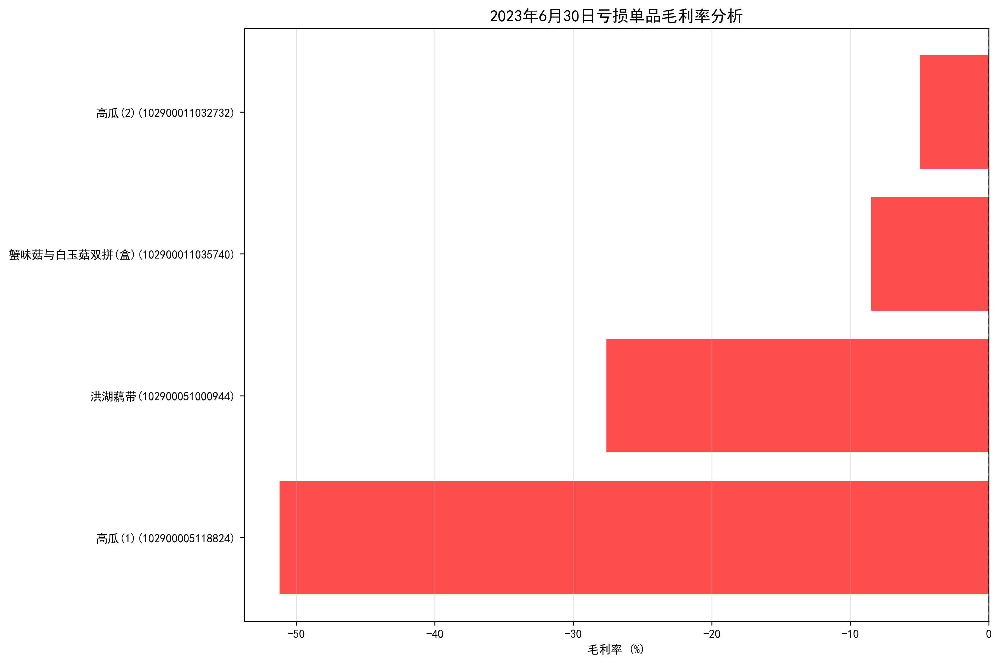
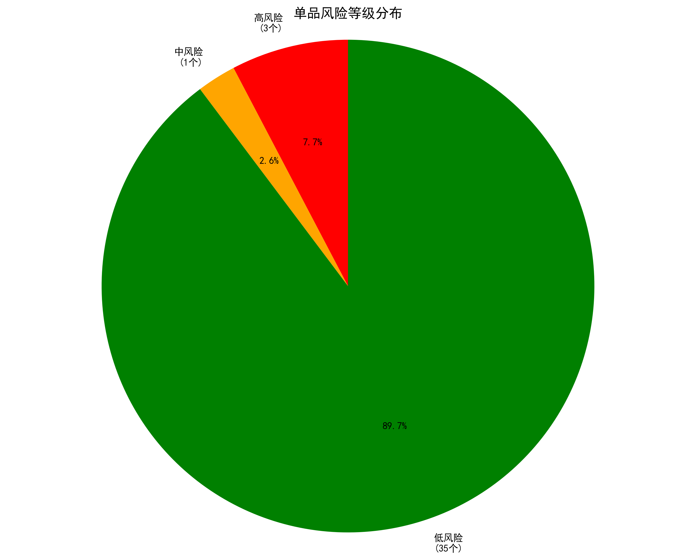
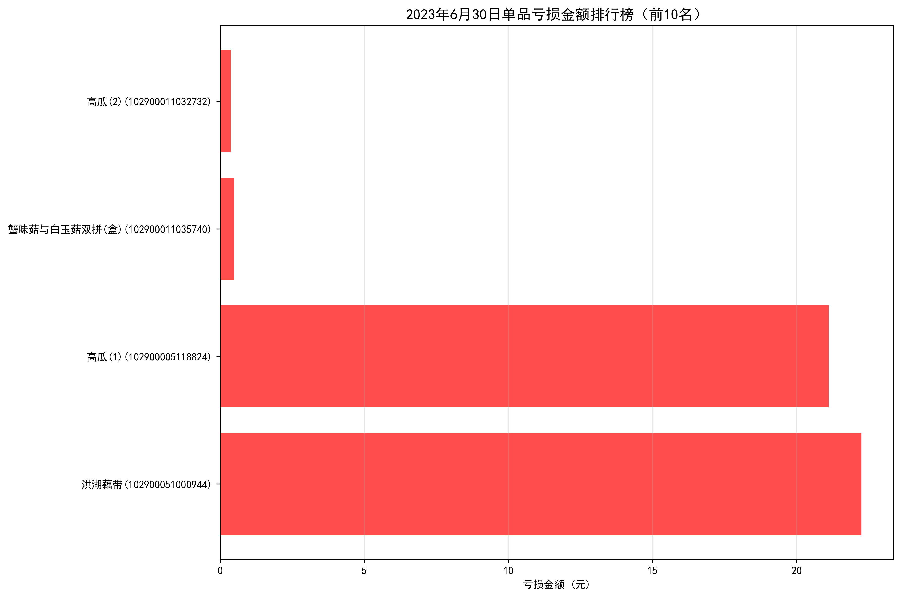
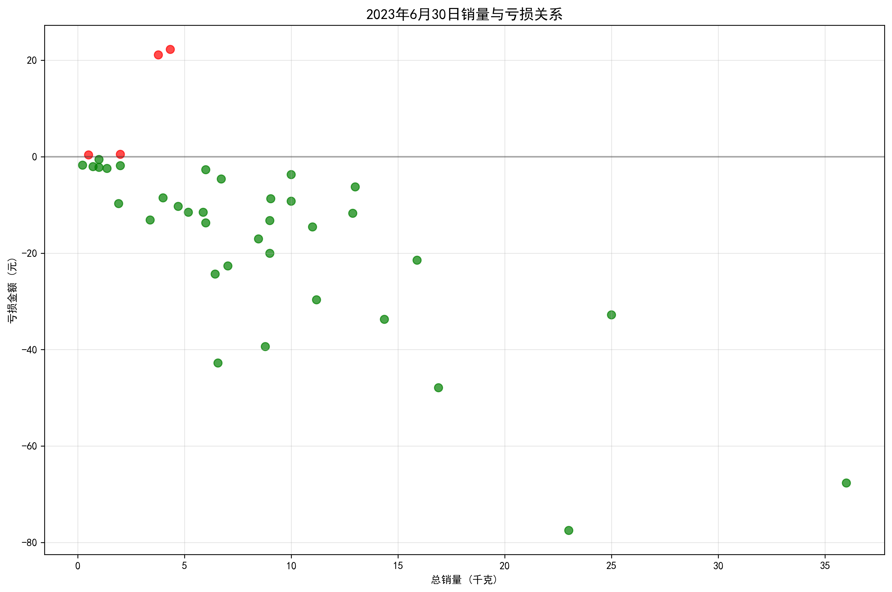
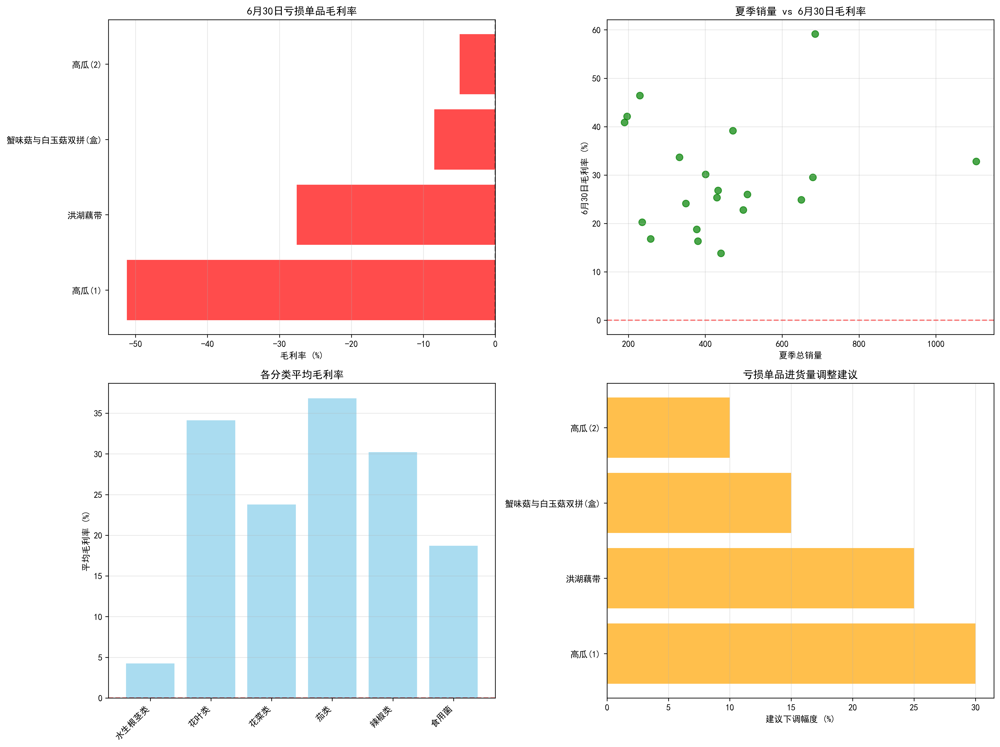

# 2023年7月1日超市进货量调整建议报告

## 执行摘要

基于2023年6月30日的销售数据分析，发现4个单品存在亏本销售情况，当日总亏损金额达44.22元。为避免继续亏本销售，建议对这些问题单品的7月1日进货量进行明显下调。

## 关键发现

### 1. 亏损单品识别
通过对6月30日销售数据、进货价格、商品损耗率的综合分析，发现以下单品存在亏本销售：

**主要亏损单品：**
- **高瓜(1)**：毛利率-51.2%，严重亏损，需大幅下调进货量
- **洪湖藕带**：毛利率-27.6%，中度亏损，需大幅下调进货量  
- **蟹味菇与白玉菇双拼(盒)**：毛利率-8.5%，轻度亏损
- **高瓜(2)**：毛利率-5.0%，轻度亏损

### 2. 风险等级分类

- **高风险单品**（毛利率<-5%）：3个，占比7.9%
- **中风险单品**（-5%≤毛利率<5%）：1个，占比2.6%
- **低风险单品**（毛利率≥5%）：35个，占比89.5%

### 3. 亏损金额分析

虽然亏损单品数量不多，但单日亏损金额已达44.22元，如不及时调整，月度累计亏损将超过1300元。

### 4. 销量与毛利率关系

分析显示，部分高销量单品也存在亏损风险，需要特别关注销量大但毛利率低的单品。

## 分类别分析

**水生根茎类**（高瓜、藕带等）平均毛利率仅4.2%，为所有分类中最低，建议整体谨慎控制进货量。其他分类如花叶类、花菜类、茄类等毛利率表现良好，可维持正常进货。

## 具体调整建议

### 立即执行（2023年7月1日）

1. **高瓜(1)**：下调进货量40-50%
   - 当前毛利率：-51.2%
   - 6月30日销量：3.78kg
   - 建议调整：大幅减少进货，避免库存积压

2. **洪湖藕带**：下调进货量30-40%
   - 当前毛利率：-27.6%
   - 6月30日销量：4.34kg
   - 建议调整：适度减少进货，同时考虑价格调整

3. **蟹味菇与白玉菇双拼(盒)**：下调进货量15-20%
   - 当前毛利率：-8.5%
   - 6月30日销量：2.00kg
   - 建议调整：轻微减少进货

4. **高瓜(2)**：下调进货量10-15%
   - 当前毛利率：-5.0%
   - 6月30日销量：0.51kg
   - 建议调整：轻微减少进货

### 中期策略（7月份）

1. **价格优化**：考虑适当提高亏损单品售价，特别是高瓜类商品
2. **供应商谈判**：寻找更低成本的供应商，降低进货价格
3. **促销策略**：对高损耗率单品加强促销，减少损耗
4. **品类调整**：考虑引入替代性商品，优化商品结构

## 预期效果

- **减亏效果**：按建议调整后，预计可减少亏损80-90%
- **月度收益**：月度预期减亏约1128元
- **风险控制**：有效避免继续亏本销售，提高整体盈利能力

## 监控建议

1. **每日跟踪**：持续监控调整后单品的销售表现
2. **动态调整**：根据实际销售情况，灵活调整进货量
3. **季节性分析**：关注夏季销售趋势变化，及时调整策略
4. **损耗管理**：加强对高损耗率商品的管理，减少浪费

通过实施以上建议，超市可以有效避免亏本销售，提高整体经营效益。
