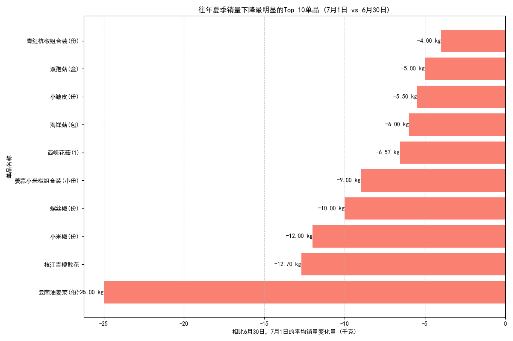

# **关于2023年7月1日商品进货策略的分析报告**

## **一、 背景与目标**

为提升超市的整体营收，核心策略之一是减少因供过于求而导致的商品损耗和资金占用，特别是要避免亏本销售。本报告基于往年夏季的历史销售数据，旨在识别出在 **7月1日相较于6月30日，销量存在持续性、显著性下降的单品**，并为2023年7月1日的备货计划提供具体的、数据驱动的下调建议。

## **二、 分析方法**

我们通过对`dacomp-025.sqlite`数据库中的`销售记录`和`商品信息`表进行深入分析，遵循以下步骤：
1.  **数据提取**：筛选出历年所有 **6月30日** 和 **7月1日** 的单品销售记录。
2.  **销量对比**：计算每个单品在这两天之间的销量差异。
3.  **趋势识别**：重点关注在 **所有被观察的年份中**，7月1日销量总是低于6月30日的单品，这表明其销量下降并非偶然，而是一种潜在的季节性或周期性规律。
4.  **量化排序**：根据销量的平均下降幅度进行排序，锁定最需要进行库存调整的单品。
5.  **结果可视化**：将销量下降最显著的Top 10单品进行可视化呈现，以便直观决策。

## **三、 核心发现与可视化**

数据显示，存在一批单品在进入7月份的第一天表现出稳定且明显的销量下滑。下图清晰地展示了平均销量下降最严重的前10种商品。

**核心发现：**
*   **首要关注对象**：**云南油麦菜(份)** 表现出最为剧烈的销量下降，平均减少了 **25.00千克**。这提示该单品在7月1日的消费者需求远低于6月底。
*   **显著下降梯队**：**枝江青梗散花**、**小米椒(份)** 和 **螺丝椒(份)** 构成了第二梯队，平均销量下降幅度均在 **10至13千克** 之间。
*   **普遍下降品类**：榜单中出现了多种**辣椒类**（小米椒、螺丝椒、小皱皮、青红杭椒组合）和**菌菇类**（西峡花菇、海鲜菇、双孢菇）商品，表明这些品类可能在7月初整体需求有所回落。

## **四、 业务建议与行动策略**

根据以上分析，如果简单地按照6月30日的销量来为7月1日备货，极有可能导致上述单品的库存积压和潜在损耗。为实现精细化库存管理，提高利润，我们提出以下具体建议：

1.  **立即调整进货量**：
    *   **重点下调**：强烈建议在2023年7月1日的备货计划中，显著下调 **“云南油麦菜(份)”** 的进货量，至少在6月30日销量的基础上减少25千克。
    *   **次级下调**：对 **“枝江青梗散花”、“小米椒(份)”、“螺丝椒(份)”** 等榜单上的其他9种单品，也应根据其平均下降值，按比例缩减进货量。例如，可参考 `(6月30日销量 - 平均下降值)` 作为7月1日进货量的基准上限。

2.  **建立动态库存模型**：
    *   建议将此类基于历史数据的“日环比”销量变化分析纳入常态化的库存管理流程。特别是针对季节交替、节假日前后等关键时间点，进行类似的预测性分析，以优化订货策略。

3.  **关注品类趋势**：
    *   考虑到多种辣椒和菌菇类产品同时出现销量下滑，采购部门应审视是否是消费者口味或烹饪习惯在7月初发生了季节性转变，并据此对整个品类的采购策略进行微调。

通过实施以上建议，超市可以更精准地匹配市场需求，有效降低滞销风险，从而切实提高总营收。
