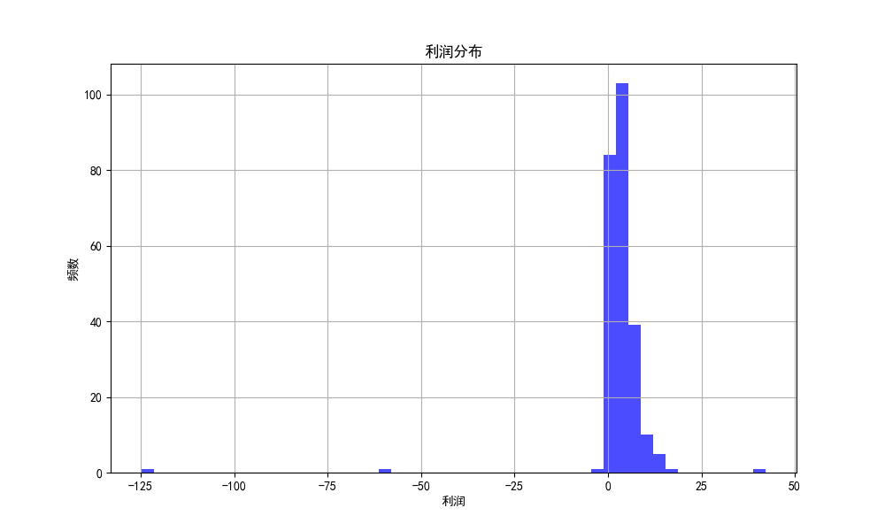

# 超市数据分析报告

## 利润分布分析

根据计算结果，我们分析了各单品的利润分布，并识别出了利润为负的单品。这些单品的进货量应进行调整，以避免亏本销售。

### 利润统计数据
- **平均利润**: 3.09 元/千克
- **利润标准差**: 9.88 元/千克
- **最高利润**: 42.11 元/千克
- **最低利润**: -124.73 元/千克

### 需要调整进货量的单品
以下单品的调整后利润为负，需要减少进货量或停止进货以避免亏损：
- 单品编码: 102900011008492, 利润: -0.51 元/千克
- 单品编码: 102900011008676, 利润: -0.44 元/千克
- 单品编码: 102900011010563, 利润: -4.20 元/千克
- 单品编码: 102900011021644, 利润: -1.18 元/千克
- 单品编码: 102900011030400, 利润: -58.67 元/千克
- 单品编码: 102900011030417, 利润: -124.73 元/千克
- 单品编码: 102900011033999, 利润: -0.99 元/千克

### 利润分布图
以下为利润分布的直方图：

### 结论
通过分析，我们识别出了利润为负的单品，并建议减少这些单品的进货量，以避免超市在2023年7月1日出现亏损。
