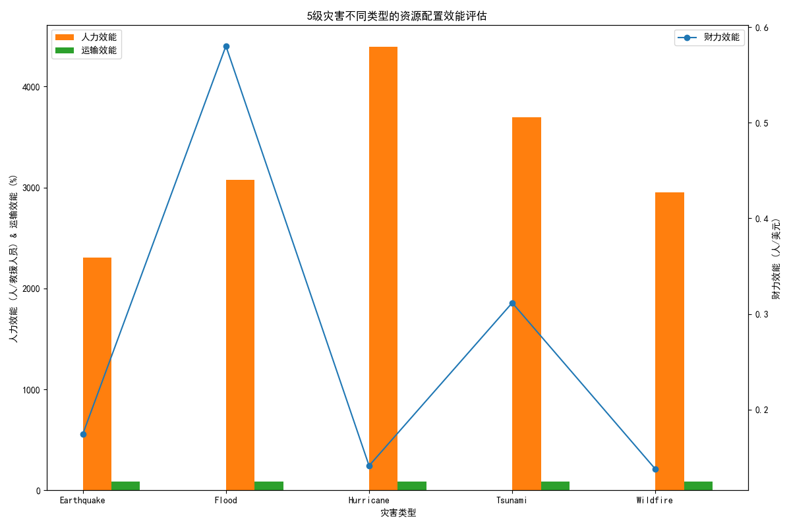

# 5级全球灾害应急响应资源配置效能评估报告

## 一、引言

本报告旨在对全球范围内灾害等级为5的重大灾害事件进行深入分析，从**人力、财力、物力及运输**等关键资源维度，系统性地评估应急响应的资源配置效能。我们通过对多维度数据的整合与分析，旨在揭示不同灾害类型下的资源配置特点与效率差异，并为未来更高效、精准的灾害应急管理提供切实可行的数据洞察和战略建议。

## 二、核心发现与分析

通过对灾害事件、财务、人力、物资和运输数据的综合分析，我们发现不同类型的5级灾害在资源配置效能上表现出显著差异。下图展示了在地震（Earthquake）、洪水（Flood）、飓风（Hurricane）、海啸（Tsunami）和野火（Wildfire）五种灾害类型下，财力、人力和运输三大核心效能指标的对比情况。

### 1. 财力配置效能：资金投入需精准匹配灾害模式

**分析发现：**
- **洪水与海啸的财力效能（单位预算覆盖的受灾人口）显著领先。** 洪水灾害中，每美元预算可覆盖约0.58人，而飓风和野火灾害的这一数字仅为0.14人左右。
- 这表明，在应对洪水与海啸时，资金的使用效率相对更高，能够以较少的成本惠及更多的受灾群众。

**原因与建议：**
- **原因推测：** 洪水和海啸通常造成大范围、同质化的影响（如淹没和疏散），救援模式以大规模人口安置和基本生活物资分发为主，规模效应明显，从而拉高了人均资金效率。相比之下，地震、飓风和野火可能导致更复杂和多样化的破坏（如建筑倒塌、关键基础设施损毁），救援行动成本（如重型设备、专业搜救）更高，资金效能因此较低。
- **策略建议：**
    - **建立差异化预算模型：** 应摒弃“一刀切”的预算方案，根据不同灾害类型的破坏模式和救援需求，建立动态的、差异化的预算预测与分配模型。
    - **优化高成本环节：** 针对财力效能较低的灾害类型（如飓风、野火），应深入审计其成本结构，重点分析行动成本、运输成本等高额支出项，通过引入新技术（如无人机勘察）、优化流程等方式，寻求成本压缩空间。

### 2. 人力配置效能：人员结构需适应救援任务复杂度

**分析发现：**
- **飓风的人力效能（每位救援人员服务的受灾人口）最高，达到约4392人/救援者。** 而地震的人力效能最低，仅为约2306人/救援者，不到飓风的一半。
- 这反映出不同灾害对救援人员的专业技能和投入强度要求存在巨大差异。

**原因与建议：**
- **原因推测：** 地震救援往往涉及在复杂危险环境下（如倒塌建筑）进行生命搜救，需要大量训练有素的专业人员（医疗、工程、搜救），人力密集且专业化程度高，导致人均服务的人口数量有限。而飓风过后的救援工作更多侧重于疏散安置、物资分发和初步清理，部分任务可由志愿者承担，因此单个人员能覆盖更广的服务范围。
- **策略建议：**
    - **构建模块化人力资源池：** 建立一个由“核心专业团队（医疗、搜救、工程）+后勤支持人员+注册志愿者”构成的多层次、模块化的人力资源体系。
    - **按需精准调配：** 针对地震等专业需求高的灾害，优先部署核心专业团队。对于飓风、洪水等影响面广的灾害，则可以大规模动员后勤支持人员和志愿者，负责外围的辅助性工作，从而将宝贵的专业人力集中在最关键的任务上。

### 3. 运输与物力效能：物流网络坚实，但“最后一公里”仍有优化空间

**分析发现：**
- **所有灾害类型的运输交付成功率均保持在84%至86%的高水平**，表明整体物流干线网络具有较强的韧性和可靠性。
- 野火和海啸的运输效能（交付成功率）略微领先，但这微小的差距在实际操作中影响有限。

**原因与建议：**
- **原因推测：** 应急响应体系中标准化的物流管理和协调机制（SOPs）在各类灾害中均得到了有效执行，保障了物资从分发中心到受灾区域主干线运输的成功率。
- **策略建议：**
    - **关注交付时间与日运量：** 尽管交付成功率高，但报告未深入分析的“平均交付时间”和“日均运输量”可能是潜在瓶颈。即使物资最终送达，过长的运输时间也会严重影响救援时效。建议管理部门将分析重点下沉到这些过程指标。
    - **推广智能化物流技术：** 投资并应用AI路线优化、无人机配送等技术，特别是在应对道路中断等复杂情况时，提升“最后一公里”的配送效率和灵活性。
    - **前置仓储与预部署：** 针对高发灾害区域，可考虑设立前置应急仓库，或在灾害预警阶段即进行物资的预部署，最大限度缩短响应和运输时间。

## 三、结论与综合建议

应急响应的资源配置并非“一招鲜”，而是一个需要根据灾害类型、影响范围和救援阶段进行动态调整的复杂系统工程。基于以上分析，我们提出以下三点综合性战略建议：

1.  **推行“基于灾害类型”的差异化资源规划：** 放弃统一的资源配置标准，为不同灾害类型制定专属的预算、人力和物资基线方案，实现资源投入的精准化和高效化。

2.  **建设“分层-模块化”的人力资源管理体系：** 大力发展由专业人员、辅助人员和志愿者构成的多层次救援力量。在应急响应中，根据任务的专业性要求，灵活组合、精准派遣，实现人力价值最大化。

3.  **打造“数据驱动”的智能物流与决策支持系统：** 持续追踪并分析运输交付时间、资源利用率等过程性指标，利用大数据和人工智能技术优化物流网络和资源调度决策，从“结果可靠”向“过程高效”迈进，全面提升应急响应的整体效能。
