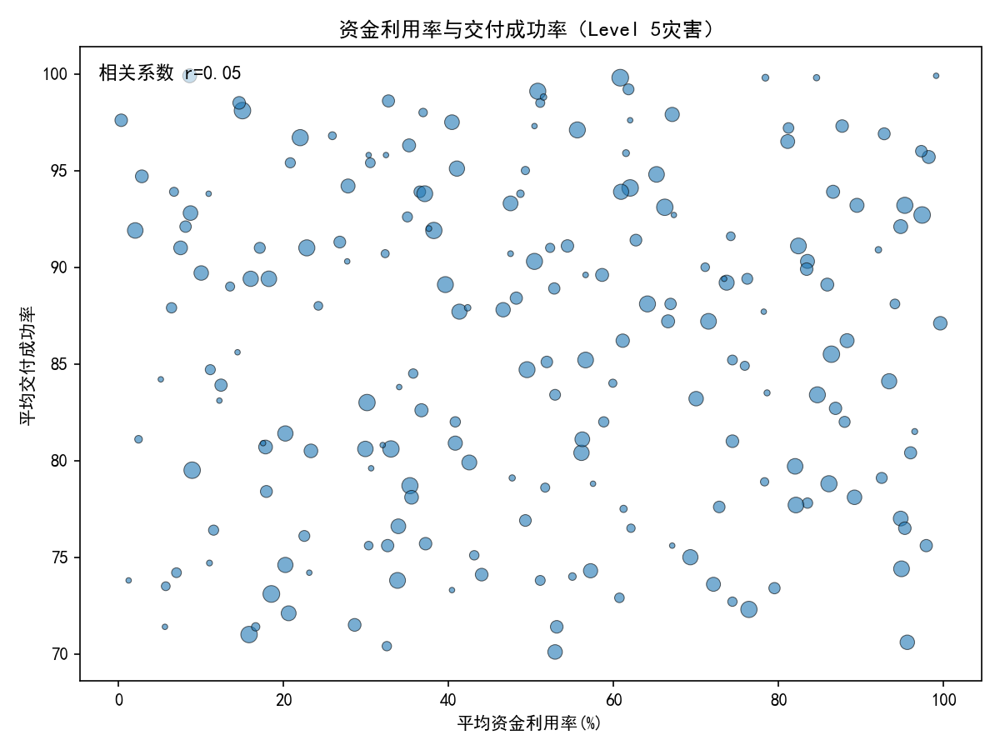
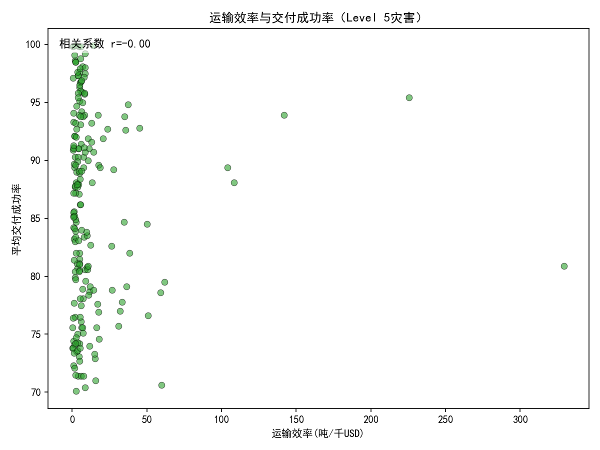
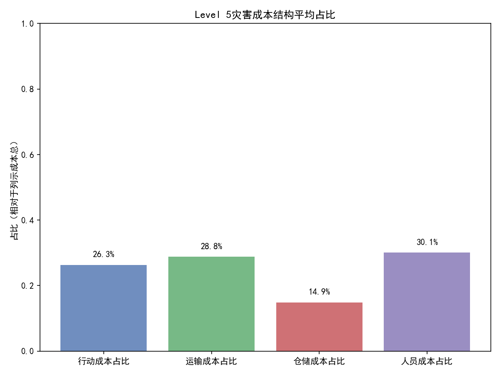
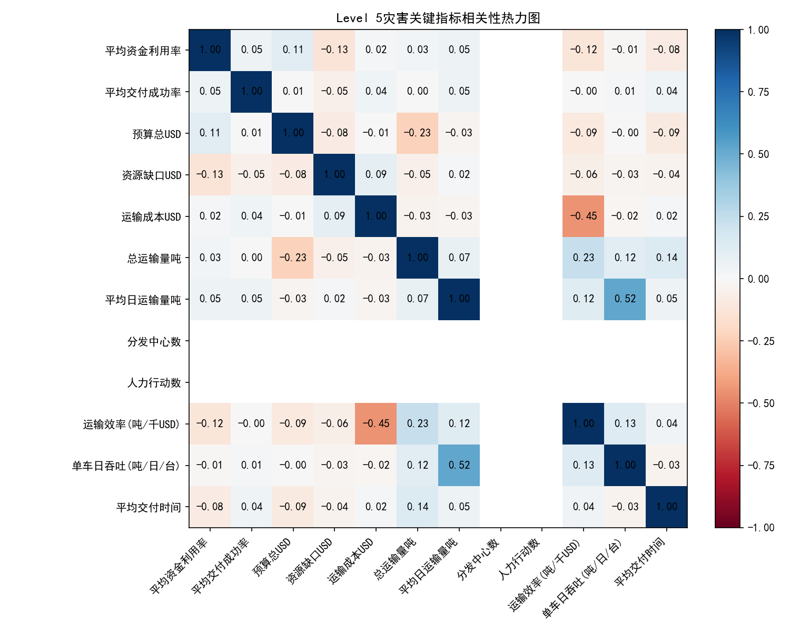

# 全球灾害等级为5的应急资源配置效能评估（人力、财力、物力、交通视角）

## 摘要（结论先行）
- 整体执行表现：在Level 5灾害（n=202）中，平均资金利用率约50.3%，交付成功率约85.8%，运输效率约13.1 吨/千USD，平均交付时间约35.6（时间单位与源数据一致）。整体交付成功率较高，但资金利用率与运输效率存在优化空间。
- 成本结构：平均成本结构占比（相对列示成本总）为人员成本30.1%、运输成本28.8%、行动成本26.3%、仓储成本14.9%。仓储占比偏低，显示“快进快出”的策略较为普遍，仍可通过交叉配送/末端直配进一步压缩仓储。
- 影响交付成功率的驱动因素：
  - 线性相关性整体较弱（资金利用率-成功率r≈0.05，运输效率-成功率r≈-0.00），说明“单一指标”难以直接决定成功率；
  - 但分位组对比显示：高成功率事件（上四分位）具有更高的运输效率（14.43 vs 10.64 吨/千USD）与略高的资金利用率（50.22% vs 47.52%），提示“效率型物流+稳健资金执行”的组合策略更可能取得高成功率。
- 速度与成功的权衡：高成功率组的平均交付时间更长（40.0 vs 37.5），意味着“更稳健/更完整的末端交付”可能需要更长的时间，存在“时间-成功率”的操作性权衡。
- 运力与产出：运输工具总数与平均日运输量的相关性很低（r≈0.05），提示运力配置存在潜在的“低利用/错配”问题，需要通过路径优化与末端网络设计提升产出。

## 数据与方法
- 数据来源：SQLite数据库 dacomp-026.sqlite。
- 使用表：
  - 灾害事件（筛选灾害等级=Level 5）。
  - 人力资源（统计人力“行动ID”数量作为人力行动数）。
  - 财务（预算与成本构成、资金利用率、资源缺口、捐赠承诺等）。
  - 物资（用于统计物资记录数与分发中心数）。
  - 运输（交付成功率、平均交付时间、运载量与可用运力等）。
- 关键派生指标：
  - 运输效率(吨/千USD) = 总运输量吨 / (运输成本USD/1000)，衡量单位运输经费的产出；
  - 单车日吞吐(吨/日/台) = 平均日运输量吨 / (平均可用卡车+直升机+船只)；
  - 成本结构占比：行动/运输/仓储/人员成本占列示成本总的比例。
- 说明：本分析严格遵循“只分析不清洗”的要求；未进行任何数据清洗与机器学习训练。

## 可视化与诊断分析

1) 资金利用率与交付成功率（气泡大小=预算）



- 观察：整体相关性较弱（r≈0.05），说明单纯提高资金利用率并不必然带来更高的交付成功率；更可能是“资金如何用在刀刃上”（如末端配送、路径与班次优化）才是关键。

2) 运输效率与交付成功率



- 观察：总体线性相关性接近于0，但分位比较发现：
  - 高成功率组（上四分位）运输效率更高（14.43 vs 10.64 吨/千USD）。
  - 指示更“节支增效”的运输产出，对实现更高的交付成功率具有加成作用。

3) 成本结构平均占比（相对列示成本总）



- 结构画像：人员30.1%、运输28.8%、行动26.3%、仓储14.9%。
- 含义：仓储占比偏低，体现快周转策略；建议继续通过交叉配送、去中间环节来压缩仓储持有成本，并将资源更多向“末端交付与路径优化”倾斜。

4) 关键指标相关性热力图



- 主要发现：
  - 预算/资源缺口与成功率的线性相关系数接近0，提示“钱花了多少/缺口多大”并非决定性因素；
  - 运输成本与总运输量的相关性也较弱（r≈-0.03），可能存在区域/地形/跨境因素引起的“单位成本差异”，需要在本地化运营层面进一步优化；
  - 运输工具总数与平均日运输量的相关性很低（r≈0.05），暗示存在运力闲置或“错场景投放”的问题。

## 关键数值（Level 5总体）
- 样本规模：202个灾害事件。
- 平均资金利用率：50.25%。
- 平均交付成功率：85.78%。
- 平均交付时间：35.62（与源数据单位一致）。
- 平均运输效率：13.07 吨/千USD。
- 平均日运输量：251.50 吨。
- 平均成本结构占比（相对列示成本总）：
  - 人员成本30.09%、运输成本28.77%、行动成本26.29%、仓储成本14.86%。
- 分位组对比（高成功率 vs 低成功率）：
  - 运输效率：14.43 vs 10.64 吨/千USD（高成功率更优）。
  - 资金利用率：50.22% vs 47.52%（高成功率略高）。
  - 平均交付时间：40.00 vs 37.47（高成功率组更慢但更稳健）。
  - 平均预算总USD：5.30M vs 5.11M（差异不大）。
  - 平均资源缺口USD：约53.7万 vs 54.8万（差异不大）。

## 诊断性解读（为什么）
- “钱花对地方”比“钱花多少”更重要：整体上预算、资金利用率与成功率关系弱，暗示关键在于“支出结构与末端执行质量”。
- 物流效率是隐性驱动：总体相关性不显著，但在高成功率样本中共同出现“更高运输效率”，说明当运作机制成熟时，物流效率对成果有明显贡献。
- 速度-成功的权衡：高成功率伴随更长交付时间，可能来自更稳健的末端分发与核验流程；在极端灾害中，保障到达与可追溯性比绝对速度更被优先。
- 运力利用不足：运力数量与吞吐弱相关，提示闲置、排班、路径与场景不匹配（如山区更需直升机、海岛则偏重船只），需要更精细的“地形/通达性匹配”。

## 规范性建议（我们应该怎么做）
1) 聚焦“效率型物流”的投入结构
- 将更多预算倾斜到提升运输效率的环节：
  - 路由优化与班次排程（减少空驶、等待与拥堵时间）。
  - 多式联运组合（山区直升机、沿海船只、内陆卡车的比例按地形与通达性匹配）。
  - 末端配送网络强化（微型分发点/移动分发车），优先提升交付成功率。

2) 优化成本结构（建议目标区间）
- 保持/适度上调运输成本份额，以换取更高的运输效率；
- 仓储占比继续控制在15%以下，通过交叉配送、直通（cross-docking）减少滞留；
- 人员成本占比控制在约30%附近，辅以岗位技能多能化，提升人均产出。

3) 强化资金执行与过程控制
- 设置“资金—产出”里程碑：例如以运输效率/交付成功率为核心KPI进行阶段拨付与绩效联动；
- 目标值建议：
  - 运输效率≥14 吨/千USD；
  - 交付成功率≥88%；
  - 资金利用率≥60%（在主要行动阶段）。

4) 针对运力错配与闲置的操作策略
- 建立“地形-运力”映射模板（山区/平原/海岛/城市），动态匹配卡车、直升机、船只配比；
- 联合路径优化与时间窗调度，减少集散点等待；
- 加强与“分发中心/分发点”的协同，适度增加末端分发点密度，提升到达概率，容忍少量时间延长换取成功率提升。

5) 人力与组织
- 虽然“人力行动数”在样本中变动不大，但建议：
  - 采用标准化ICS指挥体系，减少协同损耗；
  - 技能导向排班（驾驶/吊装/医疗/通信）+跨岗位培训，提升“每人每班”产出；
  - 将人力与运输计划深度联动（车辆/直升机起降窗口与班次绑定）。

## 局限与后续工作
- 本分析未进行数据清洗，且某些字段粒度有限（如物资数量与类别细分不足、人力配置仅以“行动数”体现），对深层因果推断存在局限；
- 建议在后续补充：
  - 物资类型/数量与需求缺口的匹配度；
  - 更细的地理通达性、地形阻力、天气窗口等外生变量；
  - 分发点密度与路径结构（星型/环型/链式）对成功率与时间的影响。

## 附：绘图所用Python代码片段（字体设置）
```python
import matplotlib.pyplot as plt
plt.rcParams['font.sans-serif'] = ['SimHei']
plt.rcParams['axes.unicode_minus'] = False
```

以上分析基于SQL提取与Python计算的实际输出和图表，遵循“只分析不清洗”的要求。建议在未来应急演练与真实部署中，将“运输效率与末端交付成功率”作为核心牵引指标，通过优化运力结构与路径设计，系统性提升Level 5灾害的资源配置效能。
