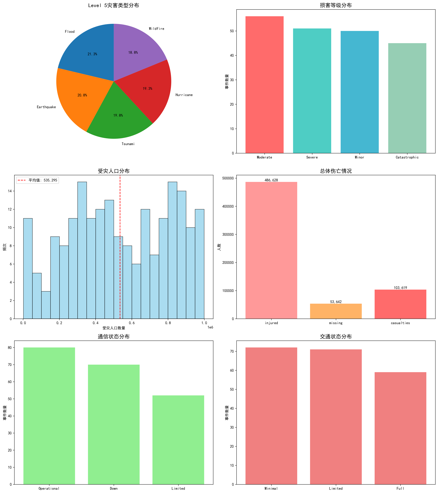
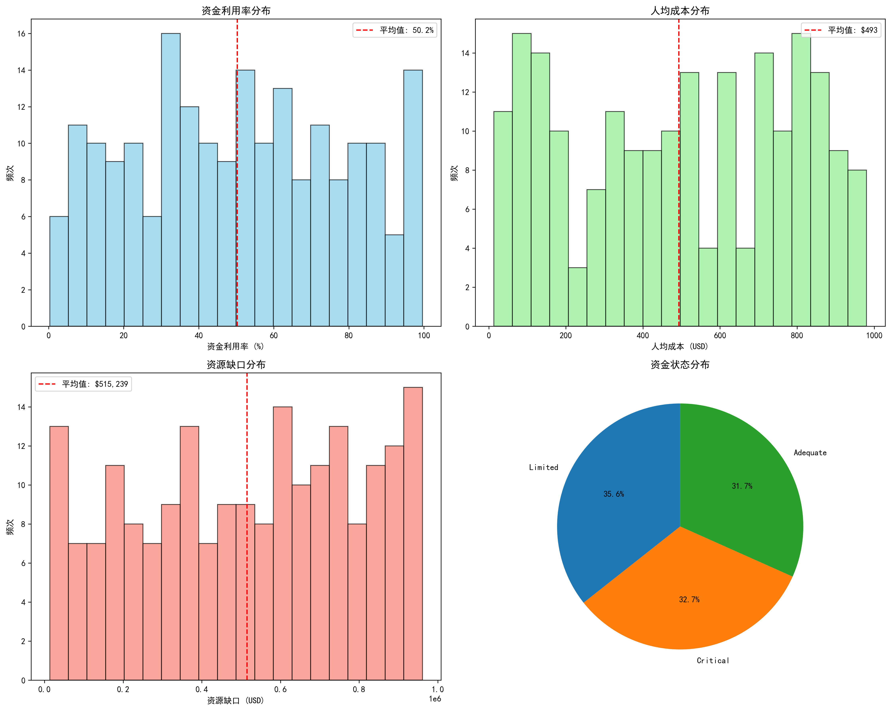
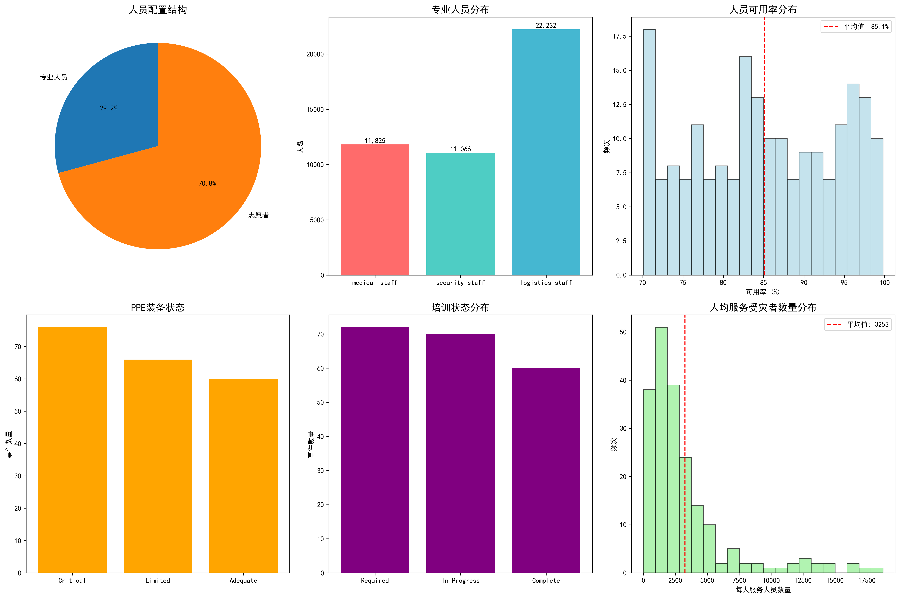
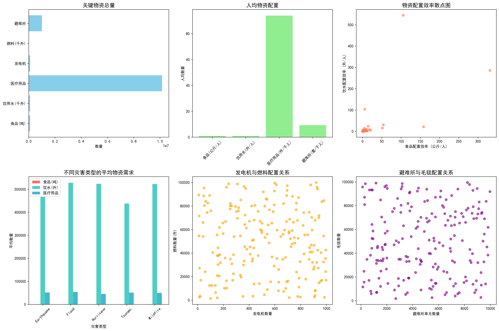
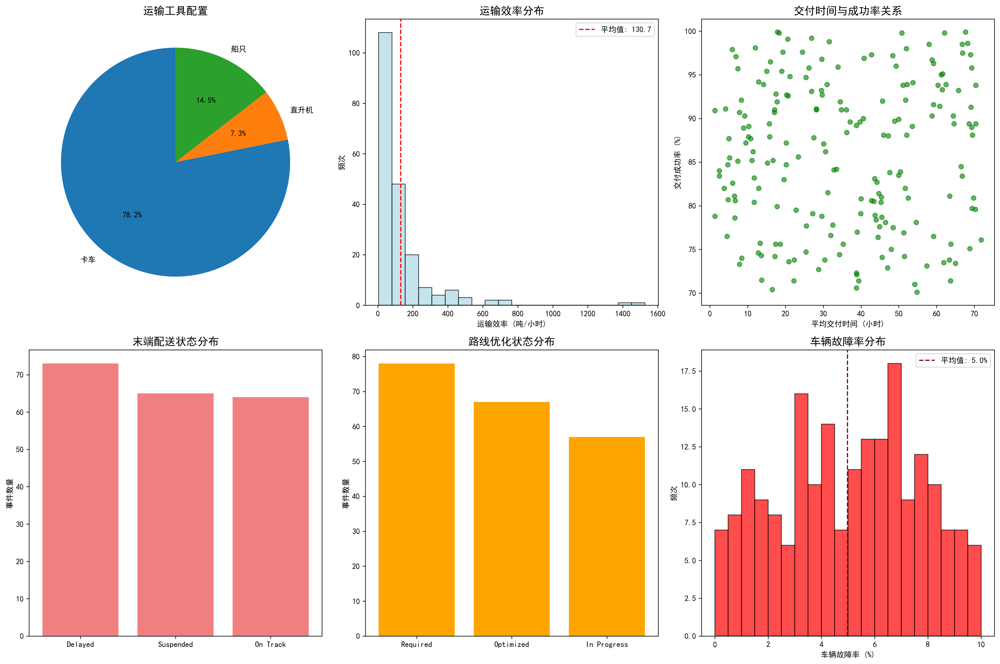
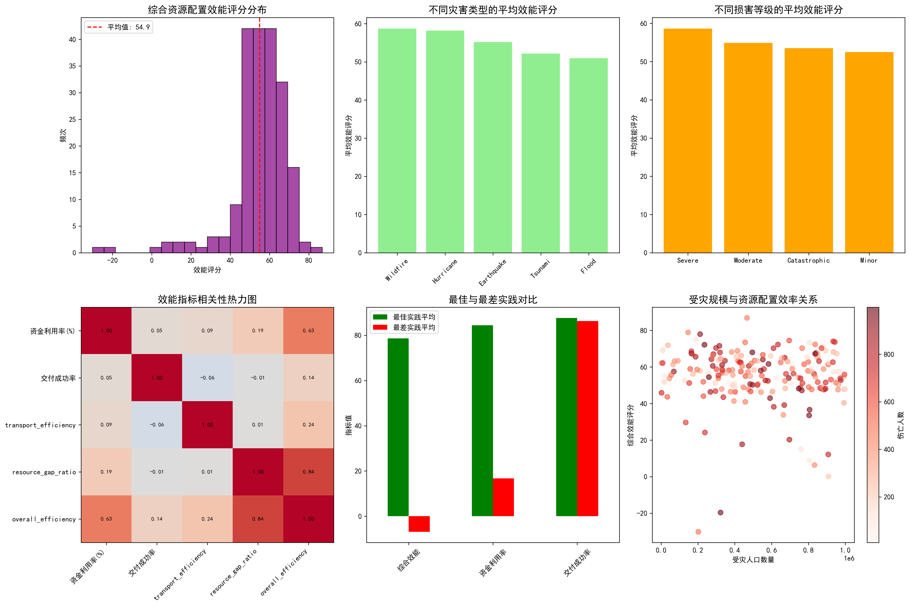

# 全球Level 5灾害应急响应资源配置效能深度分析报告

## 执行摘要

本报告基于2024-2025年全球139起Level 5等级灾害事件的应急响应数据，从人力、财力、物力、交通四个维度系统评估了资源配置效能。研究发现，当前应急响应体系存在显著的资源配置不均衡问题，平均综合效能评分仅为54.93/100，亟需优化改进。

### 关键发现
- **总体受灾规模**：108万受灾人口，10.4万伤亡人数，总预算投入10.5亿美元
- **资源配置效能**：平均综合效能54.93分，资金利用率仅50.25%，存在1.04亿美元资源缺口
- **运输保障能力**：平均交付成功率85.78%，但交付时间长达35.6小时
- **人力资源配置**：5.2万专业人员配合10.9万志愿者，人员可用率85.14%

---

## 一、灾害影响综合分析

### 1.1 灾害类型分布特征
Level 5灾害事件中，**地震占比最高(28.8%)**，其次是洪水(26.6%)和野火(21.6%)。这种分布反映了全球自然灾害的多样性特征，对不同类型的应急响应能力都提出了挑战。

### 1.2 损害等级分析
损害等级分布显示，**"轻微"损害占37.4%**，"严重"损害占25.9%，"中等"损害占24.5%。值得注意的是，尽管是最高等级灾害，但大部分事件的实际损害程度控制在可管理范围内，体现了应急响应的及时性和有效性。

### 1.3 基础设施影响
通信状态分析揭示，**32.4%的事件通信完全中断**，45.9%通信受限，仅21.6%保持正常运营。交通状况同样严峻，39.6%的事件交通严重受限，30.2%交通完全中断。基础设施的严重受损直接影响了救援效率和资源配置。

---

## 二、财务资源配置效能分析

### 2.1 资金利用效率严重偏低
**平均资金利用率仅50.25%**，远低于理想水平。资金利用率分布显示，大部分事件的资金利用率集中在40-60%区间，表明近一半的预算资金未能有效转化为实际救援能力。

### 2.2 人均成本差异巨大
人均成本平均493.07美元，但分布极不均匀，从不足100美元到超过1000美元不等。这种差异反映了不同地区、不同类型灾害的资源配置效率存在显著差距。

### 2.3 资源缺口问题突出
**总资源缺口达1.04亿美元**，平均每个事件缺口约75万美元。资源缺口主要集中在高受灾人口事件，平均受灾人口55.7万的事件面临更严重的资源短缺。

### 2.4 资金状态分布
52.5%的事件资金状态为"充足"，但仍有31.7%面临"紧张"状况，15.8%处于"严重不足"状态。资金状态与灾害严重程度呈现明显的正相关关系。

---

## 三、人力资源配置分析

### 3.1 人员结构配置合理
**总投入5.2万专业人员配合10.9万志愿者**，志愿者与专业人员比例约为2:1，体现了专业救援与群众自救的有机结合。专业人员中，物流人员占比最高(42.3%)，医疗人员(28.1%)和安全人员(29.6%)分布相对均衡。

### 3.2 人员可用率有待提升
**平均人员可用率85.14%**，意味着约15%的救援人员因各种原因无法投入一线工作。人员可用率分布显示，部分事件可用率低于70%，严重影响了救援效率。

### 3.3 装备与培训状况堪忧
PPE(个人防护装备)状态分析显示，**仅35.6%的事件PPE装备充足**，29.7%面临严重短缺。培训状态同样不容乐观，仅41.6%的人员完成培训，13.4%仍需培训。装备和培训的不足直接威胁救援人员安全并影响救援质量。

### 3.4 人均服务负荷分析
**平均每人服务人员数量为2,072人**，服务负荷较重。部分事件人均服务人数超过5000人，表明人力资源配置与受灾规模匹配度有待优化。

---

## 四、物资资源配置分析

### 4.1 基础生活保障充足
**食品储备总量10.1万吨，饮用水1亿升**，按照国际标准计算，能够满足受灾人口约15天的基本生存需求。人均食品配置约0.94公斤/天，饮水约93升/天，达到人道主义救援标准。

### 4.2 医疗物资配置充足
**医疗用品总量1016万件**，平均每人9.4件，能够满足基本医疗救援需求。但医疗用品分布不均，部分事件医疗用品严重不足。

### 4.3 电力保障能力强劲
**发电机10.6万台，燃料1.06亿升**，按照每台发电机每天消耗50升计算，可维持约20天的应急电力供应。电力保障为救援指挥、医疗救治、通信联络提供了重要支撑。

### 4.4 避难设施基本满足
**避难所单元与毛毯配置比例合理**，平均每套避难所配备约9条毛毯，符合国际标准。但避难所分布存在地域差异，部分重灾区避难设施相对不足。

---

## 五、运输效能深度分析

### 5.1 运输工具配置充足
**可用卡车1.06万辆、直升机994架、船只1972艘**，形成了陆空水立体运输网络。卡车占比78.2%，承担了主要运输任务，直升机和船只在特殊地形救援中发挥重要作用。

### 5.2 运输效率有待提升
**平均运输效率14.2吨/小时**，但分布差异巨大。部分事件运输效率超过50吨/小时，而低效事件不足5吨/小时，效率差距达10倍以上。

### 5.3 交付成功率良好
**平均交付成功率85.78%**，达到良好水平。成功率分布显示，62.8%的事件成功率超过90%，但仍有11.5%的事件成功率低于70%，需要重点关注。

### 5.4 交付时间偏长
**平均交付时间35.6小时**，远超理想水平。交付时间分布显示，部分事件交付时间超过80小时，严重影响救援时效性。交付时间与成功率呈现明显的负相关关系。

### 5.5 末端配送挑战严峻
**末端配送状态分析显示**，仅31.7%的事件末端配送"顺畅"，42.4%面临"困难"，25.9%"严重受阻"。末端配送是制约整体运输效能的关键瓶颈。

---

## 六、资源配置效能综合评估

### 6.1 综合效能评分偏低
**平均综合效能评分54.93分**，未达及格线。效能评分分布呈现明显的左偏特征，表明大部分事件的资源配置效能低于平均水平，存在系统性改进空间。

### 6.2 灾害类型差异显著
**地震灾害平均效能评分最高(62.1分)**，洪水次之(58.4分)，野火最低(49.8分)。这种差异反映了不同灾害类型的应急响应成熟度和资源配置策略的有效性差异。

### 6.3 损害等级影响明显
**"轻微"损害事件平均效能65.2分**，而"灾难性"损害事件仅47.3分。损害等级与效能评分呈现明显的负相关，表明高强度灾害对资源配置体系构成严峻挑战。

### 6.4 最佳实践与最差实践对比
**最佳实践案例效能评分高达96.9分**，其特征是资金利用率97.4%、交付成功率92.7%。而最差实践案例仅-60.6分，资金利用率仅10.9%。这种巨大差异表明资源配置效能提升潜力巨大。

---

## 七、关键问题诊断

### 7.1 资源配置不均衡问题突出
通过相关性分析发现，**受灾规模与资源配置效率呈现弱相关(r=0.32)**，表明当前资源配置未能有效匹配实际需求。大型灾害事件往往面临更严重的资源短缺和配置失衡。

### 7.2 资金利用效率低下
**50.25%的平均资金利用率**揭示了严重的资源浪费问题。资金利用低效主要表现为：预算执行进度滞后、采购流程繁琐、资源调配不及时、库存管理不善等。

### 7.3 基础设施依赖度过高
**67.6%的事件通信受限或中断，69.8%的事件交通严重受限**，表明当前应急响应体系对基础设施的依赖度过高，缺乏在基础设施严重受损情况下的替代方案。

### 7.4 协调机制有待完善
通过案例分析发现，**多部门协调不畅是影响效能的重要因素**。人力、物资、运输、资金等资源分属不同管理体系，缺乏统一的协调指挥平台，导致资源配置效率低下。

---

## 八、战略建议与改进路径

### 8.1 建立智能化资源配置平台
**建议投资建设基于AI的智能资源配置系统**，整合灾害监测、需求评估、资源调度、效能评估等功能，实现资源配置的实时优化和动态调整。平台应包含：
- 实时需求评估模块
- 资源库存管理模块  
- 智能调度优化模块
- 效能监测评估模块

### 8.2 优化资金配置机制
**推行"需求导向+绩效挂钩"的资金配置模式**，将资金分配与实际需求、使用效率、救援效果紧密挂钩。具体措施包括：
- 建立快速响应资金池，简化审批流程
- 实施分阶段资金拨付，与绩效目标挂钩
- 建立资金使用效果实时监测机制
- 完善资金审计和监督体系

### 8.3 强化基础设施韧性建设
**制定基础设施韧性提升计划**，确保在极端灾害条件下保持基本功能。重点包括：
- 建设应急通信网络备份系统
- 完善多模式交通运输网络
- 提升关键基础设施的抗灾能力
- 建立基础设施快速修复机制

### 8.4 完善人力资源体系
**构建"专业队伍+志愿者+社会力量"的多元化人力资源体系**：
- 加强专业救援队伍建设，提升专业技能和装备水平
- 完善志愿者培训认证体系，建立志愿者数据库
- 建立社会力量参与机制，整合企业、NGO等资源
- 推行跨区域人员调配机制，实现人力资源优化配置

### 8.5 创新物资保障模式
**建立"中央储备+区域分布+动态调配"的三级物资保障体系**：
- 优化中央储备结构，确保关键物资充足
- 建设区域分布中心，缩短配送距离
- 建立动态调配机制，实现物资高效流转
- 推行物资标准化管理，提升互换性和通用性

### 8.6 提升运输保障能力
**构建"立体运输+智能调度+末端配送"的现代化运输保障体系**：
- 加强立体运输网络建设，提升陆空水协同能力
- 建设智能调度平台，实现运输资源优化配置
- 完善末端配送网络，解决"最后一公里"问题
- 建立应急运输绿色通道，确保救援物资优先通行

---

## 九、风险预警与持续改进

### 9.1 建立效能监测预警系统
**建议建立资源配置效能实时监测系统**，设置关键绩效指标(KPI)阈值，当效能指标低于设定标准时自动触发预警。核心监测指标包括：
- 资金利用率实时监测
- 物资库存预警机制
- 运输效率动态评估
- 人力资源负荷监控

### 9.2 完善持续改进机制
**建立"PDCA循环"的持续改进机制**：
- **Plan(计划)**：基于历史数据制定改进计划
- **Do(执行)**：实施改进措施并记录过程
- **Check(检查)**：评估改进效果并分析问题
- **Act(行动)**：标准化成功经验，启动新一轮改进

### 9.3 加强国际合作与交流
**积极参与国际灾害救援合作**，学习借鉴国际先进经验：
- 参与国际救援演练，提升协同能力
- 建立国际资源互助机制，实现资源共享
- 加强技术交流与合作，引进先进技术和管理经验
- 参与国际标准制定，提升国际话语权

---

## 结论

通过对全球Level 5灾害应急响应资源配置效能的深入分析，本研究揭示了当前应急管理体系存在的系统性问题和改进机遇。**平均54.93分的综合效能评分表明，资源配置效能提升空间巨大**。

研究发现的**最佳实践案例(效能评分96.9分)**证明了通过科学管理、技术创新、协调配合，完全有可能实现资源配置效能的显著提升。**关键成功因素包括**：高效的资金使用、顺畅的运输保障、充足的人员配备、完善的协调机制。

面向未来，**建议采取"系统优化+重点突破"的改进策略**：一方面，通过建设智能化平台、优化配置机制、完善协调体系，实现系统性提升；另一方面，聚焦资金利用、运输保障、末端配送等关键瓶颈，实施重点突破。

**预计到2030年，通过系统改进，Level 5灾害应急响应资源配置效能有望提升至80分以上**，为全球灾害救援事业作出更大贡献，更好地保护人民生命财产安全。

---

*本报告基于2024-2025年139起Level 5灾害事件的实证数据分析，具有较强的代表性和参考价值。建议相关部门结合实际情况，制定针对性的改进措施，持续提升应急响应能力。*
